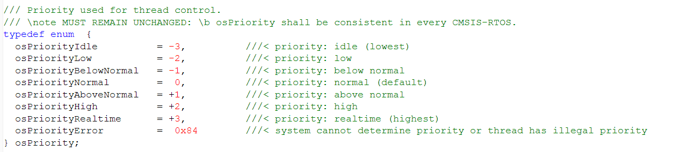
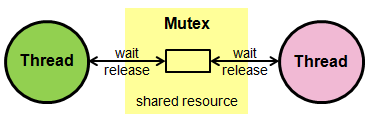
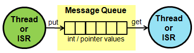
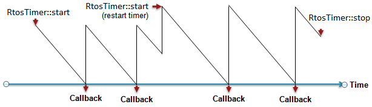

*** Editing: https://docs.google.com/document/d/10v8n0elbDH9gonE-x_T5EnTmk4vUrUDCuv4Jw7bRR-M/edit ***

# mbed-rtos

*** Not sure which link should go here... this one doesn't seem right ***

[](https://developer.mbed.org/users/mbed_official/code/mbed-rtos/docs/4c105b8d7cae/rtos_8h_source.html) 

## Thread

The ``Thread`` class allows defining, creating, and controlling thread functions in the system. The function ``main`` is a special thread function that is started at system initialization and has the initial priority ``osPriorityNormal``.

[](https://developer.mbed.org/users/mbed_official/code/rtos_basic/file/tip/main.cpp) 

<span class="notes">**Note:** The ``main`` function is already the first thread scheduled by the rtos. </span> 

[](https://developer.mbed.org/users/mbed_official/code/mbed-rtos/docs/tip/classrtos_1_1Thread.html) 

<span class="images"></span>


A ``Thread`` can be in the following states:

* **RUNNING**: The thread that is currently running is in the RUNNING state. Only one thread at a time can be in this state.
* **READY**: Threads which are ready to run are in the READY state. Once the RUNNING thread has terminated or is WAITING the next READY thread with the highest priority becomes the RUNNING thread.
* **WAITING**: Threads that are waiting for an event to occur are in the WAITING state.
* **INACTIVE**: Threads that are not created or terminated are in the INACTIVE state. These threads typically consume no system resources.

<span class="images"></span>

## Mutex

A ``Mutex`` is used to synchronize the execution of threads, for example to protect the access to a shared resource.

<span class="warnings"> **Warning:** ISR
</br>The ``Mutex`` methods cannot be called from interrupt service routines (ISR). </span>

<span class="images"></span>

[](https://developer.mbed.org/users/mbed_official/code/rtos_mutex/file/tip/main.cpp) 

<span class="notes">**Note:** C standard library mutexes
</br>The ARM C standard library has already mutexes in place to protect the access to stdio, therefore on the M3 mbed the above example is not necessary. On the contrary, ARM microlib (used on the M0 mbed) does not provide default stdio mutexes making the above example a necessity. </span> 
<span class="warnings">**Warning:** stdio (printf, putc, getc, etc), malloc &amp; new in ISR
</br>Because of the mutexes in the ARM C standard library you cannot use stdio (``printf``, ``putc``, ``getc``, etc), ``malloc`` and ``new`` in ISR! </span> 

[](https://developer.mbed.org/users/mbed_official/code/mbed-rtos/docs/tip/classrtos_1_1Mutex.html) 

## Semaphore

A ``Semaphore`` is particularly useful to manage thread access to a pool of shared resources of a certain type.

<span class="images"></span>

[](https://developer.mbed.org/users/mbed_official/code/rtos_semaphore/file/tip/main.cpp) 

[](https://developer.mbed.org/users/mbed_official/code/mbed-rtos/docs/tip/classrtos_1_1Semaphore.html) 

## Signals

Each ``Thread`` can be notified and wait for signals: 

[](https://developer.mbed.org/users/mbed_official/code/rtos_signals/file/tip/main.cpp) 

## Queue

A ``Queue`` allows you to queue pointers to data from producers threads to consumers threads:

<span class="images"></span>

```
Queue queue;

message_t *message;

queue.put(message);

osEvent evt = queue.get();
if (evt.status == osEventMessage) {
    message_t *message = (message_t*)evt.value.p;
``` 

[](https://developer.mbed.org/users/mbed_official/code/rtos_queue/file/tip/main.cpp) 

[](https://developer.mbed.org/users/mbed_official/code/mbed-rtos/docs/tip/classrtos_1_1Queue.html) 

## MemoryPool

The MemoryPool class is used to define and manage fixed-size memory pools:

```
MemoryPool mpool;

message_t *message = mpool.alloc();

mpool.free(message);
``` 

[](https://developer.mbed.org/users/mbed_official/code/rtos_queue/file/tip/main.cpp) 

[](https://developer.mbed.org/users/mbed_official/code/mbed-rtos/docs/tip/classrtos_1_1MemoryPool.html) 

## Mail

A ``Mail`` works like a queue with the added benefit of providing a memory pool for allocating messages (not only pointers).

<span class="images"></span>

[](https://developer.mbed.org/users/mbed_official/code/rtos_mail/file/tip/main.cpp) 

[](https://developer.mbed.org/users/mbed_official/code/mbed-rtos/docs/tip/classrtos_1_1Mail.html) 

## RTOS Timer

The ``RtosTimer`` class allows creating and and controlling of timer functions in the system. A timer function is called when a time period expires whereby both one-shot and periodic timers are possible. A timer can be started, restarted, or stopped. Timers are handled in the thread ``osTimerThread``. Callback functions run under control of this thread and may use CMSIS-RTOS API calls.

<span class="images"></span>

[](https://developer.mbed.org/users/mbed_official/code/rtos_timer/file/tip/main.cpp) 

[](https://developer.mbed.org/users/mbed_official/code/mbed-rtos/docs/tip/classrtos_1_1RtosTimer.html) 

## Interrupt Service Routines

The same RTOS API can be used in ISR. The only two warnings are:

* ``Mutex`` can not be used.
* Wait in ISR is not allowed: all the timeouts in method parameters have to be set to 0 (no wait).

[](https://developer.mbed.org/users/mbed_official/code/rtos_isr/file/tip/main.cpp) 

## Default Timeouts

The mbed rtos API has made the choice of defaulting to ``0`` timeout (no wait) for the producer methods, and ``osWaitForever`` (infinitive wait) for the consumer methods.

A typical scenario for a producer could be a peripheral triggering an interrupt to notify an event: in the corresponding interrupt service routine you cannot wait (this would deadlock the entire system). On the other side, the consumer could be a background thread waiting for events: in this case the desired default behaviour is not using CPU cycles until this event is produced, hence the osWaitForever.

<span class="warnings">**Warning**: No wait in ISR</br> When calling an rtos object method in an ISR all the timeout parameters have to be set to 0 (no wait): waiting in ISR is not allowed. </span>

## Status and Error Codes

The Status and Error Codes section lists all the return values that the CMSIS-RTOS functions will return:

* ``osOK``: function completed; no event occurred.
* ``osEventSignal``: function completed; signal event occurred.
* ``osEventMessage``: function completed; message event occurred.
* ``osEventMail``: function completed; mail event occurred.
* ``osEventTimeout``: function completed; timeout occurred.
* ``osErrorParameter``: parameter error: a mandatory parameter was missing or specified an incorrect object.
* ``osErrorResource``: resource not available: a specified resource was not available.
* ``osErrorTimeoutResource``: resource not available within given time: a specified resource was not available within the timeout period.
* ``osErrorISR``: not allowed in ISR context: the function cannot be called from interrupt service routines.
* ``osErrorISRRecursive``: function called multiple times from ISR with same object.
* ``osErrorPriority``: system cannot determine priority or thread has illegal priority.
* ``osErrorNoMemory``: system is out of memory: it was impossible to allocate or reserve memory for the operation.
* ``osErrorValue``: value of a parameter is out of range.
* ``osErrorOS``: unspecified RTOS error: run-time error but no other error message fits.

## osEvent

The ``osEvent`` data structure is returned by ``get`` methods of ``Queue`` and ``Mail`` objects. This data structure contains both an error code and a pointer to the actual data:

[](https://developer.mbed.org/users/mbed_official/code/rtx/docs/tip/structosEvent.html) 

## Implementation

The mbed RTOS is based on the [CMSIS RTOS](CMSIS-RTOS). ** MISSING LINK **
