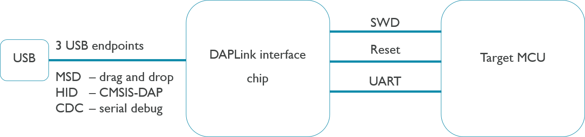
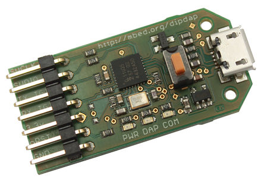
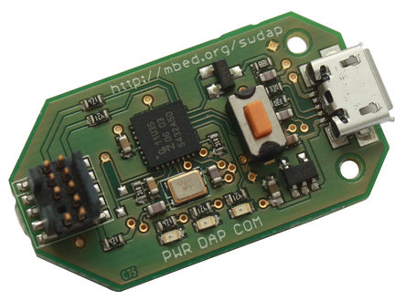

# DAPLink

DAPlink is an open source project that implements the embedded firmware required for a Cortex debug probe. The project is hosted on GitHub and is published under an Apache 2.0 license, making it attractive for commercial developments.

The software project is complemented by a series of reference designs for creating the DAPLink debug probe hardware, which is available [here](https://docs.mbed.com/docs/mbed-hardware-development-kit/en/latest/).

## DAPLink features

A DAPLink debug probe connects to your host computer through USB and connects to your target system (the one to be programmed and debugged) through a standard [Cortex debug connector](http://infocenter.arm.com/help/topic/com.arm.doc.faqs/attached/13634/cortex_debug_connectors.pdf). It provides three main features -CMSIS-DAP Debug (HID), Serial Port (VCOM), drag and drop programming (MSD) - all over a single USB connection.

DAPLink circuit overview

### HID interface 

The driver-less HID interface provides a channel over which the CMSIS-DAP debug protocol runs. This enables all the leading industry standard toolchains to program and debug the target system. 

Supported tools include:

  * Keil MDK.
  * IAR Workbench.
  * pyOCD.

### USB disk drag and drop programming 

DAPLink debug probes appear on the host computer as a USB disk. Program files in binary (``.bin``) and hex (``.hex``) formats can be copied onto the USB disk, which then programs them into the memory of the target system.

**Note:** The DAPLink probe needs to contain the programming algorithms specific to the target system. Therefore, the version of the DAPLink firmware you use must match the target system.

## USB serial port 

The DAPLink debug probe also provides a USB serial port, which can be bridged through to a TTL UART on the target system.
The USB serial port will appear on a Windows machine as a COM port, or on a Linux machine as a /dev/tty interface.

For more information on configuring your host computer to use this feature, please [see here](../getting_started/serial_communication.md).

## Interface Boards

Currently there are two stand alone boards commercially available that you can run DAPLink on.

#### DIPDAP

dipdap

The DIPDAP is a debug probe based on the NXP LPC11U35, supported by the DAPLink project. It provides a CMSIS-DAP interface and a serial port
[Buy - LTEK](http://uk.rs-online.com/web/p/processor-microcontroller-development-kits/9054100/) [Buy - Minewtech](http://www.minewtech.cn/product/60653683522-804909412/DIPDAP_Board_with_matching_cable_robotic_arm.html?spm=a2700.8304367.0.0.N9LkhJ) | [Design Files](https://github.com/ARMmbed/mbed-HDK/tree/master/Production%20Design%20Projects/ARM-mbed/DAPLink/DIPDAP)

#### SWDAP

swdap

The SWDAP is a debug probe based on the NXP LPC11U35, supported by the DAPLink project. It provides a CMSIS-DAP interface for programming and debugging. This design is NRND (not reccomended for new designs) because it does not have COM Port functionality, so it cannot be used for automated testing in the mbed ecosystem, which is required for validation and continuous integration testing.
[Buy](http://uk.rs-online.com/web/p/processor-microcontroller-development-kits/9054104/) | [Design Files](https://github.com/ARMmbed/mbed-HDK/tree/master/Production%20Design%20Projects/ARM-mbed/DAPLink/SWDAP)

## Further reading

* [The DAPLink GitHub repo](https://github.com/ARMmbed/DAPLink/blob/master/README.md).
* [Debug probes built with DAPLink](https://developer.mbed.org/platforms/SWDAP-LPC11U35).

## FAQ

	- Q: How do I program a board using DAPLink?
	- A: The DAPLink interface circuit will show up like a USB Drive to your computer. To program the target chip connected to the DAPLink interface chip simply dag and drop the target binary to the USB drive. DAPLink will then load the program to the target chip.

	- Q: How do I program different target chips with the same DAPLink interface? (ie use a DIPDAP to program different targets)
	- A: Currently DAPLink can only program one target. To switch the target you will need change the firmware on the DAPLink interface chip. 

	- Q: Can I use DAPLink in my project?
	- A: Sure! Go to the mbed HDK and grab the interface layout files. Make sure to hook up USB on one side, and the 6 pins between the interface circuit and target circuit on the other side.

	- Q: How do I port DAPLink to my chip?
	- A: Instructions can be found on the [github page](https://github.com/mbedmicro/DAPLink/blob/master/docs/DEVELOPERS-GUIDE.md).

	- Q: Where is the latest release of DAPLink?
	- A: Daplink is released through the [DAPLink github release page](https://github.com/mbedmicro/DAPLink/releases). Download the zip file and select the firmware version that matches your `interface-chip_target-chip.bin`.

	- Q: What MCU's can DAPLink run on as Interface Circuit MCU's?
	- A: The k20dx, kl26z, atsam3u and the lpc11u35.