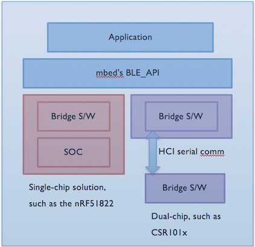
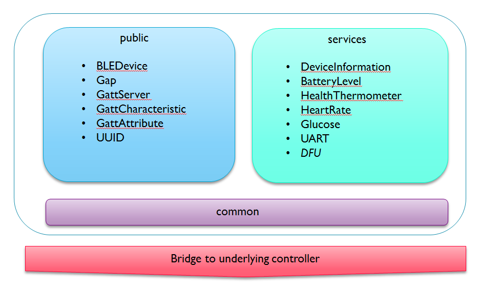

# BLE

Bluetooth low energy (BLE) is a low power wireless technology standard for building personal area networks. Typical applications of BLE are health care, fitness trackers, beacons, smart home, security, entertainment, proximity sensors, industrial and automotive.

Arm Mbed BLE, also called `BLE_API`, is the Bluetooth Low Energy software solution for Mbed. Many Mbed [targets and components](https://os.mbed.com/platforms/?mbed-enabled=15&connectivity=3) support Mbed BLE. Developers can use it to create new BLE enabled applications.

Mbed’s `BLE_API` interfaces with the BLE controller on the platform. It hides the BLE stack’s complexity behind C++ abstractions and is compatible with all BLE-enabled Mbed platforms. The Mbed OS `BLE_API` automatically configuring the clocks, timers and other hardware peripherals to work at their lowest power consumption.

## `BLE_API`, bridges and stacks

<span class="images"></span>

You can build a BLE application using Mbed OS, `BLE_API` and a controller-specific Bluetooth stack together with some bridge software to adapt it to `BLE_API`:

- `BLE_API` as described above.
- The bridge software is specific to each vendor’s platform. It provides the instantiations for the interfaces `BLE_API` offers and helps drive the underlying controller and Bluetooth stack.
- The Bluetooth stack implements the Bluetooth protocol and is specific to the controller, so a vendor using different controllers may provide different stacks.

## Inside `BLE_API`

<span class="images"></span>

`BLE_API` offers building blocks to help construct applications. These fall into two broad categories:

1. Interfaces under **`ble/`** to express BLE constructs, such as GAP, GATT, services and characteristics.

1. Classes under `ble/services` to offer reference implementations for many of the commonly used GATT profiles. The code under 'services/' isn't essential, but it’s a useful starting point for prototyping. We continue to implement the standard GATT profiles.

## The BLEDevice class and header

The entry point of Mbed's `BLE_API` is the BLE class accessible using the header `ble/BLE.h`. This class allows you to obtain a BLE object that includes the basic attributes of a spec-compatible BLE device and can work with any BLE radio:

```c TODO
#include "ble/BLE.h"

BLE& mydevicename = BLE::Instance();
```

The class's member functions can be divided by purpose:

1. Basic BLE operations, such as initializing the controller.

1. Accessor to Bluetooth Modules that manage GAP, GATT or the security.

## Usage

1. Set up advertising and connection modes.
1. Assign UUIDs to the service and its characteristic.
1. Create an input characteristic.
1. Construct a service class and add it to the BLE stack.
1. Push notifications when the characteristic's value changes.

## BLE class reference

[](https://os.mbed.com/docs/development/mbed-os-api-doxy/class_b_l_e.html)

## Example: BLE beacon

Here is an example demonstrating how you can create a BLE beacon.

[](https://github.com/ARMmbed/mbed-os-example-ble/blob/mbed-os-5.14/BLE_Beacon/source/main.cpp)

## Example: BLE heart rate monitor

Here is an example demonstrating how to build a heart rate sensor that can be connected and monitored by a BLE client such as your phone.

[](https://github.com/ARMmbed/mbed-os-example-ble/blob/mbed-os-5.14/BLE_HeartRate/source/main.cpp)

## Related content

- Mbed Enabled [targets and components](https://os.mbed.com/platforms/?mbed-enabled=15&connectivity=3) that support BLE.
- [BLE tutorial](../tutorials/ble-tutorial.html).
- [Office Hours video about BLE](https://www.youtube.com/watch?v=j5RJ6UfkylA).
