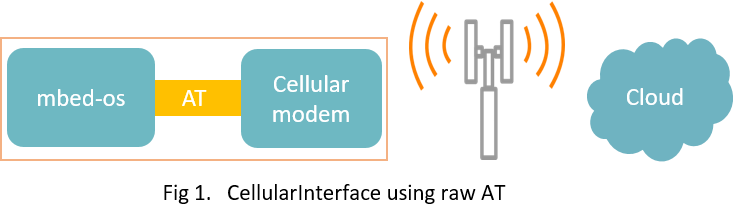
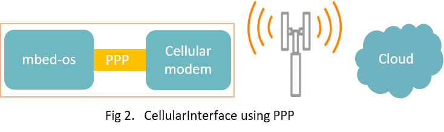

<h1 id="cellular-api">Cellular API</h1>

<span class="images"><span>CellularInterface class hierarchy</span></span>

The [CellularInterface](https://os.mbed.com/docs/development/mbed-os-api-doxy/class_cellular_interface.html) class provides a C++ API for connecting to the internet over a Cellular device.

## Getting started

1. Choose an [Mbed board that supports cellular](https://os.mbed.com/platforms/?mbed-enabled=15&connectivity=1), such as the [UBLOX-C027](https://os.mbed.com/platforms/u-blox-C027/) or [MTS-DRAGONFLY](https://os.mbed.com/platforms/MTS-Dragonfly/).

1. Clone [`mbed-os-example-cellular`](https://os.mbed.com/teams/mbed-os-examples/code/mbed-os-example-cellular/). Follow the instructions in the repository.

    1. Compile the code.
    1. Flash the board.

   You see output similar to the excerpt below:

```
mbed-os-example-cellular
Establishing connection ......

Connection Established.
TCP: connected with echo.mbedcloudtesting.com server
TCP: Sent 4 Bytes to echo.mbedcloudtesting.com
Received from echo server 4 Bytes


Success. Exiting
```

## Basic working principles

You can use and extend a cellular interface in various different ways. For example,

- Using AT commands to control sockets in an existing IP stack built into the cellular modem.

<span class="images"></span>

- Using a PPP (Point-to-Point Protocol) pipe to pass IP packets between an Mbed OS supported IP stack and cellular modem device.

<span class="images"></span>

[`mbed-os-example-cellular`](https://os.mbed.com/teams/mbed-os-examples/code/mbed-os-example-cellular/) uses PPP or AT mode depending on the modem. We can summarize this particular design as follows:

- It uses an external IP stack, such as LWIP, or on-chip network stacks such as when the modem does not support PPP.
- The easy cellular connection uses standard 3GPP AT 27.007 AT commands to set up the cellular modem and to register to the network.
- After registration, the driver opens a PPP pipe using LWIP with the cellular modem and connects to the internet. If AT only mode is in use, then modem-specific AT commands are used for socket data control.

## CellularInterface class reference

[](https://os.mbed.com/docs/development/mbed-os-api-doxy/class_cellular_interface.html)

## Usage

To bring up the network interface:

1. Instantiate an implementation of the CellularInterface class.
1. Call the `connect(pincode, apn)` function with a PIN code for your SIM card and an APN for your network.
1. Once connected, you can use Mbed OS [network sockets](network-socket.html) as usual.

## Cellular example: connection establishment

This example establishes connection with the cellular network using Mbed OS CellularInterface.

[](https://github.com/ARMmbed/mbed-os-example-cellular/blob/mbed-os-5.14/main.cpp)

## Related content

- [Network socket](network-socket.html) API reference overview.
- [Cellular overview](../reference/cellular-networking.html) describes cellular architecture and its usage in more detail.
- [Cellular configuration documentation](../reference/configuration-connectivity.html).
