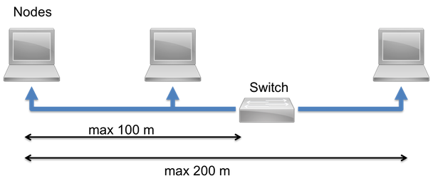
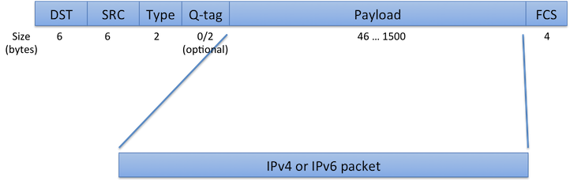

<h2 id="ethernet-technology">Ethernet</h2>

The term **Ethernet** refers to technologies first introduced in 1980 and standardized in 1983 as **IEEE 802.3**. Ethernet is a wired network, usually implemented by twisted pair wiring, or optical fiber and coaxials. However, coaxial has largely become obsolete.

Initially, the speed from the standard was 1 Mbps, but later standards increased it first to 10 Mbps, and later 100 Mbps and 1 Gbps. The latter two are the most popular connection speeds today.

Ethernet works with cable lengths of up to 100 meters. When connected to a switch, Ethernet allows the maximum segment length to span 200 meters.

Ethernet segment

### Ethernet connection speeds

Since introducing the initial standard, IEEE has improved Ethernet, making it faster and cheaper, and has released subsequent standards covering these improvements.

| Speed     | Name       | Standard     | Year | Description |
|-----------|------------|--------------|------|-------------|
| 10 Mbps   | 10BASE-5   | IEEE 802.3   | 1983 | First Ethernet standard; used thick coaxial cable. |
| 10 Mbps   | 10BASE-2   | IEEE 802.3a  | 1985 | Superseded the first coaxial by using thinner and cheaper cable. Newer versions of IEEE 802.3 make both obsolete now. |
| 10 Mbps   | 10BASE-T   | IEEE 802.3i  | 1990 | Became most popular Ethernet by replacing problematic coaxial cables with CAT-3 twisted pair cable. |
| 100 Mbps  | 100BASE-TX | IEEE 802.3u  | 1995 | Standard called **Fast Ethernet**; uses CAT-5 twisted pair cable. |
| 1000 Mbps | 1000BASE-T | IEEE 802.3ab | 1999 | Increased speed to 1 Gbps using CAT-5e cable. With 100BASE-TX, the most popular standard today. |

Today, most Ethernet devices are capable of automatically negotiating connection speeds of 10/100/1000 Mbit/s with the switch. However, embedded devices rarely support 1 Gbps connection speed.

### Ethernet frames

Ethernet framing has remained nearly untouched after its initial introduction, making it possible to connect devices with various speeds to the same Ethernet segment. Mbed OS uses Ethernet only to carry IP frames.

Ethernet frame

**Fields in frame:**

DST: 48 bit destination MAC address

SRC: 48 bit source MAC address

Type: Originally length field, but later used to specify content type of payload. Also known as EtherType.
    Values higher than 1536 are registered type specifiers. Most common is 0x0800 for IPv4 and 0x86DD for IPv6.

Q-Tag: Optional virtual LAN ID.

FCS: Frame Check Sequence used for integrity check. Implemented as CRC-32.

### Follow-up information

To understand the use of Ethernet and TCP/IP in Mbed OS, please see the following sections:

- [IP networking](ip-networking.html).
- [Ethernet API](../apis/ethernet.html).
- [Socket API](../apis/socket.html).
