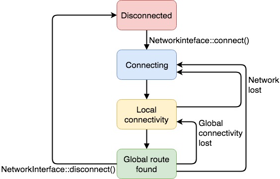

## Network interface overview

A socket requires a NetworkInterface instance to indicate which NetworkInterface the socket should be created on. The NetworkInterface provides a network stack that implements the underlying socket operations.

NetworkInterface is also the controlling API that the application uses to specify the network configuration.

### Existing network interfaces:

- [Ethernet](ethernet.html): API for connecting to the internet over an Ethernet connection.
- [Wi-Fi](wi-fi.html): API for connecting to the internet with a Wi-Fi device.
- [Cellular](cellular-api.html): API for connecting to the internet using a cellular device.
- [Mesh networking interface](mesh-api.html): Mbed OS provides two kinds of IPv6-based mesh networks - 6LoWPAN_ND and Thread.

### Network connectivity states

When you create a network interface, it starts from the disconnected state. When you call `NetworkInteface::connect()`, the interface stays connected until you call `NetworkInterface::disconnect()`. The following diagram illustrates the state changes:

<span class="images"><span>Network states</span></span>

The interface handles all state changes itself between `Connecting`, `Local connectivity` and `Global route found`. Calling `NetworkInterface::connect()` might return when either local or global connectivity states are reached. This depends on the connectivity. For example, Ethernet and Wi-Fi interfaces return when global connectivity is reached. 6LoWPAN-based mesh networks depend on the standard you're using. 6LoWPAN-ND returns when it connects to a border router that provides global connection. The Thread returns when you create a local mesh network and may later get global connection when it finds a border router.

When a network or route is lost or any other cause limits the connectivity, the interface may change its state back to `Connecting`, `Local connectivity` or `Disconnected`. In the `Connecting` and `Local connectivity` states, the interface usually reconnects until the application chooses to call `NetworkInterface::disconnect()`. Depending on the network, this reconnection might have internal back off periods, and not all interfaces implement the reconnection logic at all. Refer to table below on how different interfaces behave.

An application may check the connection status by calling `nsapi_connection_status_t get_connection_status()` or register a callback to monitoring status changes. The following table lists defined network states with actions that applictions should take on the state change:

| State             |`nsapi_connection_status_t` | Actions to do on application |
|-------------------|----------------------------|------------------------------|
| Disconnected       | `NSAPI_STATUS_DISCONNECTED`| Call `connect()`. Close socket connections, if previously was connected. |
| Connecting         | `NSAPI_STATUS_CONNECTING`  | Close and destroy all open sockets. Wait until connection is established. |
| Local connectivity | `NSAPI_STATUS_LOCAL_UP`    | You can create sockets and communicate with local devices in the same network. |
| Global route found | `NSAPI_STATUS_GLOBAL_UP`   | You can create sockets and communicate with all hosts. |


Use the following API to register status callbacks:

- [Network status](network-status.html): API for monitoring network status changes.

Error handling and reconnection logic depends on the network interface used. Use following table to determine what actions your application needs to do on each network type.

| `NetworkInterface` sub class | Does it reconnect automatically? | Possible states |
|------------------------------|---------------------------------|-----------------|
| `EthernetInterface` | Yes | 1.`NSAPI_STATUS_DISCONNECTED`<br />2.`NSAPI_STATUS_CONNECTING`<br />3.`NSAPI_STATUS_GLOBAL_UP`|
| `WiFiInterface` | Yes, when onboard network stack is used.<br />For external modules, it depends on the driver.<br />See examples below. | - |
| `OdinWiFiInterface` or<br /> `RTWInterface` | Yes | 1.`NSAPI_STATUS_DISCONNECTED`<br />2.`NSAPI_STATUS_CONNECTING`<br />3.`NSAPI_STATUS_GLOBAL_UP`|
| `ESP8266Interface` | Yes  | 1.`NSAPI_STATUS_DISCONNECTED`<br />2.`NSAPI_STATUS_CONNECTING`<br />3.`NSAPI_STATUS_GLOBAL_UP`|
| `CellularInterface` | Mostly no | 1.`NSAPI_STATUS_DISCONNECTED`<br />2.`NSAPI_STATUS_CONNECTING`<br />3.`NSAPI_STATUS_GLOBAL_UP`<br />`CellularInterface` may also send Cellular specific states specified in `CellularCommon.h` |
| `LoWPANNDInterface` or<br />`ThreadInterface` or<br />`WisunInterface` | Yes | 1.`NSAPI_STATUS_DISCONNECTED`<br />2.`NSAPI_STATUS_CONNECTING`<br />4.`NSAPI_STATUS_LOCAL_UP`<br />4.`NSAPI_STATUS_GLOBAL_UP`|

### Default network interface

In Mbed OS, targets that provide network connectivity also provide a default network interface. This can be Ethernet, Wi-Fi, mesh or cellular. Using a default interface allows you to port applications to different targets and connectivity options.

The following example uses a default interface to connect to the network:

```
NetworkInterface *net = NetworkInterface::get_default_instance();

if (!net) {
    printf("Error! No network inteface found.\n");
    return 0;
}

net->connect();
```

This example works on all IP-based connectivity options that Mbed OS supports. The Mbed OS configuration system provides configuration for the default interface at build time, so at run time, you can call `connect()` without any parameters.

For example, when providing a Wi-Fi SSID and password, you may use the following `mbed_app.json`:

```
{
    "target_overrides": {
        "*": {
            "nsapi.default-wifi-security": "WPA_WPA2",
            "nsapi.default-wifi-ssid": "\"ssid\"",
            "nsapi.default-wifi-password": "\"password\""
        }
    }
}
```

Please see [Selecting the default network interface](../reference/configuration-connectivity.html#selecting-the-default-network-interface) for information about how to supply required configuration parameters on different connections.

Targets with connectivity set the `target.network-default-interface-type` configuration variable appropriately, either to their only interface or the one most commonly used. For targets that provide more than one type of connectivity, you may choose the default by overriding the `target.network-default-interface-type` configuration variable.

Applications may also ask for a specific type of connection, as the following table shows:

|Method|What connectivity is returned| Requirements |
|------|-----------------------------|--------------|
|`*WiFiInterface::get_default_instance()`| Wi-Fi interface | Requires security parameters (mode, SSID, password). |
|`*EthInterface::get_default_instance()` | Wired Ethernet interface, not Wi-Fi | none |
|`*MeshInterface::get_default_instance()` | Returns either `LoWPANNDInterface` or `ThreadInterface`, depending on which is set to default | Target provides a driver or macro `DEVICE_802_15_4_PHY` is enabled. |
| `*CellularBase::get_default_instance()` | Return cellular connectivity | Requires network parameters (pin, APN, username, password). |
| `*NetworkInterface::get_default_instance()` | One of the above, depending on `target.network-default-interface-type`. |  |

Note that the calls for a specific interface type do not preconfigure credentials such as SSID because an interface-type-specific application is expected to configure these in code. `NULL` is returned if no interface of that type is available.

Calls for a NetworkInterface request one of the interface types depending on `target.default-network-interface-type`, and preconfigure the credentials. If credentials can't be preconfigured (for example, because `nsapi.default-wifi-ssid` isn't set), the call returns `NULL` rather than an unconfigured interface.

An application may check the type of interface returned by `NetworkInterface::get_default_instance()` using "dynamic downcast" methods:

```
// net set from NetworkInterface::get_default_instance() as above
WiFiInterface *wifi = net->wifiInterface();
if (wifi) {
    printf("This is a Wi-Fi board.")
    // call WiFi-specific methods
}
```

### Notes on portable applications

When application is expected to be portable between different network interfaces, following guidelines should be used:

1. Use only `NetworkInterface::get_default_instance()` for getting the interface.
2. Register network status handler and implement reconnection logic.

See previous section [Default network interface](#default-network-interface) on how to use the portable API for network interface.

For network status changes, the API is specified in [Network status](network-status.html) section. Being portable means that your application only communicates after `NSAPI_STATUS_GLOBAL_UP` is received and tries to reconnect the network if `NSAPI_STATUS_DISCONNECTED` is received without calling `NetworkInterface::disconnect()`.


### Asynchronous operation

`NetworkInterface::connect()` and `NetworkInterface::disconnect()` are blocking by default. When application prefers asyncronous operation
it can set the interface into non-blocking mode by calling `NetworkInterface::set_blocking(false)`. This has to be done for each interface separately.

When interface is operating in asyncronous mode, the return values of `connect()` and `disconnect()` have slightly different meaning. Basically calling `connect()` starts the asyncronous operation which aims to have the device in `GLOBAL_UP` state. Calling `disconnect()` has the target state being `DISCONNECTED`. Return codes in asyncronous mode do not anymore reflect the connection status. Most common return codes in asyncronous mode is `NSAPI_ERROR_OK` which means that operation just started. Refer to Doxygen documentation of [NetworkInterface::connect()](https://os.mbed.com/docs/mbed-os/v5.11/mbed-os-api-doxy/class_network_interface.html#aaf6bf1dfffbe6a5626b7b52eaa542b6e) and [NetworkInterface::disconnect()](https://os.mbed.com/docs/mbed-os/v5.11/mbed-os-api-doxy/class_network_interface.html#afdda3f62c7d73df183ee2d352e8cd146) for return values of these functions.

For checking the whether the interface is connected, application needs to register the status callback for the interface. Refer to [Network status API](network-status.html) how to do it.

### Related content

- [Configuring the default network interface](../reference/configuration-connectivity.html#selecting-the-default-network-interface).
- [Network connectivity](../reference/networking.html).
- [IP networking](../reference/ip-networking.html).
- [Network status API](network-status.html).
- [Network sockets](../apis/network-socket.html).
