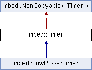

# Timer

Timer class hierarchy

Use the Timer interface to create, start, stop and read a stopwatch-like timer for measuring precise times (better than millisecond precision).

You can independently create, start and stop any number of Timer objects.

## Warnings and notes

- Timers are based on 64-bit signed microsecond counters, giving a range of over 250,000 years.
- While a Timer is running, deep sleep is blocked to maintain accurate timing. If you don't need microsecond precision, consider using the LowPowerTimer or Kernel::Clock classes instead because these do not block deep sleep mode.

## Timer class reference

## Timer hello, world

