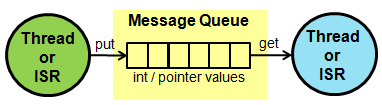

# Queue

<span class="images"><span>Queue class hierarchy</span></span>

A Queue allows you to queue pointers to data from producer threads to consumer threads.

<span class="images"></span>

## Queue class reference

[](https://os.mbed.com/docs/development/mbed-os-api-doxy/classrtos_1_1_queue.html)

## Queue example

```
Queue<message_t, 32> queue;

message_t *message;

queue.put(message);

osEvent evt = queue.get();
if (evt.status == osEventMessage) {
    message_t *message = (message_t*)evt.value.p;
}
```

## Queue and MemoryPool example

This example shows `Queue` and [MemoryPool](memorypool.html) managing measurements.

[](https://github.com/ARMmbed/mbed-os-examples-docs_only/blob/master/APIs_RTOS/Queue/main.cpp)

## Related content

- [MemoryPool](memorypool.html) API reference.
