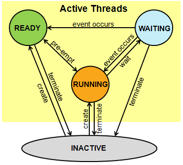

<h1 id="rtos-api">RTOS overview</h1>

The Mbed OS RTOS capabilities include managing objects such as threads, synchronization objects and timers. It also provides interfaces for attaching an application-specific idle hook function, reads the OS tick count and implements functionality to report RTOS errors.

The code of the Mbed RTOS can be found in the [`mbed-os`](https://github.com/ARMmbed/mbed-os) repository, in the [RTOS subdirectory](https://github.com/ARMmbed/mbed-os/blob/master/rtos). See [the Doxygen](https://os.mbed.com/docs/development/mbed-os-api-doxy/group__rtos.html) for more information.

### Memory considerations

Memory for the RTOS primitives is allocated as part of the C++ objects on the stack unless you explicitly use dynamic allocation, in which case it is placed on the heap. Exceptions to this rule are user's thread stacks, which by default are allocated on the heap. You can provide your own memory in the construction if you'd rather not use dynamic memory in your system. For details, please see the [Thread](thread.html) class documentation.

**Note:** Mbed OS overrides the RTX default memory pool approach.

### RTOS Ticker

Platforms using RTOS, including Mbed OS, need a mechanism for counting the time and scheduling tasks. A timer that generates periodic interrupts and is called system tick timer usually does this. Under Mbed OS, we call this mechanism the RTOS ticker.

SysTick is a standard timer available on most Cortex-M cores. Its main purpose is to raise an interrupt with set frequency (usually 1ms). In addition, many Mbed OS platforms
implement timers as part of peripherals. Mbed OS supports using SysTick or the peripheral timers as RTOS ticker.

The Mbed OS platforms uses SysTick as the default RTOS ticker, but if you want to use one of the peripheral timers as your RTOS ticker, you can override the default SysTick timer. For example, see [Low Power Ticker](lowpowerticker.html) on how to use an external low power timer to perform power efficient timing operations that only require millisecond accuracy.

### RTOS APIs

The RTOS APIs handle creation and destruction of threads in Arm Mbed OS 5, as well as mechanisms for safe interthread communication. Threads are a core component of Mbed OS 5 (even your `main` function starts in a thread of its own), so understanding how to work with them is an important part of developing applications for Mbed OS 5.

- [Thread](thread.html): The class that allows defining, creating and controlling parallel tasks.
- [ThisThread](thisthread.html): The class with which you can control the current thread.
- [Mutex](mutex.html): The class used to synchronize the execution of threads.
- [Semaphore](semaphore.html): The class that manages thread access to a pool of shared resources of a certain type.
- [Queue](queue.html): The class that allows you to queue pointers to data from producer threads to consumer threads.
- [EventQueue](eventqueue.html): The class that provides a flexible queue for scheduling events.
- [UserAllocatedEvent](userallocatedevent.html): The class that provides APIs to create and configure static events
- [MemoryPool](memorypool.html): This class that you can use to define and manage fixed-size memory pools
- [Mail](mail.html): The API that provides a queue combined with a memory pool for allocating messages.
- [EventFlags](eventflags.html): An event channel that provides a generic way of notifying other threads about conditions or events. You can call some EventFlags functions from ISR context, and each EventFlags object can support up to 31 flags.
- [Event](event.html): The queue to store events, extract them and execute them later.
- [ConditionVariable](conditionvariable.html): The ConditionVariable class provides a mechanism to safely wait for or signal a single state change. You cannot call ConditionVariable functions from ISR context.
- [Kernel](kernel-interface-functions.html): Kernel namespace implements functions to control or read RTOS information, such as tick count.

#### Default timeouts

The Mbed RTOS API has made the choice of defaulting to `0` timeout (no wait) for the producer methods, and `osWaitForever` (infinite wait) for the consumer methods.

A typical scenario for a producer could be a peripheral triggering an interrupt to notify an event; in the corresponding interrupt service routine you cannot wait (this would deadlock the entire system). On the other side, the consumer could be a background thread waiting for events; in this case the desired default behavior is not using CPU cycles until this event is produced, hence the `osWaitForever`.

**Note**: When calling an RTOS object method in an ISR, all the timeout parameters must be set to 0 (no wait); waiting in ISR is not allowed. 

#### The main() function

The function `main` is a special thread function that is started at system initialization and has the initial priority `osPriorityNormal`; it is the first thread the RTOS schedules.

A `Thread` can be in the following states:

- `Running`: The currently running thread. Only one thread at a time can be in this state.
- `Ready`: Threads that are ready to run. Once the `running` thread has terminated or is `waiting`, the `ready` thread with the highest priority becomes the `running` thread.
- `Waiting`: Threads that are waiting for an event to occur.
- `Inactive`: Threads that are not created or terminated. These threads typically consume no system resources.

#### Signals

Each `Thread` can wait for signals and be notified of events:

#### Status and error codes

The Mbed OS error handling system assigns specific error codes for RTOS-related errors. See [the error handling documentation](../apis/error-handling.html) for more information on RTOS errors reported.
