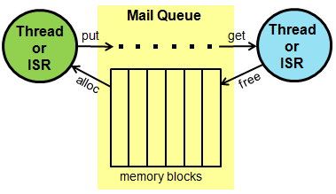

# Mail

Mail class hierarchy

Mail works like a queue, with the added benefit of providing a memory pool for allocating messages (not only pointers).

## Mail class reference

## Mail example

This code uses `mail` to manage measurement.

