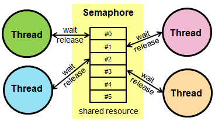

# Semaphore

Semaphore class hierarchy

A semaphore manages thread access to a pool of shared resources of a certain type.

## Semaphore class reference

## Semaphore example

Use Semaphore to protect printf().

