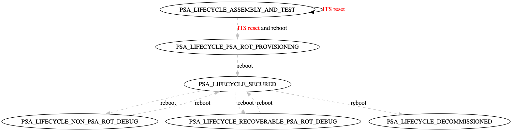

## PSA lifecycle

The PSA lifecycle enables fine-grained control of the target root of trust (RoT).

The following is a state machine depiction of the PSA lifecycle:

 **Note:** PSA Lifecycle is not a standalone feature; it depends on PSA bootloader support, which has not yet been introduced in Mbed OS. The only lifecycle change currently supported is `PSA_LIFECYCLE_ASSEMBLY_AND_TEST` to `PSA_LIFECYCLE_ASSEMBLY_AND_TEST`, which you can use in testing to reset the device RoT state.
All of the lifecycle changes represented by dashed lines in the diagram above have not yet been implemented.

You can specify the lifecycle during build time using the `MBED_CONF_LIFECYCLE_STATE` macro. The default lifecycle value is `PSA_LIFECYCLE_ASSEMBLY_AND_TEST`.

In Mbed OS, the PSA lifecycle is implemented as part of the [platform service](../apis/platform_service.html).

### PSA lifecycle class reference

### Example

### Related content

* [Platform Security Architecture - Firmware Framework](https://pages.arm.com/psa-resources-ff.html).
