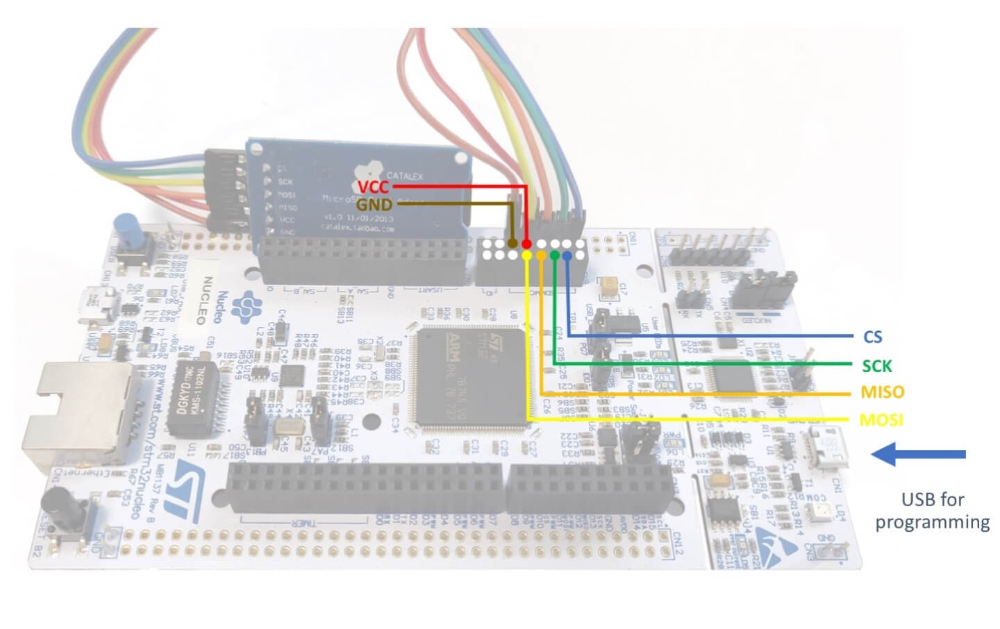

# SDBlockDevice

<span class="images"><span>SDBlockDevice class hierarchy</span></span>

You can use the Mbed OS SD card block device, so applications can read and write data to flash storage cards using the standard POSIX File API programming interface. Applications use the FAT filesystem and SD block device components to persistently store data on SDCards. The SD block device uses the SD card SPI-mode of operation, which is a subset of possible SD card functionality.

To configure this class, please see our [BlockDevice configuration documentation](../apis/data-options-and-config.html).

## How to wire an external SD-card module to a developer board

<span class="images"><span>How to wire an external SD-card module to a developer board</span></span>

1. In `mbed_app.json`, override the SD pin mapping based on the wiring. For example:

   ```
   "sd.SPI_MOSI" : "PC_3",
   "sd.SPI_MISO" : "PC_2",
   "sd.SPI_CLK"  : "PC_7",
   "sd.SPI_CS"   : "PB_9",
   ```

1. Add the `SD` component to `mbed_app.json`:

   ```
   "target.components_add" : ["SD"],
   ```

1. Ensure your micro SD card is plugged in to your device.
1. Connect the device to your computer with a USB cable.

The device appears as removable storage.

<span class="tips">**Tip:** You may need to remove and manually format your micro SD card, flash the binary to the device and then reinsert your micro SD card.</span>

## Mbed OS file system software component stack


    ------------------------
    |                      |
    |    Application       |        // This application uses the POSIX File API
    |                      |        // to read/write data to persistent storage backends.
    ------------------------

    ------------------------        // POSIX File API (ISO).

    ------------------------
    |                      |
    |     libc             |        // The standard c library implementation
    |                      |        // for example, newlib.
    ------------------------

    ------------------------        // sys_xxx equivalent API.

    ------------------------
    |                      |
    |  mbed_retarget.cpp   |        // Target specific mapping layer.
    |                      |
    ------------------------

    ------------------------        // File system Upper Edge API.

    ------------------------
    |                      |
    |     File System      |        // File system wrappers and implementation.
    |                      |
    ------------------------

    ------------------------        // FS Lower Edge API (Block Store Interface).

    ------------------------
    |    Block API         |
    |  Device Block device |        // The SD card block device, for example.
    |  e.g. SDBlockDevice  |
    ------------------------

    ------------------------        // SPI.h interface.

    ------------------------
    |                      |
    |       SPI            |        // SPI subsystem (C++ classes and C-HAL implementation).
    |                      |
    ------------------------

    Figure 1. Mbed OS generic architecture of filesystem software stack.

The figure above shows the Mbed OS software component stack used for data storage on the SD card:

- At the top level is the application component, which uses the standard POSIX File API to read and write application data to persistent storage.
- The newlib standard library (libc) `stdio.h` interface (POSIX File API) implementation is optimized for resource-limited embedded systems.
- `mbed_retarget.cpp` implements the libc backend file OS handlers and maps them to the file system.
- The file system code (hosted in `mbed-os`) is composed of 2 parts: the FAT file system implementation code and the file system classes that present a consistent API to the retarget module for different (third-party) file system implementations.
- The Block API. The SDCard block device is a persistent storage block device.
- The SPI module provides the Mbed OS SPI API.

## Mbed OS `erase` for SDBlockDevice

There is a difference between `erase` as usually defined for SD cards and the definition in Mbed OS: In Mbed OS, `erase` prepares the block device for writing. Because an SD card doesn't need preparation, `erase` is not applicable on SDBlockDevice; it's a no-op operation.

## SDBlockDevice class reference

[](https://os.mbed.com/docs/mbed-os/development/mbed-os-api-doxy/class_s_d_block_device.html)

## SDBlockDevice example application

[](https://github.com/ARMmbed/mbed-os-snippet-SDBlockDevice/blob/v6.6/main.cpp)

## Related content

- [BlockDevice configuration](../apis/data-options-and-config.html).
