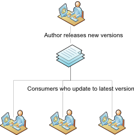
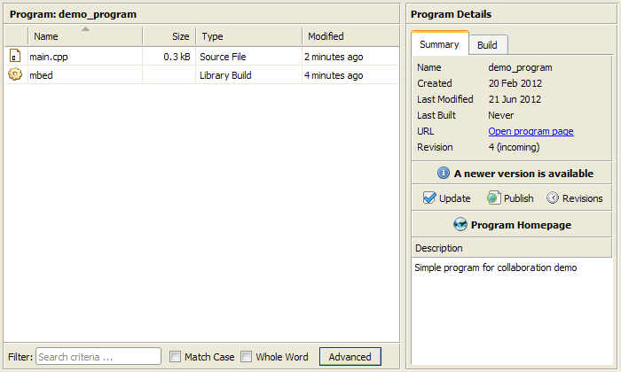
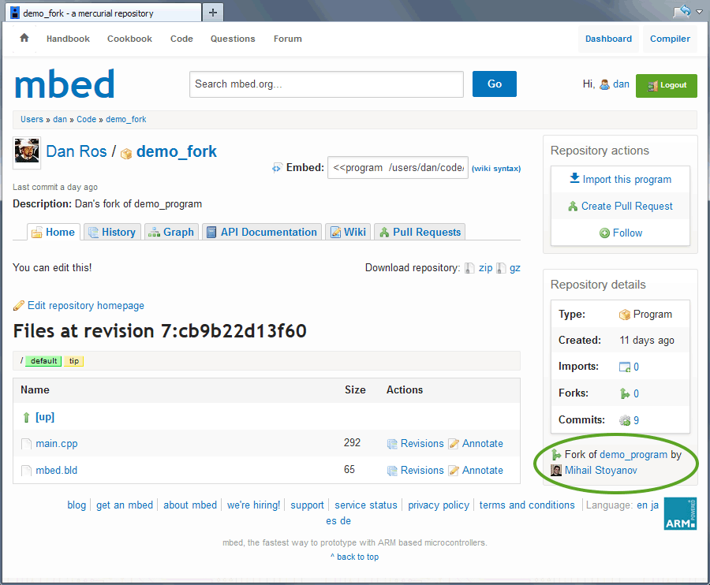
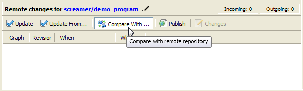

# Collaboration and version control with the mbed Online Compiler

The mbed Online Compiler offers collaboration and version control functions to help the community benefit from and improve individual work.

## Terminology

Remote repository
:	A library or program published on mbed.org.

Local repository
:	A library or program in your private workspace. 

Commit
:	Create a checkpoint within your program's local repository. This does not publish or make it public.

Pull
:	Copy changes from a remote repository to a local repository in your workspace.

Push
:	Copy changes from a local repository to a remote one.

Fork
:	Create a remote repository on mbed.org from an imported local repository (that may also contain local changes and modifications). The fork is created under your profile.

Publish
:	Copy changes from a local repository to an existing remote one (push) or create a new one (fork).

Update
:	Pull from a remote repository and switch your Local repository to the latest revision.

## Basic collaboration

The most basic (and the most popular) usage of the collaboration system is the traditional workflow where one author develops a project, then multiple users import and use it.

When you import a repository, you are making a clone of a public repository in your private workspace. An imported repository can either be a whole program or a library for a program, and can contain dependencies to other repositories. For example, a library may need another library in order to work. All dependencies will be imported for you automatically when you import a repository.

Once imported, the local repository in your workspace will be 'linked' to the remote repository by URL to let you check its status, receive new changes and even contribute code to it.

To import a repository, simply click the Import link on the repository's page on the mbed website, or use the Import button within the mbed Compiler. You can read more about importing on the [mbed Online Compiler page](../dev_tools/online_comp.md).

## Getting updates

While browsing a program or a library, you will receive notifications of new versions in the Browser panel under the Summary tab:

It is also possible to view detailed information about the new changes in the Revisions panel. The top list represents the local repository revisions, where revision numbers marked in green are outgoing revisions, currently not present in the remote repository:

The bottom list represents the remote repository revisions currently not present in your local repository. Just like with local revisions, you can click on revisions in the remote list to see change sets and individual changes per file.

To get the latest version of the code, simply click the **Update** button.

## Forking a repository

When you add changes to an imported repository in your private workspace, you might want to publish them for others to use.

Unless you are the author of the imported repository or have developer access (see [Multiple Authors](mult_auth.md)), you will be forced to fork (or re-publish).

1. Open the context menu of the imported program or library and click **Publish**:

	

1. You are prompted to publish to the linked remote repository:

	

1. As you do not have permission to publish to the repository, click the **Fork...** button:

	

1. Your repository, with all its changes, is published to your profile on the mbed.org website.

The forking process is identical to the [code publishing](publishing_code.md) workflow, with the exception that the forked repository will be recognized as a fork of the original or imported one:

**Note:** When you fork a repository, the local repository in your workspace is linked to the forked remote repository - the URL changes to the forked repository's URL. You can change the URL by clicking the pencil icon next to the URL in the Revisions panel.

**Once the fork is complete you can send a *pull request*, asking the ancestor (imported) repository to pull from your fork. This is covered in the [Pull requests](pull_requests.md) page.**

## Updating from a fork

If someone forks one of your repositories and modifies it, you can easily pull in any changes they have made into your own workspace. 

1. Click the 'Update From ...' button:

	

1. Enter the URL of the published repository you want to pull changes from:

	

1. Click OK. The changes are pulled into your local repository.

**Note:** This won't change the URL of your local repository.

## Comparing with a fork

The Revisions panel lets you compare a local repository with a remote one, if they are 'related'. The term 'related repositories' means that one repository is the ancestor of the other, through direct or indirect relationship (for example, a fork of the fork of the fork).

Comparing repositories doesn't apply any actions or changes to your local repository, so you can safely review the remote revisions without affecting your local work.

To compare the local repository with the remote one:

1. Open the Revisions panel and click the "Compare WIth ..." button on the bottom panel:

	

1. Enter the URL of the Remote repository you want to compare with.

	

1. Click OK. The repositories are compared, and the Revisions panel reflects the comparison mode:

	

You can view the remote changes by clicking on revisions in the bottom (remote) panel. You can then

* Pull individual revision through the **Pull this revision** context menu item, or by dragging and dropping them to the upper (local) panel.
* Pull all changes using the **Pull All** button.
* Pull and switch to the latest revision using the **Update** button as you would normally do in non-comparison mode.
