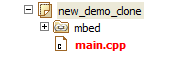

# Multiple authors in the mbed Online Compiler

Repositories on developer.mbed.org are not limited to one author for each repository. Instead, several authors may have the right to publish to the same repository, allowing them to collaborate on a project while other users, who may be interested in using the project's code but are not concerned with the individual authors, can interact with a single repository.

## Adding a new author to your repository

Granting permission for another author to commit to your repository is easy:

1. Go to your repository on the mbed website and click the **Repository Administration** link. 

1. Start typing a username in the **Developers** box to add them to the list:

	

## Day to day usage

The key difference between single-author workflows and multiple-author workflows is the necessity to **merge** the changes made by one author with those made by another author, when they simultaneously commit to a single parent revision.

The following are some common operations you will need to do day to day. You won't necessarily need to do all of them, and not necessarily in the order shown.

### Pulling from the public repository

When there are changes that exist on the public repository but not in your workspace repository, we call them "incoming" changes. The Revisions panel tells you when and what incoming changes are available.

To bring the changes into your own workspace repository, simply click the **Update** button in the Revisions panel for the relevant program or library:

### Merging your changes (if necessary)

If you have not made any commits or changes while your co-author has been working, then no merging will be necessary.

However, if two people have worked at the same time on a program or library, it will be necessary to merge or combine the changes.

When you pull the changes into your workspace, you will see something like this:

The Revisions panel shows one person's changes diverging from another person's changes. This is called *a branch*. 

To join up the two branches, click the **Merge** button. You may need to resolve conflicts, as explained below.

#### Resolve merge conflicts (if needed)

The merge function attempts to combine the changes from one or more branches into a single branch. Often, this will complete without issue.

However, if two or more people have edited the same line of the same file, a merge conflict occurs. That means Mercurial does not know whose changes to keep. It's up to you to decide how the file should really look. This is called *resolving conflicts*.

When a merge conflict occurs, you get a warning. Also, all the files that have conflicts in them are highlighted:

Open the file(s) in conflict and look for something like this:

Wherever there is a conflict, Mercurial annotates the source code with markings showing your changes and other people's changes. You then have to choose one person's version, or blend the two. When you have finished, remove the ``<<<<``, ``>>>`` and ``===`` marks, and save the file. 

The first save of a file after being opened in a conflicted state marks it as resolved and removes the red highlight.

#### Commit the merge

After you merge the code, you have to commit it. This makes the join between two branches permanent. 

Once you commit, your Revisions pane will look something like this:

You can see the two branches coming back together at "merged revision 1 with revision 2".

### Pushing back to the repository

Once all branches and conflicts are resolved and joined back into one, you would typically re-test your program or library. When all tests pass, you can push your changes and the merged result back to the public repository.

To push your changes, simply click the **Publish** button.
