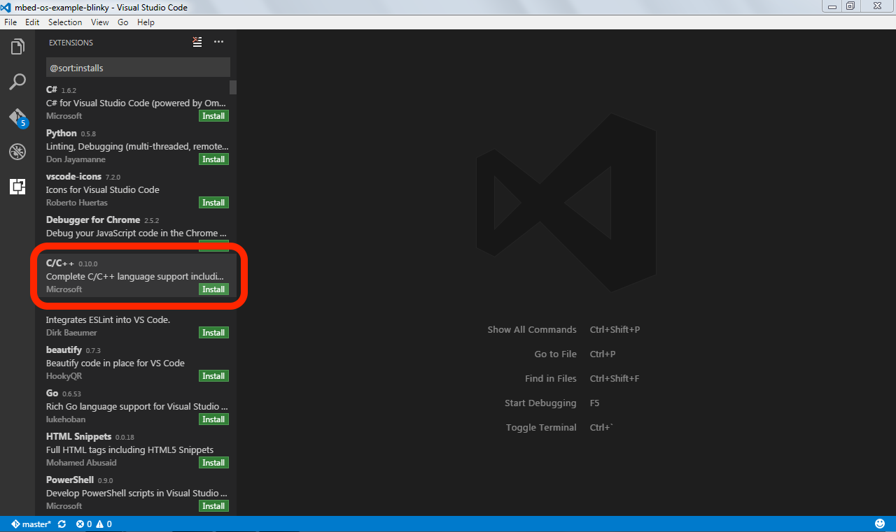
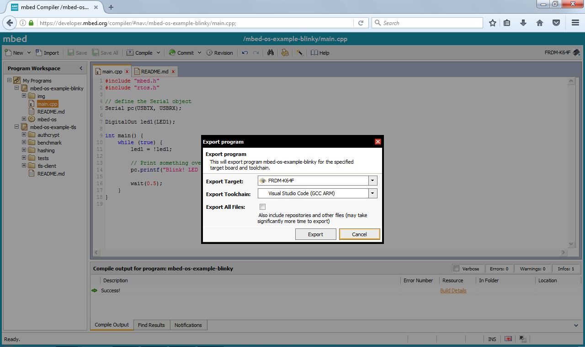
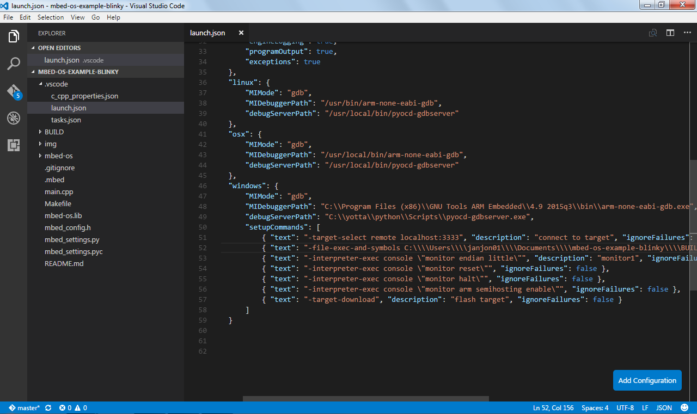
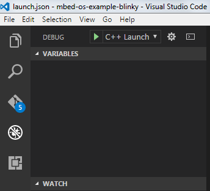
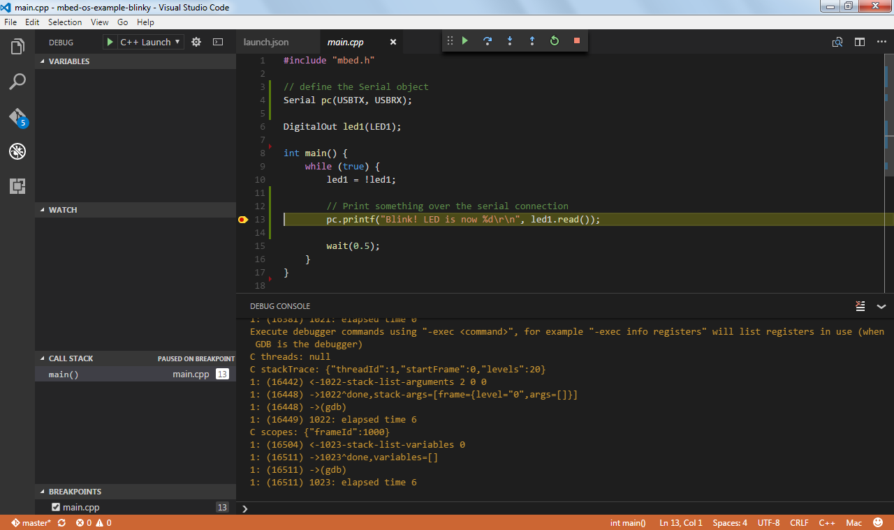

# Visual Studio Code

This document explains how to build and debug Arm Mbed OS applications using Visual Studio Code. Before starting, first [configure your local debug toolchain](../debug-test/setting-up-a-local-debug-toolchain.html).

Also install [GNU Make](https://www.gnu.org/software/make/) or [Mbed CLI](../build-tools/mbed_cli_1) to build the project.

## Installing Visual Studio Code

You need to install Visual Studio Code with the C/C++ extensions to begin.

1. Install [Visual Studio Code](https://code.visualstudio.com).
1. Open Visual Studio Code, and click on the **Extensions** button.
1. Search for the C/C++ plugin (by Microsoft) and click **Install**.

    <span class="images"><span>Installing the C/C++ plugin in Visual Studio Code</span></span>

1. When prompted, restart the IDE.

## Exporting a project

To export your project to Visual Studio Code, you can use either the Online Compiler or Arm Mbed CLI.

### Online Compiler

1. Right click on your project.
1. Select **Export Program...**.
1. Under **Export toolchain**, select **Visual Studio Code (GCC ARM)**.

    <span class="tips">**Tip:** For most targets, you can also export to ARMCC.</span>

1. Click **Export**, and unpack at a convenient location.

    <span class="images"><span>Exporting to Visual Studio Code</span></span>

### Arm Mbed CLI

In your project folder, run:

```
## alternatively, use -i vscode_armc5 for ARMCC, or -i vscode_iar for IAR
## replace K64F with your target board

$ mbed export -i vscode_gcc_arm -m K64F --profile debug
```

## Configuring the debugger

To configure the debugger for your project:

1. Open the folder in Visual Studio Code.
1. Open the `.vscode/launch.json` file.
1. If you're using pyOCD as your debug server, verify that `debugServerPath` is set to the location of `pyocd-gdbserver`.
1. If you're using OpenOCD as your debug server:
     1. Change `debugServerPath` to point to the location of `openocd`.
     1. Change `debugServerArgs` to include your OpenOCD arguments. For more info, read our [toolchain document](../build-tools/third-party-build-tools.html).

    <span class="images"><span>Configuring the debugger</span></span>

<span class="notes">**Note:** If you installed the GNU Arm Embedded Toolchain in a nondefault location (for example, through the Arm Mbed CLI installer), you need to update the `MIDebuggerPath` to the full path of your copy of `arm-none-eabi-gdb`. To find the new path, open a terminal, and run `where arm-none-eabi-gdb` (Windows) or `which arm-none-eabi-gdb` (macOS and Linux).</span>

## Debugging your project

1. On the **Debug** tab, click the **Play** icon.

    <span class="images"><span>Starting the debug session</span></span>

1. The project builds, and debugging starts when the build succeeds.
1. To see warnings or errors, select **View > Problems**.
1. Click on **Debug Console** to see the debug output (this is not activated automatically).

    <span class="images"><span>Running the debugger</span></span>

<span class="tips">**Tip:** You can use the Debug Console to interact with the device over GDB and use functionality the UI does not expose. For example, to see the registers, type `-exec info registers`. To put a watch on a memory location, type `-exec watch *0xdeadbeef`.</span>

## Building with Mbed CLI

Visual Studio Code uses `make` to build your application by default. You can also build with Mbed CLI. To do this:

1. In `.vscode/tasks.json`, replace the four instances of `make` with `mbed`.
1. In `.vscode/tasks.json`, change `args` to:

    ```
    "args": ["compile", "--profile=debug", "-t", "GCC_ARM", "-m", "YOUR_TARGET"],
    ```

1. In `.vscode/launch.json`, replace both instances of `make` with `mbed`.
1. In `.vscode/launch.json`, change `${workspaceRoot}/BUILD/` (twice) to `${workspaceRoot}/BUILD/YOUR_TARGET/GCC_ARM/`.
1. In `.vscode/launch.json`, change `${workspaceRoot}\\BUILD` to `${workspaceRoot}\\BUILD\\YOUR_TARGET\\GCC_ARM`.
