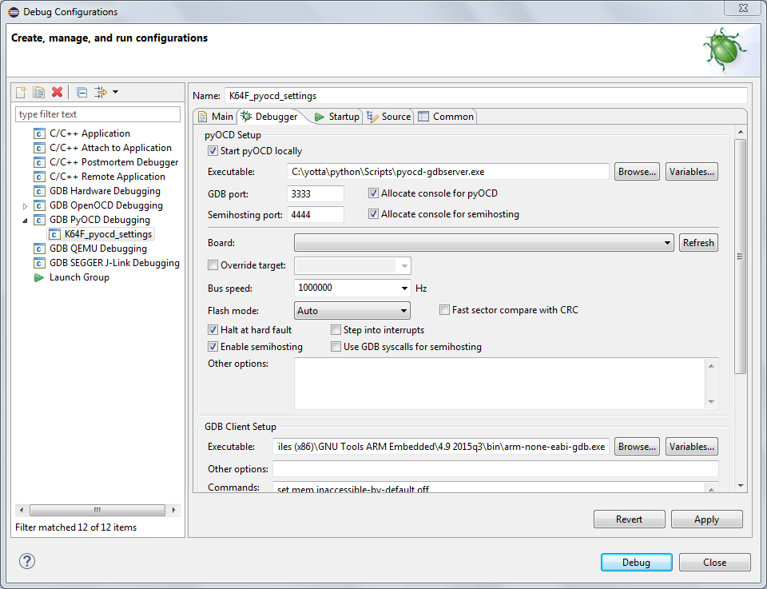

# Debugging mbed OS 5 applications with Eclipse

This document explains how to build and debug mbed OS applications using Eclipse. Before starting, please [configure your local debug toolchain](toolchain.md).

## Installing Eclipse

You need to install Eclipse CDT with the GNU ARM Eclipse plugins to begin:

1. Install [Eclipse IDE for C/C++ Developers](http://www.eclipse.org/downloads/eclipse-packages/).
1. Open Eclipse.
1. Create a workspace directory. This will be separate from your code.
1. Install the GNU ARM Eclipse plugin:
    1. Click the **Help** menu item and select **Install New Software**.
    1. In the **Work with** box, paste the install address, and press Enter: `http://sourceforge.net/projects/gnuarmeclipse/files/Eclipse/updates/`.

    	If this does not work, please see the [GNU ARM Eclipse solutions and workarounds page](http://gnuarmeclipse.github.io/blog/2016/12/02/plugins-install-issue/).
    1. The package **GNU ARM C/C++ Cross Development Tools** appears. Select it.

        
    1. Click **Next** repeatedly, and accept the license agreements.
    1. Click **Finish**. If prompted to restart Eclipse, click **Yes**.

## Exporting a project

To export your project to Eclipse, you can use either the mbed Online Compiler or mbed CLI.

### Online compiler

1. Right click on your project.
1. Select *Export Program...*.
1. Under *Export toolchain*, select *Eclipse (GCC ARM)*.
    * For most targets you can also export to IAR or ARMCC.
1. Click *Export*.
1. Unpack to a convenient location. Make a note of this location for the import step.


### mbed CLI

In your project folder, run:

```
# Replace K64F with your target board
# If you're not using GCC ARM, use -i eclipse_armc5 for ARMCC, or -i eclipse_iar for IAR

$ mbed export -i eclipse_gcc_arm -m K64F --profile mbed-os/tools/profiles/debug.json
```

## Importing the project in Eclipse

1. Open Eclipse.
1. On the *Welcome* screen, select *Import a project with a working Makefile*.
1. Select the folder to which you extracted your mbed OS project.
1. Under *Toolchain for Indexer Settings*, select `<none>`.

    
1. Click *Finish*.
1. Dismiss the Welcome screen.
1. Select *Project > Build Project* to build the project.

<span class="notes">**Note:** If building fails with `make[1]: arm-none-eabi-g++: No such file or directory`, you need to configure Eclipse's PATH (not your OS PATH):

1. In Eclipse, click *Project > Properties > C/C++ Build > Environment*.
1. Click *Add*.
1. Under *Name*, enter `PATH`.
1. Under *Value*, add the location of the GNU ARM Embedded Toolchain. To find it:
    * On Windows, from a CMD window, run `where arm-none-eabi-g++`.
    * On Mac OS and Linux, from a Terminal, run `which arm-none-eabi-g++`.


</span>

Once the project builds, you can configure the debugger. The configuration depends on the debug server you're using: pyOCD or OpenOCD.

### pyOCD

1. Select *Run > Debug Configurations...*.
1. If no configuration exists under *GDB pyOCD Debugging*, click on *New launch configuration*.
1. In the *Main* tab:
    * Under *C/C++ Application*, select the `.elf` file (BUILD/projectname.elf).

    
1. In the *Debugger* tab:
    * Under *pyOCD Setup*, set the *Executable* path to your copy of `pyocd-gdbserver`.
    * Under *GDB Server Setup*, set the *Executable* path to your copy of `arm-none-eabi-gdb`.
    * If you cannot see the *GDB Server Setup* section, the scrollbar might be hidden; switch tabs to make the scrollbar reappear.

    
1. Click *Apply*.
1. Click *Debug* to start debugging.

### OpenOCD

1. Select *Run > Debug Configurations...*.
1. If a configuration already exists under *GDB pyOCD Debugging*, please remove it.
1. If no configuration exists under *GDB OpenOCD Debugging*, click on *New launch configuration*.
1. In the *Main* tab:
    * Select the `.elf` file (BUILD/projectname.elf) under *C/C++ Application*.

    
1. In the *Debugger* tab:
    * Under *OpenOCD Setup*, set the *Executable* path to your copy of `openocd`.
    * Under *OpenOCD Setup*, set the *Config options* to the setup options from the [Configure your local debug toolchain](toolchain.md) guide.
    *  Under *GDB Client Setup*, set the *Executable* path to your copy of `arm-none-eabi-gdb`.
    * If you cannot see the *GDB Server Setup* section, the scrollbar might be hidden; switch tabs to make the scrollbar reappear.

    
1. Click *Apply*.
1. Click *Debug* to start debugging.


## Building with mbed CLI

We build using Make, but you can also use mbed CLI for building from Eclipse:

1. Go to *Project > Properties > C/C++ Build*.
1. Remove the check *Use default build command*.
1. Set *Build command* to `mbed`.
1. Under *Behavior* > *Build (Incremental build)*, select your mbed CLI build options. For example: `compile -m K64F -t GCC_ARM --profile ${CWD}mbed-os/tools/profiles/debug.json`.
1. Make sure to update the paths to the `.elf` file in your debug configuration.
