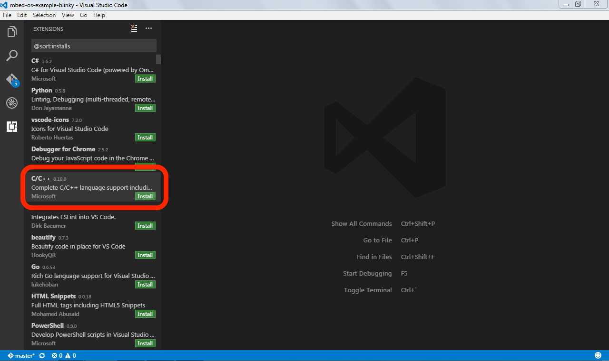
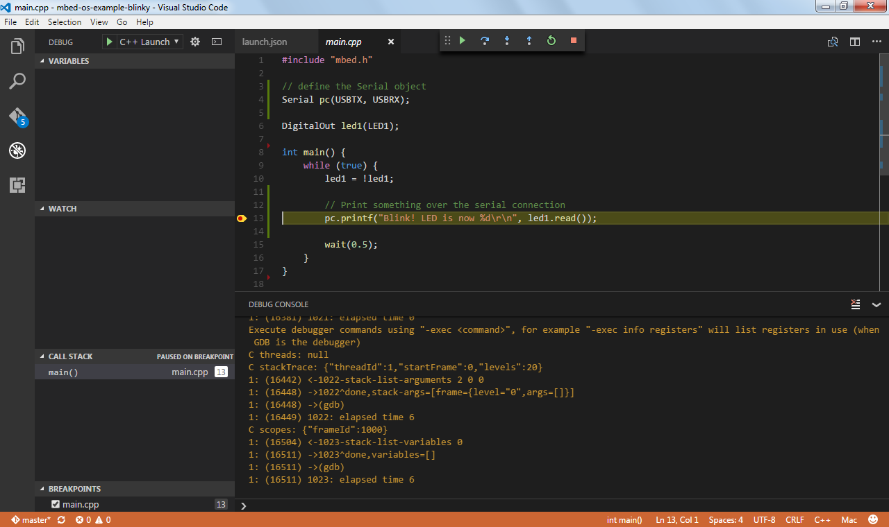

# Debugging mbed OS applications with Visual Studio Code

This document explains how to build and debug mbed OS applications using Visual Studio Code. Before starting, first [configure your local debug toolchain](toolchain.md).

## Installing Visual Studio Code

You need to install Visual Studio Code with the C/C++ extensions to begin.

1. Install [Visual Studio Code](https://code.visualstudio.com).
1. Open Visual Studio Code, and click on the `Extensions` button.
1. Search for the C/C++ plugin (by Microsoft) and click *Install*.

    

1. When prompted, restart the IDE.

## Exporting a project

To export your project to Visual Studio Code, you can use either the Online Compiler or mbed CLI.

### Online Compiler

1. Right click on your project.
1. Select *Export Program...*.
1. Under 'Export toolchain', select *Visual Studio Code (GCC ARM)*.
    * For most targets, you can also export to IAR or ARMCC.
1. Click *Export*, and unpack at a convenient location.


### mbed CLI

In your project folder, run:

```
# alternatively, use -i vscode_armc5 for ARMCC, or -i vscode_iar for IAR
# replace K64F with your target board

$ mbed export -i vscode_gcc_arm -m K64F --profile mbed-os/tools/profiles/debug.json
```

## Configuring the debugger

To configure the debugger for your project:

1. Open the folder in Visual Studio Code.
1. Open the '.vscode/launch.json' file, and verify that `MIDebuggerPath` is set to the location of your copy of `arm-none-eabi-gdb`. (This needs to be an absolute path).
1. If you're using pyOCD as your debug server, verify that `debugServerPath` is set to the location of `pyocd-gdbserver`.
1. If you're using OpenOCD as your debug server:
     1. Change `debugServerPath` to point to the location of `openocd`.
     1. Change `debugServerArgs` to include your OpenOCD arguments. For more info, read our [toolchain document](toolchain.md).

<span class="notes">**Note on Windows:** Point the `-file-exec-and-symbols` configuration to the *absolute path* of your .elf file (in the BUILD directory), and escape each `\` four times:

    ```
    C:\\\\Path\\\\to\\\\mbed-os-example-blinky\\\\BUILD\\\\mbed-os-example-blinky.elf
    ```
</span>


## Debugging your project

1. On the 'Debug' tab, click the *Play* icon.

    

1. The project builds, and debugging starts when the build succeeds.
    * To see warnings or errors, select *View > Problems*.
1. Click on the `Debug Console` button to see the debug output. (This is not activated automatically).



<span class="tips">**Tip:** You can use the Debug Console to interact with the device over GDB and use functionality the UI does not expose. For example, to see the registers, type `-exec info registers`. To put a watch on a memory location, type `-exec watch *0xdeadbeef`.</span>
