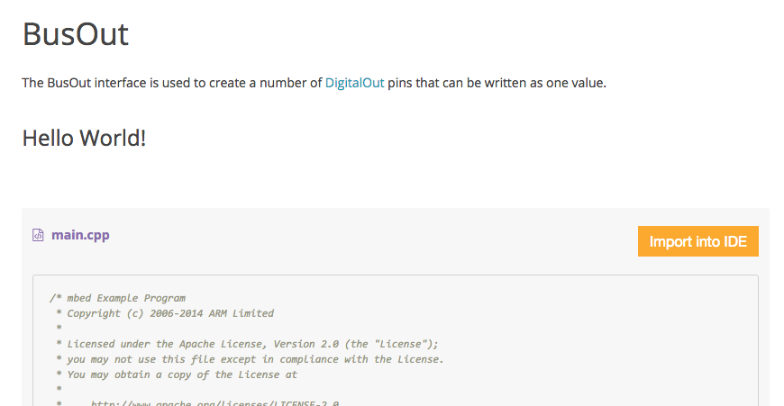
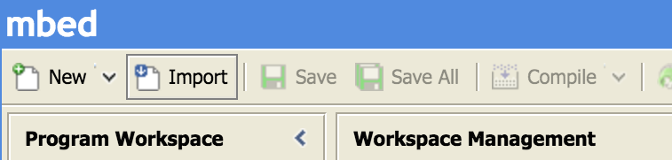
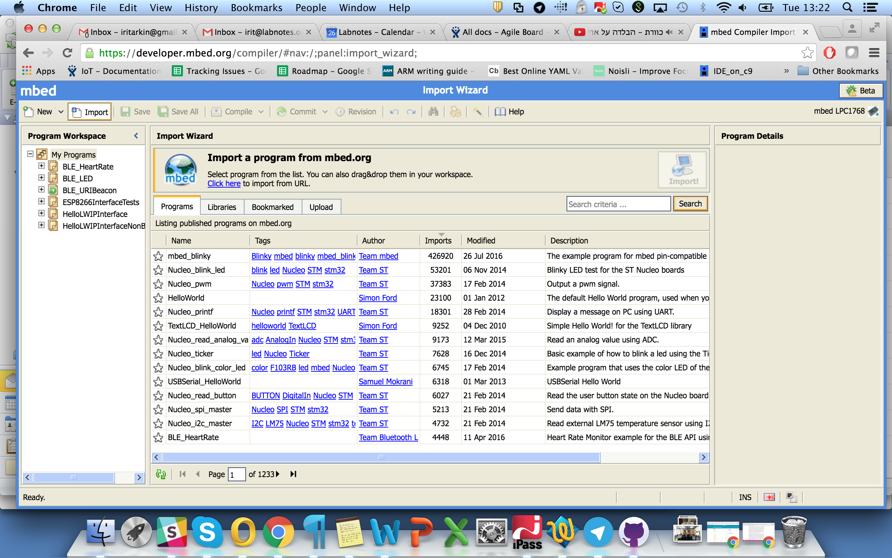
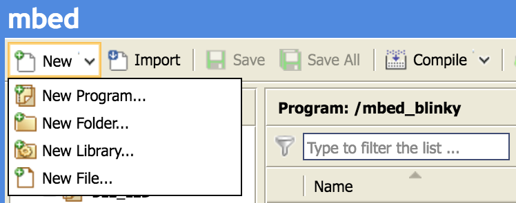
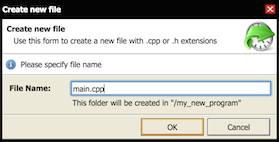
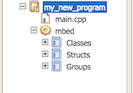

# mbed Online Compiler

The online compiler enables you to either write your code from scratch or import an existing project and modify it to suit your needs. The only thing you need is [an mbed developer account](https://developer.mbed.org/account/signup/).

The compiler is always available on [https://developer.mbed.org/compiler/](https://developer.mbed.org/compiler/).

## Video summary

## Importing code to the compiler

There are two methods of importing the code into the online compiler: directly from a program presented on the site, or using the compiler’s Import button:

1. Directly from the site: wherever you see a program on the site, you should see an **Import into mbed IDE** button:
	
	Most code snippets on the site can be directly imported

	Clicking that button will take you to the compiler; you can then give the program a new name and import it to your workspace:

	Importing to the mbed Online Compiler

1. The compiler's Import button: click the **Import** button in the compiler to open the Import Wizard:

	Triggering the Import Wizard from within the mbed Online Compiler

	You can search for a program by name, or perform an empty search to show all available programs:

	The applications list

	Double click a program to import it.

## Creating a new program 

1. From the **New** menu, select **New Program**:

	The applications listTriggering a new program

1. The **Create new program** pop-up opens.
	1. Select your platform (board). 
	1. You can create from an existing template or from an empty program.
	1. Enter a unique name.

	Creating a new program

1. Create a ``main.cpp`` file in your program:
	1. Right click on the program and select **New File...**. The **Create new file** pop-up opens. If you created from an existing template, this file already exists.

		Adding a file

	1. Enter ``main.cpp`` as the file name.

		Naming the new file

1. Import the mbed OS library, so you can build your program with the mbed OS codebase:
	1. Click **Import**. The Import Wizard opens.
	1. Go to the Libraries tab and search for "mbed", or perform an empty search to show all libraries:

		Searching for mbed OS

	1. Double click on "mbed" to import it. The library is added to your program.

		mbed OS is now in the workspace

## Getting your program on your board

The mbed Online Compiler builds a file that can run on your board. All you need to do is:

1. Select the correct board.
1. Compile the code and download the compiled file.
1. Copy the file to your board.

### Selecting your board

mbed programs can be built to run on multiple boards. The hard work is done behind the scenes by mbed OS itself. All you need to do is tell the mbed Online Compiler which board you're building for.

To select a board as the build target:

1. The compiler shows the current build board's name on the upper right corner:

	Showing current board. Click the board to open the full list

1. Click the name of the board you need:

	Click a board to set it as the compilation board

	If the board isn't already on your list, go to the board's page on mbed.com and click the **Add to your mbed Compiler** button:

	Adding a board to the mbed Online Compiler list

###  Compile and download

The **Compile** menu offers five options:

1. **Compile:** builds your code and downloads a binary file. Current program only.
1. **Compile All:** same as *compile*, but for all programs.
1. **Build Only:** compiles your code but doesn't download the result.
1. **Compile Macros:** defines additional macros at compile time.
1. **Update Docs**: see the [guide for documenting APIs](https://docs.mbed.com/docs/mbed-os-api-reference/en/5.1/APIs/API_Documentation/).

### Copying the file to the board

**Note:** If you're working on Windows, you might need to install a driver to allow you to copy to your board. Please see the [Windows Serial Driver section](../getting_started/what_need.md#windows-serial-driver).

Your board should appear on your computer as removable storage. To run your program on the board, simply drag and drop the file you downloaded in the previous section. 

The device appears as removable storage, under the name MBED

## Keyboard shortcuts

### Navigation

| Shortcut   | Description                                       |
|------------|---------------------------------------------------|
| Hold Ctrl  | Interactive mode                                  |
| Shift + Home | Select from current position to beginning of line |
| Shift + End  | Select from current position to end of line       |
| Ctrl + Home  | Go to beginning of file                           |
| Ctrl + End   | Go to end of file                                 |
| Ctrl + Shift + Home | Select from current position to beginning of file |
| Ctrl + Shift + End | Select from current position to end of file  |
| Shift + Page Up  | Select from current position up one page |
| Shift + Page Down | Select from current position down one page |
| Shift + any arrow  | Extend or reduce text selection |
| Ctrl + left arrow  | Go to beginning of current or previous word |
| Ctrl + right arrow   | Go to beginning of the next word |
| Ctrl + up arrow | Scroll up one row |
| Ctrl + down arrow | Scroll down one row |                            

### Ctrl key sequences

| Shortcut   | Description                                       |
|------------|---------------------------------------------------|
| Ctrl + A  | Select all                                  |
| Ctrl + B | Compile only (no download prompt) |
| Ctrl + Shift + B | Compile all and download |
| Ctrl + C | Copy (only selected text) |
| Ctrl + Shift + C | Commit |
| Ctrl + D | Compile and download |
| Ctrl + Shift + D | Duplicate line |
| Ctrl + E | Erase current line |
| Ctrl + F | Find and replace |
| Ctrl + Alt + F | Find in files |
| Ctrl + Shift + F | Format code (selected text or current file) | 
| Ctrl + H | Find and replace |
| Ctrl + K | Find and replace | 
| Ctrl + L | Change selected text to lower case |
| Ctrl + R | Current file's revision history (must be in single file mode) |
| Ctrl + S | Save current file |
| Ctrl + Alt + S | Save as |
| Ctrl + Shift + S | Save all |
| Ctrl + U| Change select text to upper case |
| Ctrl + V | Paste text from clipboard |
| Ctrl + W | Close current file (doesn't work on Chrome) |
| Ctrl + Shift + W | Close all (doesn't work on Chrome) |
| Ctrl + X | Cut selected text |
| Ctrl + Y | Redo |
| Ctrl + Z | Undo |
| Ctrl + / | Toggle line comment (using slashes) |
| Ctrl + Shift + / | Toggle block comment (using /* ... */)| 

### Misc

| Shortcut   | Description                                       |
|------------|---------------------------------------------------|
| Tab  | Increase text indent                                  |
| Shift + Tab | Decrease text indent |
| Esc | Close find or toggle editor area full screen |
| Ins | Toggle insert mode |
| Ctrl + Ins | Copy selected text |
| Shift + Ins | Paste text from clipboard |
| Shift + Del | Delete selected text |
| F8| Compile only (no download prompt) |
| F9 | Compile and download |
| F10 | Compile all and download |

### Touch device shortcuts

#### Editor

| Shortcut   | Description                                       |
|------------|---------------------------------------------------|
| Single tap  | Move the cursor                                |
| Double tap | Text selection on the tapped word (opens context menu) |
| Triple tap | Text selection on the tapped row (opens context menu) |
| Hold | Context menu |
| Touch + drag | Text selection until the touch is released (opens context menu) |

#### Compiler IDE

| Shortcut   | Description                                       |
|------------|---------------------------------------------------|
| Single tap  | Equivalent to single mouse click  |
| Double tap |  Equivalent to double mouse click  |
| Hold |  Equivalent to right click (opens context menu) |
| Touch + drag | Equivalent to mouse dragging |
