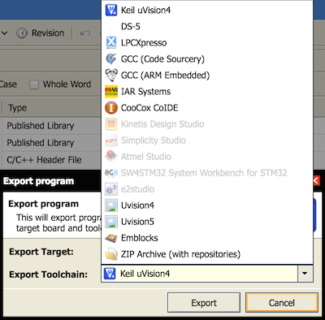

# Exporting to third party Toolchains

If you'd like to develop on mbed OS with a third party tool, or migrate to one, you can choose to export an mbed project to the following development environments:

* Keil uVision5.
* IAR Systems.
* Make using:
  * GCC (ARM Embedded).
  * ARM Compiler 5.
  * IAR ARM Compiler.
* Eclipse CDT using:
  * GCC (ARM Embedded).
  * ARM Compiler 5.
  * IAR ARM Compiler.
* DS-5.
* LPCXpresso.
* Kinetis Design Studio.
* Simplicity Studio.
* Atmel Studio.
* SW4STM32 System Workbench for STM32.
* CooCox CoIDE.
* e2studio.
* Emblocks.

This may be useful to launch a debug session with your favorite tool while using mbed CLI for development, or creating examples or projects you work on within your tool of choice. 

## Exporting from mbed CLI

mbed CLI currently supports exporting to all of the development environments mentioned above by using the ``export`` command.

For example, to export to uVision5 with the K64F target run:

	$ mbed export -i uvision5 -m K64F

A `*.uvproj` file is created in the root folder of the project. 
You can open this project file with uVision5.

## Exporting from the mbed Online Compiler

The mbed Online Compiler has a built-in export mechanism that supports the same development environments as mbed CLI:

1. Right click on a project you want to export.

1. Click **Export Program.** The **Export Program** window opens.

	Triggering an export

1. From the **Export Target** drop-down list, select your board.

	Selecting a target board

1. From the **Export Toolchain** drop down list, select your development environment.

	Selecting a toolchain

1. The export process generates a ZIP archive with a project file matching your selected development environment. 

Follow your toolchain's import or project creation process to begin working there.

## Before you export

Changing the compiler toolchain introduces many degrees of freedom in the system. The differences include how the compiler translates C/C++ code to assembly code, the link time optimizations, changing implementations of the C standard libraries and differences caused by changing compile and link options.

Although we support exporting your project and libraries to an alternate toolchain, we cannot guarantee the same consistency as using the mbed Online Compiler.

We will do our best to maintain the exported libraries and project files, but please understand we cannot cover all cases and combinations, or provide support for use of these alternative tools themselves.

## Third party tool notes

### Make and Eclipse (GCC ARM Embedded, IAR Compiler, ARM Compiler 5)

**Note:** Our Eclipse CDT projects use Makefile. Therefore, Makefile advice also applies to using Eclipse.

> "[GNU Make](http://www.gnu.org/software/make/) is a tool which controls the generation of executables and other non-source files of a program from the program's source files."
> 
>(Taken verbatim from the GNU Make website).

Make itself does not compile source code. It relies on a compiler such as:

* [GCC ARM Embedded](https://launchpad.net/gcc-arm-embedded), which can be installed for free using the instructions found [here](http://gnuarmeclipse.livius.net/blog/toolchain-install/). Please note that the current Makefile requires that you add your compiler to your PATH variable. This contradicts the instruction given on the installation website, because those instructions are intended for Eclipse, not Make.
* The IAR ARM compiler bundled with the IAR Embedded Workbench.
* ARM Compiler 5.

**Note:** As stated above, you should ensure that the compiler you are exporting to is accessible using your `PATH` environment variable, as Makefile requires this. For example, when using an exported Makefile from make_armc5, the command `armcc` should print a help message about how to use ARM Compiler 5.

#### Make and Eclipse on Windows: Nordic platforms using SoftDevices
	
Make and Eclipse exports targeting Nordic devices require the [Nordic nrf51_SDK](http://developer.nordicsemi.com/nRF51_SDK/nRF51_SDK_v6.x.x/nrf51_sdk_v6_1_0_b2ec2e6.msi) on Windows. 
Please download and install it.

#### Make and Eclipse on Linux and Mac OS X: Nordic platforms using SoftDevices
	
Make and Eclipse exports on POSIX-like operating systems targeting Nordic devices require the `srec_cat` executable from the [sRecord](http://srecord.sourceforge.net) package. It may be available from your package manager (such as apt-get or Brew). 

### Kinetis Design Studio (Freescale KDS) with GCC ARM Embedded

Freescale KDS now ships with the GCC ARM Embedded toolchain. You may need to update a linker flag depending on the version of tools installed. 

1. Press **Alt + Enter** or **Option** + **Enter**. The **C++ Build** dialog box opens.
1. In **Settings**, select **Tool Settings**.
1. Any file extension that is ``.s`` needs to be changed to ``.S`` (lowercase to uppercase):
	
	__KDS >= 3.0__

	``-specs=nosys.specs``

	__KDS < 3.0__

	``-nanolibc``

### Atmel Studio

The mbed libraries contain CMSIS startup files. 

When importing an mbed project into [Atmel Studio](http://www.atmel.com/Microsite/atmel-studio/), you must un-check the **migrate to current infrastructure** box.

### Simplicity Studio

We have more information about Simplicity Studio [in a stand-alone guide](https://docs.mbed.com/docs/third-party-integrations/en/latest/Simp_Stu/simp_stu/).
