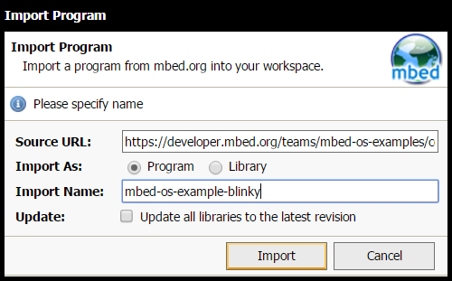
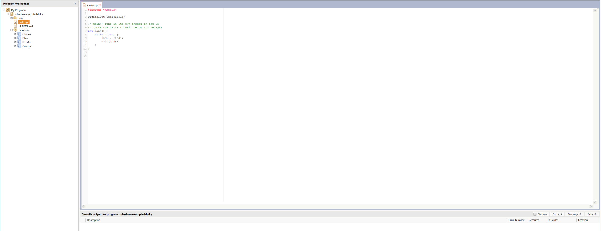
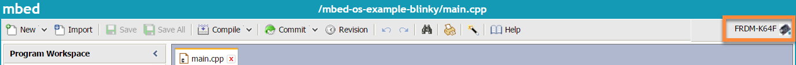
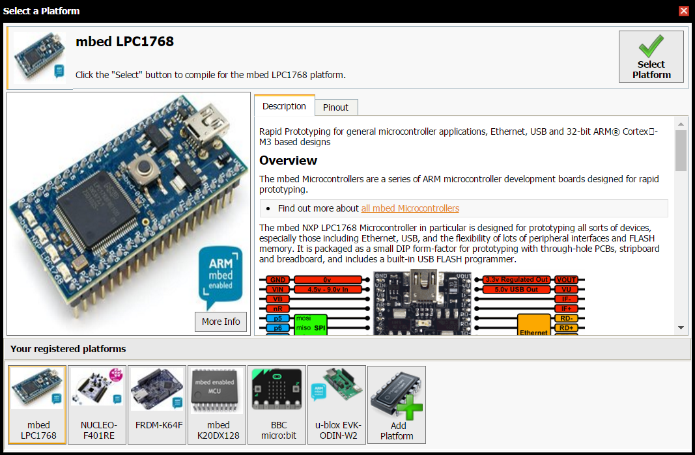
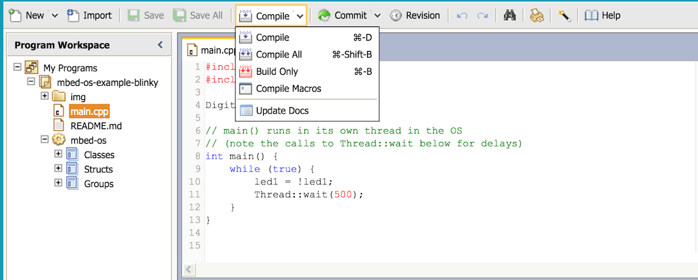
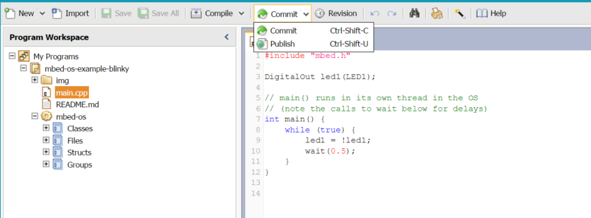

# Blinky on the mbed Online Compiler

Please create a [developer account](https://developer.mbed.org/account/signup/). It's free, and we don't spam.
 
## Importing Blinky

To get Blinky into the mbed Online Compiler, click the **Import into mbed IDE** button below:

Importing Blinky

The import mechanism offers a default name, but you're free to change it. When you're done, click **Import**.

## Viewing Blinky

The imported Blinky has two interesting parts:

* ``main.cpp``, where the Blinky-specific code is. You can double-click the file in the navigation pane on the left to view the code.
* ``mbed-os``, where the mbed OS codebase is.

Later we'll compile the code; this will take both of these parts and create a single application file from them.

Viewing the code in main.cpp

## Selecting a target board

The mbed Online Compiler can build your application to match any mbed Enabled board. However, you have to select the target before compiling.

### Adding a board to your list

To add a board to your list, go to the board's page on mbed.com, and click the **Add to your mbed Compiler** button:

Adding a board to the mbed Online Compiler's board list

### Selecting a board

The compiler shows the current build board's name on the upper right corner:

Opening the list of boards

Click the name to change your board as needed:

Selecting a board

## Compile and install

The mbed Online Compiler builds a ``.bin`` file that you can install on your board.

1. Click **Compile**.

	The Compile menu; choose Compile to build and download your application

1. The program compiles:

	Compilation progress

1. When the compiled file is ready, it's downloaded to your default download location (or opens a Download dialog box). The file format is ``.bin``, and the file  name is the same as your program name.

1. Connect your board to your computer over USB. mbed boards are shown as "removable storage".

	The device is listed as "MBED", and its type is removable storage

1. Drag and drop your program to the board. 

1. The board installs the program and then runs it. You should see the LED blink.

