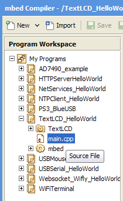
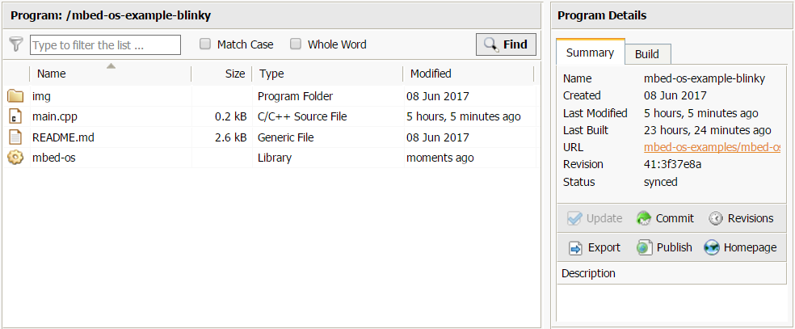
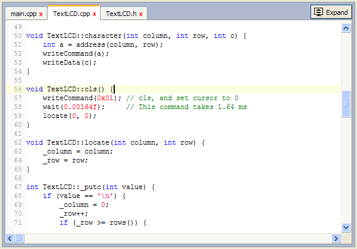
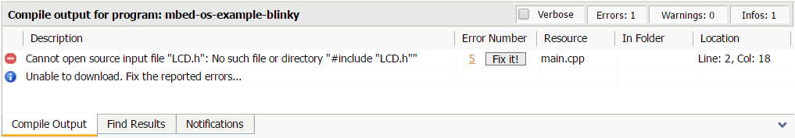
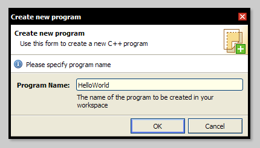

# Getting Started on the Online Compiler

The mbed Online Compiler delivers a full online editor, standard keyboard shortcuts, flexible workspace management and version control optimized for the mbed ecosystem.

This article reviews the basics of interacting and creating and maintaining code in your workspace.

## Interface basics
The mbed Online Compiler interface consists of five key components - [main toolbar](#main-toolbar), [navigation tree](#navigation-tree), [browser panel](#browser-panel), [editor](/#editor) and [output panel](#output-panel).

### Main toolbar
The buttons on the main toolbar are accessible at all times though they may not always be active because their state depends on the current context or current task. For example, when you're browsing a program, a folder or a library, the "Undo", "Redo", "Print" and "Format Code" buttons won't be active because their function is relative to text editing. Therefore, you must select a file in the navigation tree for them to be active. Similarly, selecting "My Programs" in the navigation tree disables "Compile", "Commit", "Revision History" and other buttons. "My Programs" is your workspace root. Thus, you can't complete these tasks on it. If unsure of the context you are currently working on, you can always look at the top blue bar that shows your location.

Most of the main toolbar buttons have a keyboard [shortcut](/online_comp.md#keyboard-shortcuts), which saves a mouse click or two. Some buttons have a dropdown menu with similar or related functions. For example, there are several ways to compile under "Compile" and different new items under "New".

When you edit a file, the main toolbar looks like the image below.

Viewing the main toolbar

On the right side of the main toolbar is the device selection dropdown, which lets you change the device you are compiling for. The mbed Online Compiler help guide is accessible through the top-right Help button or via the F1 keyboard shortcut.

### Navigation tree
The navigation tree defines the context you are working on and lets you browse your workspace.

Viewing main.cpp in the navigation tree

If you have selected "My Workspace", a program, a folder or a library in the navigation tree, then browse mode is active via the browser panel, and you can maintain and control various aspects of the selected item. (See [browser panel](/handbook/mbed-Compiler-Getting-Started#browser-panel).)

Selecting a file activates editing mode and opens the editor, showing you the contents of that file and other opened files, presented as editor tabs. (See [editor](/handbook/mbed-Compiler-Getting-Started#editor).)

The navigation tree allows you to invoke item-specific functions via mouse context menu or via keyboard [shortcut](/online_comp.mds#keyboard-shortcuts). Additionally, it has complete drag and drop support, so you can drag and drop between navigation tree items, drag and drop navigation tree items to and from the browser panel and even HTML5-driven features such as dragging and dropping files from your operating system file manager inside the navigation tree, effectively importing them in your workspace.

### Browser panel
The browser panel is active when a nonfile is selected in the navigation tree and consists of two subpanels - browse list and sidebar.

Viewing the browse list and sidebar in the browser panel

The **browse list** is tightly related to the navigation tree selection as being flat, single-level, nonrecursive representation of the contents of the currently selected item (or context), showing extended information such as size, type and time since modification, similar to that of desktop operating systems. You can sort the browse list by the column headers and filter them through the Filter field at the top. 

A key feature of the browse list is the ability to manipulate single and multiple items using mouse context menu functions, keyboard shortcuts and mouse drag and drop. To complete a multiselection, you have to either use combo Shift/Ctrl+Mouse-Click or use drag-select gesture outside the list, similar to that of desktop operating systems. A multiselection has a different mouse context menu to reflect the selection, though keyboard shortcuts and drag and drop functionality remain the same.

Similar to the [navigation tree](/handbook/mbed-Compiler-Getting-Started#navigation-tree), the browse list allows HTML5 drag and drop upload of files and zip archives. Because you can't upload just anywhere in your workspace and the uploaded files exist under the browse list parent, we recommend you use the navigation tree instead.

The **sidebar panel** has two tabs - Summary and Build. The **Summary** tab offers extended information about program or library creation date, last modified date, tags and description. It also includes [collaboration](/handbook/Collaboration)-related information, such as public repository URL and ability to update and publish to and from the public repository. The **Build** tab is essential for successfully built programs. It offers valuable statistics about the Flash and RAM usage.

### Editor
The editor is the main tool of the mbed Online Compiler. It's a fully featured, lightweight code editor that uses high standard syntax highlighting, keyboard [shortcuts](/online_comp.mds#keyboard-shortcuts) and undo and redo operations. It's also compliant with all major browsers' cut, copy and paste text operations, so you can inject and extract code between your host operating system and the mbed editor.

Viewing an overview of the editor tool in the Online Compiler

The editor features include:
 * Standard C/C++ syntax highlighting.
 * Python, Lua, JavaScript, XML, HTML, CSS syntax highlighting.
 * Unlimited undo/redo operations buffer.
 * Compliant clipboard text operations - cut, copy and paste.
 * "Artistic Style" code formatting for text selections or whole file.
 * Find text with case, word and regular expression matching.
 * Find in Files with filtering capabilities.
 * Mouse, keyboard, [touch or tap](/handbook/Guide-to-mbed-Compiler-on-tablet-device) navigation.
 * Text selection block comment and code indention manipulation.
 * UTF-8/Unicode base encoding.
 * Print-friendly code preview.

Additionally, you can explore the editor [shortcuts and controls](/online_comp.md#keyboard-shortcuts) section, where you can find more information on shortcuts and hidden functions.

### Output panel
The output panel is under the editor (or browser panel), and its main purpose is to display the output of the ARMCC compile engine when you decide to compile code. 

A typical compile error looks like the image below:

Viewing a compiler output error

If you click the number under the "Error Number" column, a wiki page opens with more information about the compile error or warning. You can also double-click the text under "Location" and open the source file at the line or column of the definition.

The output panel also displays results for the "Find in Folder" functionality. Having the find result under the editor lets you quickly switch between matches in different files.

## Create your first program

From the main toolbar, click the `New` button, and select your target platform. Choose a starter template from the drop-down list, or select `Empty Program` to create a blank project. Complete the `Program Name` field like in the image below.

Creating a new program

Once you click "OK", the program is created in your workspace, and the mbed Online Compiler automatically opens it.

If you chose to create your new program using a starter template, the program is not empty. It contains two items - a `main.cpp` file and the mbed OS library. This is because the mbed OS library is applicable for every project based on an mbed hardware board. Additionally, the `main.cpp` file is the main file for every program. 

If you chose to create your new program with the `Empty Program` template, the program is empty. You need to create a `main.cpp` file and import the latest version of mbed OS to initialize your project. To import mbed OS into your project, right-click on your program's name, and hover over `Import Library...`. Then select `From URL ...`. Copy and paste the link to the mbed OS GitHub repository [https://github.com/ARMmbed/mbed-os/](https://github.com/ARMmbed/mbed-os/) into the `Source URL` field like in the image below. Then click `Import`.

Importing the latest version of mbed OS
