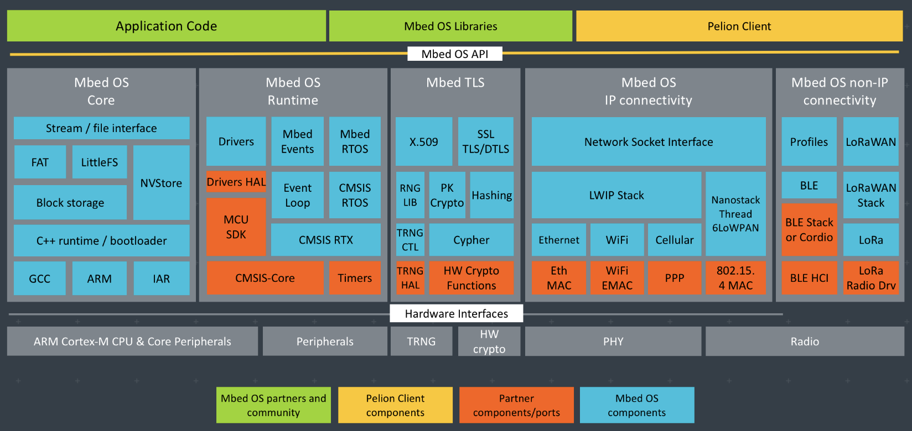

# An introduction to Arm Mbed OS 6

Mbed OS is an open-source operating system for platforms using Arm microcontrollers designed specifically for Internet of Things (IoT) devices: low-powered, constrained devices that need to connect to the internet. Mbed OS provides an abstraction layer for the microcontrollers it runs on, so that developers can focus on writing C/C++ applications that call functionality available on a range of hardware. Mbed OS applications can be reused on any Mbed-compatible platform.

<section class="row">

  <h2>On this page</h1>
  <ul class="guides-list">
          <ul data-tab-content>
                <li><a href="#getting-started">Getting Started</a></li>
                <li><a href="#licensing">Mbed OS licensing</a></li>
                <li><a href="#architecture">A review of Mbed OS software and related hardware</a></li>
                <li><a href="#tools">Mbed OS tools</a></li>
                <li><a href="#the-docs">An introduction to the documentation</a></li>
                <li><a href="#docs-updates">Recently updated documentation</a></li>
            </ul>
    </ul>

</section>

<h1 id="getting-started">Getting started</h1>

If you want to dive straight in:

- The source code is available on [GitHub](https://github.com/ARMmbed/mbed-os) and on our [release page](https://os.mbed.com/releases/).
- Or [try our quick start](../quick-start/index.html).

<h1 id="licensing">Source code and licensing</h1>

We release Mbed OS under an Apache 2.0 license, so you can confidently use it in commercial and personal projects. For more information about licensing, please see [our licensing documentation](../contributing/license.html).

<h1 id="architecture">Architecture diagram</h1>

This is the basic architecture of an Mbed board:

## Mbed OS foundations

Mbed OS uses a hardware abstraction layer (HAL) to support the most common parts of a microcontroller, such as timers. This foundation facilitates writing applications against a common set of application programming interfaces (APIs); your device automatically includes necessary libraries and driver support for standard MCU peripherals, such as I2C, serial and SPI.

The HAL also serves as the starting point when adding support for new targets or features to existing targets. We work closely with our silicon Partners to port these new features to Mbed Enabled development boards.

Mbed OS has an RTOS core, so it supports deterministic, multithreaded, real-time software execution. The RTOS primitives are always available, allowing drivers and applications to rely on threads, semaphores, mutexes and other RTOS features.

The structure of Mbed OS enables matching applications and storage systems. In other words, where the block level storage options vary and are application dependent, you can choose the file system that best fits your IoT device. The FAT file system - backed by an SD card - provides compatibility with other operating systems, such as Windows, Mac OS or Linux. When high reliability and recovery from power failure are important, it makes sense to use our embedded file system, backed with a (Q)SPI NOR flash chip.

Finally, Mbed OS implements the retargeting layer and boot process integration of each supported toolchain for you, so application development feels similar to C or C++ development for any other operating system.

## Connectivity

Arm works with its Partners to enable Bluetooth Low Energy, NFC, RFID, LoRa, 6LoWPAN-ND, Thread, Wi-SUN, Ethernet, Wi-Fi, cellular and mobile IoT (LPWA) across devices and system architectures running Mbed OS. Mbed OS offers a stable core of existing connectivity technologies. At the same time, it adds modern ones in quarterly feature releases, keeping you informed of industry trends so you can transition to new, innovative solutions that generate business value.

The networking and connectivity stacks are flexible enough to meet the needs of the most demanding IoT device designs, whether a combination of a single chip microcontroller and radio, or multiple chips connected across serial buses. System designers can have confidence in our certified connectivity stacks, such as our certified Thread stack, because of their maturity, interoperability and validated components.

Mbed OS fully supports our Pelion IoT Platform, so you can manage your deployed devices and their data. Together, Mbed OS and Pelion comprise a coherent ecosystem that meets the needs of most production-ready projects.

## Security

The Pelion IoT Platform has built-in security at all levels, stressing both protection against violations and mitigation of their consequences. Alongside hardened cloud services, robust communication stacks and safe firmware updates, Mbed offers two security-specific embedded building blocks: [Arm Mbed TLS](https://www.mbed.com/en/technologies/security/mbed-tls/) and a Secure Partition Manager (SPM) that meets industry best practices as part of Arm’s Platform Security Architecture. Mbed TLS secures communication channels between a device and gateway or server, and the use of a secure partition manager and isolated security domains for trusted system services reduces the attack surface. All together, this provides a unique chip-to-cloud security model, relying on the low-level capabilities the Arm ecosystem silicon Partners provide to secure the data and identity of cloud-connected devices.

Our approach to security is to leverage state-of-the-art industry standard protocols, ciphers and encryption suites following the recommendations from NIST and other related organizations. This gives us access to the latest work by the global security research community, rather than a limited in-house resource.  We regularly verify the results of these efforts with code reviews, penetration exercises and other methods.

## Hardware

Arm, its Partners and the Arm Mbed developer community work together to develop the Mbed OS project. This thriving ecosystem means that Mbed OS includes drivers for a lot of different hardware, so you can concentrate on clean and portable application code.

Broadly speaking, the hardware you can see on our site is of three types:

- **[Modules](https://os.mbed.com/modules/)**: include a microcontroller, IoT centric connectivity and required onboard memory. They are ideal for designing IoT products, from prototyping to mass production. Mbed Enabled Modules have full support for Mbed OS with all available connectivity drivers.
- **[Boards](https://os.mbed.com/platforms/)**: development boards are an inexpensive way to start developing with Mbed OS and other components.
- **[Components](https://os.mbed.com/components/)**: the Component Database hosts reusable libraries for different hardware, middleware and IoT services that you can use with Arm Microcontrollers. These components can be used as building blocks for quickly developing prototypes and products.

<h1 id="tools">Tools</h1>

The Mbed product suite includes the tools you need to work with Mbed OS, whatever your skill level. If you are an experienced developer with a desktop setup, you may prefer working offline with Arm Mbed CLI, our Python-based command-line tool. You can use Mbed CLI with one of three supported toolchains: Arm Compiler 6, GCC and IAR. You can also [export projects](../tools/exporting.html) for other IDEs, such as Keil MDK. Mbed OS includes integration code for each supported toolchain to make it thread safe.

If you prefer to work online, use the Arm Mbed Online Compiler, our online development tool, which lets you write and build applications using a web browser with no additional setup.

You can use our debugging tools, DAPLink and pyOCD, to program and debug many devices. At the end of the development cycle, you can use the Mbed OS validation tools, Greentea and utest, to test your project.

<h1 id="the-docs">The documentation</h1>

This is the technical documentation for Mbed OS. We have three types of documents: references, tutorials and porting guides. Our references are background technical material about our APIs, architecture and runtime execution. Our tutorials are step-by-step instructions that show you how to perform specific tasks and solve problems. Our porting guides show our silicon Partners how to port Mbed OS to their targets.

Please see the following sections of our documentation for more information.

- [APIs](../apis/index.html).
- [Quick start](../quick-start/index.html), a guide to creating your first application.
- [Reference](../reference/index.html), architectural information about our code.
- [Tools](../tools/index.html), reference material about the tools Mbed OS uses.
- [Tutorials](../tutorials/index.html).
- [Going to production](../mbed-os-pelion/going-to-production.html), the process of connecting Mbed OS devices to Pelion Device Management for large-scale production.
- [Contributing](../contributing/index.html), guidelines about contributing to our open-source project.
- [Porting guides](../porting/index.html), for Partners and developers interested in porting targets to Mbed OS.

<h1 id="docs-updates">Recently updated documentation</h1>

- New API references for [BufferedSerial](../apis/bufferedserial.html) and [UnbufferedSerial](../apis/unbufferedserial.html).
- New content about [using small C libraries in Mbed OS bare metal](../reference/using-small-c-libraries.html).
- A guide to [porting a custom board](../porting/porting-a-custom-board.html).
- A porting guide for the [static pin map extension](../porting/static-pinmap-port.html).
- The [UserAllocatedEvent](../apis/userallocatedevent.html) API reference.
