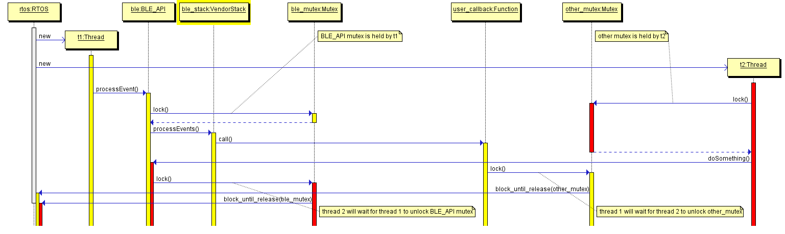
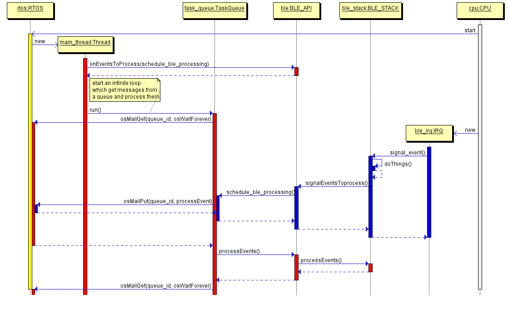
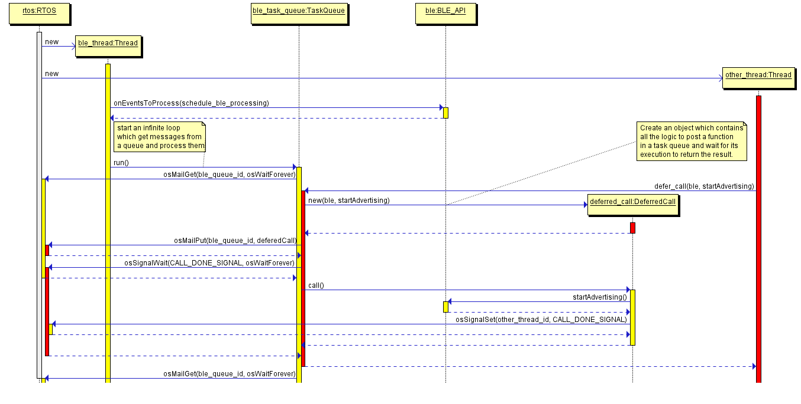
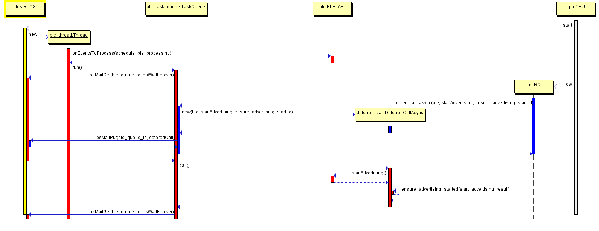

# Porting mbed BLE

This document describes the changes made to mbed BLE for the upcoming version of mbed. Those changes were required for RTOS support.

This Document also explains **in depth** the rationale behind those changes. You can skip directly to the [API changes](#api-changes-in-mbed-os-50) if you are not interested in these rationales.


## Introduction

From a bare-metal system without any kind of scheduling to an asynchronous,
event driven system - mbed has evolved a lot over the course of the last years.
In the next release of mbed OS, [CMSIS-RTOS](http://www.keil.com/pack/doc/CMSIS/RTOS/html/index.html) will be available by default. This 
is a departure from mbed OS 3.0, which used MINAR.

This is a huge change. From a simple (but not simplistic) event driven system mbed
will become a full fledged, more conventional RTOS. It will provide more tools
to mbed users to build systems that meet their needs. From simple systems
driven with an endless loop to complex design with threads or event driven
systems, users will have the freedom to design their system the way they want it.

mbed BLE (but not all its ports) is ready for those big changes made in the core
of the OS.

This document explain all the changes done to mbed BLE to make it ready for RTOS.

## Design Goals

During the history of mbed, mbed BLE has always carefully embraced all core OS
changes. That state-of-mind allows mbed BLE users to run the `ble` module on mbed OS 3 and mbed OS 2.

With or without an event loop; with or without an endless loop; mbed BLE remains
usable on those two systems.

For the RTOS changes, we kept that philosophy in mind.
Big and successful application frameworks like bbc:microbit have already been
released and their code base should not be impacted by mbed core-os changes.

In the meantime, ports of mbed BLE had to be impacted as little as possible by the
changes brought by the new mbed OS release - otherwise ports of mbed BLE will not
support RTOS as quickly as we would like, and people will keep using mbed OS 3 or
mbed OS 2 instead of the latest version of mbed, even if they want to use the
RTOS parts provided by the latest release.  

To summarize the goals that have driven our design process of the RTOS port:

* **Compatibility:** existing applications should still compile and work on existing
platforms (mbed OS and mbed OS 2), as is.
* **Simplicity:** mbed BLE usage should remain as simple as it is right now. RTOS
support should not disrupt existing coding practices, but offer new options to
the ones already available.
* **Availability:** mbed BLE ports should support RTOS as soon as possible. This can
be achieved by keeping changes as simple as possible and localized within the codebase
of the platform ports.

# mbed BLE overview

Before going further, it is important to understand what the architecture of mbed BLE is and how BLE stacks from different vendors work.

## mbed BLE asynchronicity

mbed BLE, like most network stacks, is asynchronous by nature:

* Users have to register callbacks for events they are interested in. The BLE
stack calls the registered handlers when the events occurs.

```text
     User code                                 mbed BLE                      mbed BLE port/stack
   +-----------+                            +------------+                   +--------------+
         |                                        |                                  |
         |     onEventXXX(whenEventXXX)           |                                  |
         +---------------------------------------->                                  |
         \                                        \                                  \
		 \                                        \  processXXXEvent(XXXParams)      \
	     |                                        <----------------------------------+
         |      whenEventXXX(XXXParams)           |                                  |
         <----------------------------------------+                                  |
		 \                                        \                                  \
         \                                        \                                  \		 
		 \                                        \  processXXXEvent(XXXParams)      \
		 |                                        <----------------------------------+
         |      whenEventXXX(XXXParams)           |                                  |
         <----------------------------------------+                                  |         
         |                                        |                                  |
         +                                        +                                  +
```

* BLE operations are never done in a single function call. Instead, the user code
initiates a request by calling a function from mbed BLE, which may need port or stack
specific handling. Later, when the stack emits an event, mbed BLE calls a user
registered callback with the result of the operation.

```text
     User code                                 mbed BLE                      mbed BLE port/stack
   +-----------+                            +------------+                   +--------------+
         |                                        |                                  |
         |   startXXXOperation(whenXXXDone)       |                                  |
         +----------------------------------------> startXXXOperationImplementation()|
         |                                        +---------------------------------->
         |                                        |                                  |
         \                                        \                                  \
		 \                                        \  processXXXEvent(XXXParams)      \
		 |                                        <----------------------------------+
         |        whenXXXdone(XXXParams)          |                                  |
         <----------------------------------------+                                  |  
         |                                        |                                  |
         +                                        +                                  +
```

### Example: Connection

As an example, consider the connection establishment process. A connection always
involves two ends:

* A Central. This is the initiator of the connection.
* A Peripheral. It advertises its availability. It will enter the connection
once a Central connects to it.

In mbed BLE, user code can monitor connection events by registering a callback. When a connection is initiated either by user code or the peer at the other end, the callback is called:
```cpp
// This is the user function called by the BLE stack when the device enters
// a connection.
void whenConnectionEstablished(const Gap::ConnectionCallbackParams_t* params);

// somewhere else in the code ...
// register callback for connection events
BLE::Instance().gap().onConnection(whenConnectionEstablished);
```

For Central, connection is initiated by the device itself:

```cpp
// Initiate a connection request.
// user will be notified of the completion of the operation later; by the
// registered connection callback
ble_error_t err = BLE::Instance().gap().connect(
    peer_address, peer_address_type,
    connection_params,
    scan_params
);
```

For Peripheral, a connection can happen at any time, so long as it is advertising in
a connectable mode:

```cpp
Gap& gap = BLE::Instance().gap();
gap.setAdvertisingType(GapAdvertisingParams::ADV_CONNECTABLE_UNDIRECTED);
// until advertising is stopped, a connection can happen at anytime.
// If the device enter in a connection, the registered connection callback will
// be called.
ble_error_t err = gap.startAdvertising();
```


## Eventing in vendor stacks

BLE vendor stacks do not target a specific OS; they can run with an RTOS,
without an RTOS or with a custom scheduling strategy. Due to that platform
independence, BLE vendor stacks share commonalities regarding event handling:

* BLE stacks often own an internal event queue, which is used to store BLE events
that have to be processed.
* BLE stacks expose an API, which allows user code to process and dispatch stack
events.
* BLE stacks expose a way for signaling user code that the event queue needs
to be processed.


## Thread and execution context safety of vendor stacks

Vendor stacks provide different guarantees for concurrent access from
multiple user threads and access from IRQs:

| Stack                    | Nordic softdevice | Nordic SDK | ST     |
|--------------------------|-------------------|------------|--------|
| Concurrent thread access |        Safe       |   Unsafe   | Unsafe |
| Access from IRQ          |        Safe       |   Unsafe   | Unsafe |

Accessing the stack from an unsafe context can corrupt the stack, which can lead
to undefined behaviors that, in turns, lead to crashes, reset, disconnections or other random behaviours.


Given that mbed BLE is a portable abstraction over several stacks, it makes sense
for mbed BLE to define a common thread safety guarantee for all the ports - otherwise applications will not be portable.

In our case, the less "secure" port (ST) does not provide any thread safety guarantees and can't be used in interrupt context.

It is reasonable to state that it is not safe to access mbed BLE ports from concurrent user threads, and it is not safe to access mbed BLE in IRQ handlers, because those guarantees are not provided by all BLE stacks.

As a result, we can make the following rule: **mbed BLE ports should run in a
single thread of execution; in thread mode.**


## Thread and execution context safety of mbed BLE

mbed BLE keeps different states in memory. Those states are not protected against
concurrent access: modifying these states from different threads can lead to a corruption of the internal data structures of mbed BLE, and reading those states from one thread while modifications occur in another thread may return corrupted data.

The same rule established before should be applied: **mbed BLE ports should run in a
single context of execution in thread operation mode.**


## Eventing in mbed BLE

In its previous version, mbed BLE didn't expose any APIs for event processing.
Instead, every port provided its own logic - depending on whether mbed BLE
is executed on mbed OS 2.0 or mbed OS 3.0.

### mbed OS 2.0

#### Event processing

When mbed BLE is used on mbed OS 2.0, we expect the main function to be an endless loop that goes to sleep by waiting for BLE events:

```cpp
int main(void) {
    // initialization process ...
    while (1) {
        // stuff ...

        // low power wait for event
        ble.waitForEvent();
    }
}
```

Unfortunately, due to the lack of any policy regarding stack event processing, the
function `BLE::waitForEvent` may, for some ports, do much more than what it
should.

For some ports, like the ST port, this function also processes events from the vendor stack, whereas on the Nordic port the event processing is triggered by an IRQ and done in an IRQ.

Those differences can be summarized in the following table:

| Stack                | Nordic        | ST                  |
|----------------------|---------------|---------------------|
| Processing execution | Port internal | `BLE::waitForEvent` |
| Processing context   |  Handler mode |     Thread Mode     |

mbed BLE callbacks are executed by the handler processing stack events. The user can't
know for sure where its callback will be executed. For some user code that can't
be called from interrupt context, and that is running on the Nordic stack, this might lead to unpredictable behavior.


#### Thread and execution context safety
The lead platform for mbed BLE has always been Nordic, due to the
safety of its  execution context. The result is that these questions were never on the table, and mbed BLE examples have promoted unportable and unsafe ways to write applications.

It is common in mbed OS 2.0 examples to call mbed BLE from interrupt context. On non-Nordic platform such calls may result in undefined behavior.

It is also important to note that even if the Nordic stack is safe regarding concurrent execution context, mbed BLE itself is not safe. Calling mbed BLE from a different context is itself an undefined behavior.


### mbed OS 3.0

#### Event processing

The mbed OS 3.0 port of mbed BLE is much saner than the mbed OS 2.0 port. In mbed OS 3.0, users and APIs are expected to schedule their work through MINAR, a single-threaded event queue.

Every port of mbed BLE on mbed OS 3.0 does the same thing regarding event processing:
When the BLE stack has an event to process, the port schedules the event processing function in MINAR. Later, MINAR  executes the processing function in thread mode.  

It is also important to note that the function `BLE::waitForEvent` should **not**
be called on mbed OS 3.0. It is the system which schedules BLE's sleep.


#### Thread and Execution context safety

Thread safety is guaranteed because every BLE operations
happens in a single context.

It is still possible for user code to call mbed BLE from Handler mode - and this is
still an undefined behavior. But at least user code can use MINAR to delegate
work execution from Handler mode to Thread mode.


### Conclusion

Two things were missing in the previous version of mbed BLE:

* A clear statement about what is safe and what is not regarding execution context.
Even if the underlying rule is that mbed BLE should be called from a single context
in thread mode, that rule wasn't clearly stated in mbed BLE documentation and
was not applied in mbed BLE examples on mbed OS 2.0.
* A generic event processing API. The function `BLE::waitForEvent` was fulfilling
that role for some of the ports, but the name is not correct and this function does much more than just processing events: it also waits for the next event by going to sleep. This functionality should be provided by the platform, not by the mbed BLE port.


# RTOS integration

The next release of mbed OS will makes RTOS functionality such as threads, mutex,
semaphore, or mail queue available to all mbed OS users.

These features are basic concurrency primitives. Users may build their own higher abstractions like executor or event/task loop on top, and handle the thread synchronization themselves for code that is not thread safe. Users may also want to keep things simple and use a single thread with an endless loop, like they do in mbed OS 2.0.


## mbed BLE usage

The release of mbed OS 5.0 brings more freedom for the user. In that regard, mbed
BLE should be able to work gracefully with the following designs:

* Simple use cases: the user should be able to go with the mbed OS 2.0 way of
building applications (endless loop in a single thread).  
* Efficient application: the user should be able to run mbed BLE in an event loop
a la MINAR with a single thread.
* Complex application: the user can mix multiple threads and event loops.


## Requirements

To let mbed BLE users have freedom in their application design, the following
requirements were used during the design phase of those changes:

* User code should be able to process events from mbed BLE. Applications running
as a simple event loop fulfill that requirement.
* User code should be able to schedule BLE event processing. Applications with an
event queue need to know when there is an event to process, in order to schedule
that processing.
* mbed BLE should not create its own thread, otherwise some mbed users might
pay for what they don't need or use. On a platform like NRF51, where only 6k of RAM are available to the user, the price of an extra thread can be quite high. It is also worth noting that in the absence of a standard "mbed way" to do inter-thread communication, mbed BLE would have been forced to go with a solution that
might be incompatible with other inter-thread communication solutions.


## A word about thread safety


Given that mbed BLE will run on an RTOS, it would make sense for some of mbed users
if mbed BLE can be accessed from different threads. Unfortunately, things are not that simple: mbed BLE is not thread safe because some of the vendor stacks are not thread safe, and the API was never designed that way.

One short-sighted solution would be to put a global lock for mbed BLE - lock it when an mbed BLE function is entered, and unlock it when a function is exited. This approach won't work, and can even cause deadlocks, because mbed BLE is based on callbacks.

The following diagram explains how a deadlock can occur:



In this example, `t1` calls the function `BLE::processEvent`, which first locks `ble_mutex`, then calls the internal stack processing function. At the same time, the thread `t2` locks `other_mutex`.

In `t1`, the stack calls a user-registered callback named `user_callback`. The first thing that this callback tries to do is lock `other_mutex`. The RTOS puts `t1` to sleep because `other_mutex` is already locked by `t2`. Meanwhile, `t2` calls a function of mbed BLE and therefore tries to lock `ble_mutex`.
The RTOS will put `t2` to sleep because `ble_mutex` is already locked by `t1`.

At this point, `t1` and `t2` are deadlocked and can't make any progress: `t1` is waiting for a mutex locked by t2 and vice-versa.

Another reason to not go with the all-lock solution is that locking and unlocking blindly at each function call can cause a huge overhead. Users that don't want to run their code in multiple threads and want to make the most efficient application (in terms of power and speed) would be penalized by such a policy.

**Thread safety guarantees of mbed BLE remain unchanged (mbed BLE can't be
accessed concurrently).**

Nonetheless, at the end of this document we present a simple abstraction that allows generic and safe inter-thread calls.


# API changes in mbed OS 5.0

## New APIs

To handle the arrival of RTOS and solve some current issues with mbed BLE, two new
kinds of API have been introduced:

- Event processing: The user code should be able to schedule and start the processing of
the BLE stack.
- Event signal/slot: The stack should be able to signal the user code that there are
events to process. The user code should be able to register for events arrival.

### Event processing

#### user API

```c++
/**
 * Process ALL pending events living in the BLE stack .
 * Return once all events have been consumed.
 * This function is called by user in their while loop (mbed OS 2.0)
 * or automatically by Minar (mbed OS) when BLE event processing is scheduled.
 * Internally, this function will call BLEInstanceBase::processEvent.
 */
void BLE::processEvents();
```

#### implementation API

```c++
/**
 * Process ALL pending events living in the BLE stack .
 * Return once all events have been consumed.
 * This function shall be implemented by the port of BLE::API.
 */
virtual void BLEInstanceBase::processEvents() = 0;
```


### Event signaling

#### Port API

```c++
/**
 * This function allow the BLE stack to signal that their is work to do and
 * event processing should be done (BLE::processEvent()).
 * @param id: The ID of the BLE instance which does have events to process.
 * @note This function shall called by the port of mbed BLE, it is not accessible
 * by end users.
 */
void BLEInstanceBase::signalEventsToProcess(BLE::InstanceID_t id);
```

#### User hook registration

```c++
/**
 * Register a hook which will be called every time the BLE stack has pending
 * work.
 * By registering a callback, user code can know when event processing has to be
 * scheduled.
 * Callback format is void (*)(OnEventsToProcessCallbackContext*);
 */
void onEventsToProcess(const OnEventsToProcessCallback_t& callback);
```


## Deprecation

The function `BLE::waitForEvent` is deprecated and its usage will be discouraged.
For backward compatibility reasons, the function continues to behave inconsistently.


## Port impact

These changes make mbed BLE simpler to port.

Previously, porters were forced to make a differentiation between mbed OS 3.0 and
mbed OS 2.0 and schedule work into MINAR by themselves.

With the changes presented in this document, porters can remove specific details about event processing scheduling in their port, and let scheduling logic be implemented at a higher level.


## Usages

### mbed OS 2.0

* The existing code using `BLE::waitForEvent` will continue to work as is.
* The thread safety guarantees will be documented and the current examples will be rewritten to match those guarantees.
* The new basic main loop looks like this:

```c++
int main() {

    // setup ...

    // actual loop
    while(true) {
        // do something
        ble.processEvents();
        // other stacks processing

        // Equivalent to WFE on most platforms, not provided by mbed BLE
        // but by mbed OS 2.0.
		// IMPORTANT: behavior should be close to WFE otherwise, the device will
		// go to sleep indefinitely.
        sleep();                
    }
}
```

* Users are allowed to code their own task queue/scheduler and plug it with BLE API:

```c++
Scheduler scheduler;

void schedule_ble_processing(BLE::OnEventsToProcessCallbackContext* context) {
	// schedule event processing of the ble instance in input
    scheduler.schedule(context->ble, &BLE::processEvents);
}

int main() {

    // setup the function which will shedule BLE processing
	// every time that the stack will indicate that there is ble
	// events to process, this function will schedule it into scheduler.
    ble.onEventsToProcess(schedule_ble_processing);

    // other setup

    while(true) {
        // process all events in the scheduler and manage sleeping, etc
        scheduler.run();
    }
}
```


### mbed OS 3.0

Nothing particular to do. By default a callback to `BLE::onEventsToProcess`
is registered. It just schedules the processing of the BLE stack:

```c++
// automatically registered in all BLE instances
void schedule_ble_processing_into_minar(BLE::OnEventsToProcessCallbackContext* context) {
    minar::Scheduler::postCallback(context->ble, &BLE::processEvent);
}
```

Existing user code remains unchanged.


### RTOS

On the latest version of mbed OS, mbed BLE should not impose too much constraint
or limitation regarding threading or BLE event processing. Users who wants
to use a single thread for performance reasons should be able to do so, and users who want to build complicated multi threaded application should be able to do it.

As long as mbed OS doesn't provide any kind of event queue like MINAR does, the user will remain responsible of scheduling the processing of the BLE stack or provide a mechanism to schedule that work. Fitting libraries are already in incubation:
[https://github.com/geky/mbed-events](https://github.com/geky/mbed-events).


#### Single thread, endless loop

The user code looks like mbed OS 2.0 code:

```c++
int main() {

    // setup ...

    // actual loop
    while(true) {
        // do something
        ble.processEvents();
        // other stacks processing         
    }
}
```


#### Single thread, user task queue/event loop

Users have to build a task queue on top of RTOS primitives and use
it like MINAR:

```c++
TaskQueue task_queue;

void schedule_ble_processing(BLE::OnEventsToProcessCallbackContext* context) {
    task_queue.post(context->ble, &BLE::processEvents);
}

int main() {

    // setup the function which will shedule BLE processing
    ble.onEventsToProcess(schedule_ble_processing);

    // other setup

    while(true) {
        // process all events in the scheduler and manage sleeping, etc
        task_queue.run();
    }
}
```

The sequence diagram of that application case is available below. The main thread execution flow is displayed in red and the IRQ flow is displayed
in blue.




#### Multiple threads, user task queue/event loop

It is possible to use the task queue/event
loop primitives to do inter-thread communication. It then becomes possible to safely call mbed BLE from another
thread and collect the function result. It also becomes possible to safely start BLE-related operations from an IRQ.

A real world, working example of this pattern is available [here](
https://github.com/pan-/thread-safe-example).

##### Access mbed BLE safely from other threads

In this example, mbed BLE runs in a thread named `ble_thread`, which is
associated with a `TaskQueue` named `ble_task_queue`. The task queue exposes a
function named `defer_call` that allows inter-thread communication:

```c++
TaskQueue ble_task_queue;

void schedule_ble_processing(BLE::OnEventsToProcessCallbackContext* context) {
    ble_task_queue.post(context->ble, &BLE::processEvents);
}

void ble_thread_function(const void* data) {
	// setup the function which will shedule BLE processing
	ble.onEventsToProcess(schedule_ble_processing);

	// infinite loop
	while (true) {
		ble_task_queue.run();		
	}
}

void other_thread_function(const void* data) {
	// start advertising from another thread.
	// This call unlike BLE::Instance().startAdvertising() is safe across threads
	ble_error_t err = ble_task_queue.defer_call(BLE::Instance(), &BLE::startAdvertising);
	// do something with the result
}

int main() {
    // various setup

	// start ble_thread and other_thread
    Thread ble_thread(ble_thread_function);
    Thread other_thread(other_thread_function);
}
```

The function `defer_call` works like this:

* Create on the stack a variable that stores the result of the deferred call.
* Create on the stack a function-like object `deferred_wrapper`, containing the
function to invoke (`deferred_function`), a reference to the result to fulfill
(`result_ref`) and the ID of the calling thread (`caller_thread_id`).
When `deferred_wrapper` is called it will simply execute `deferred_function`,
set the returned value into `ref_result` and signal `caller_thread_id` that
the result is available.
* Post `deferred_wrapper` function-like object into the task queue.
* Wait for the result availability.

The sequence diagram of that application is available below.
The `ble_thread` execution flow is displayed in yellow and the `other_thread`
flow is displayed in red:




##### Access mbed BLE safely from IRQ

In this example, mbed BLE runs in a thread named `ble_thread`, and this thread is
associated with a `TaskQueue` named `ble_task_queue`. The task queue exposes a
function named `defer_call_async`, which allows user code to schedule any function
execution from an IRQ context:

```c++
TaskQueue ble_task_queue;
InterruptIn push_button(p8);

void schedule_ble_processing(BLE::OnEventsToProcessCallbackContext* context) {
    ble_task_queue.post(context->ble, &BLE::processEvents);
}

void ble_thread_function(const void* data) {
	// setup the function which will shedule BLE processing
	ble.onEventsToProcess(schedule_ble_processing);

	// infinite loop
	while (true) {
		ble_task_queue.run();		
	}
}

void ensure_advertising_started(ble_error_t err) {
	// do something in case of failure
}

void button_handler(const void* data) {
	// start ble advertising from an IRQ.
	// This call unlike BLE::Instance().startAdvertising() is safe from an
	// IRQ context
	// Once the function has been executed, the function ensure_advertising_started
	// will be called in the ble thread with the result of
	// BLE::Instance().startAdvertising()
	ble_task_queue.defer_call_async(
		BLE::Instance(), &BLE::startAdvertising,  
		ensure_advertising_started
	);
}

int main() {
    // various setup

	// start ble_thread and attach IRQ handler to push_button.
    Thread ble_thread(ble_thread_function);
	push_button.fall(button_handler);
}
```


The function `defer_call_async`:
* Creates a function-like object `deferred_async_wrapper` containing the
function to invoke (`deferred_function`), and a copy of the continuation callback
(`continuation_cb`).
When `deferred_async_wrapper` is called, it simply executes `deferred_function`,
then calls `continuation_cb` with the result of the operation.
* Posts (by copy) the `deferred_async_wrapper` function-like object into the task queue.


The sequence diagram of that show case is available below. The `ble_thread` execution flow is displayed in red and the `irq` flow is
displayed in blue:


