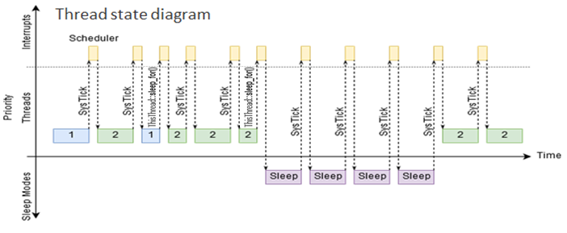
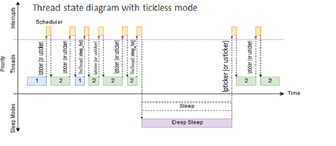

# Tickless mode

Tickless mode is an optimization mechanism available in RTOS for suspending the SysTick. You can use it in situations when RTOS is idle for multiple ticks, so you can save power by entering uninterrupted sleep.

## Scheduling and sleep modes in Mbed OS

Mbed OS uses the SysTick timer in periods of 1ms to process threads' scheduling.

For instance, a system running two threads would see this timing:



Note that the device never enters deep sleep and wastes cycles in SysTick while all threads are asleep.

## Tickless mode

To support tickless mode in Mbed OS, your target needs to meet two requirements:

- Support for Sleep HAL API.
- Support for either Low Power or Microsecond Ticker HAL API.

To enable tickless mode for your target, add the `MBED_TICKLESS` macro in `target.json` (in your target's section):

```json
"macros_add": [
    "MBED_TICKLESS"
]
```

When tickless mode is enabled, Mbed OS's default [OsTimer](../mbed-os-api-doxy/structos__timer__def.html) based on the [low power ticker](../mbed-os-api-doxy/group__hal__lp__ticker.html) replaces SysTick. If a target's low power ticker has an excessively long wake-up time or other performance issues, make it use the [microsecond ticker](../mbed-os-api-doxy/group__hal__us__ticker.html) instead by adding the below configuration in 'target.json' (in your target's section). And this configuration is not required for the target which does not have low power ticker as the default OsTimer based on the microsecond ticker.

```json
"overrides": {
    "tickless-from-us-ticker": true
}
```

If tickless mode uses the microsecond ticker, the device will enter sleep rather than deep sleep, but will still avoid unnecessary tick calls.

The expected scheduling for the previous use case should look like:



## Testing

There are no dedicated tests validating tickless mode. Running all Mbed OS test suites, with particular focus on HAL sleep and HAL low power ticker tests, provides sufficient coverage.

## References

You can find more details on sleep modes in Mbed OS in the section [Mbed OS power management (sleep)](../apis/power-management-sleep.html)
