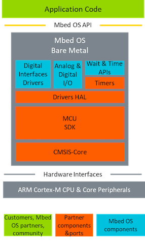

# Mbed OS bare metal profile

There are many use cases for IoT devices. Different use cases require different configurations, connectivity and security. They also have different requirements for resource consumption. Many products must operate in ultraconstrained environments on tiny MCUs with low memory and compute power available. We created the Mbed OS bare metal profile for IoT devices that require ultraconstrained resources.

Mbed OS bare metal profile block digram

The Mbed OS bare metal profile is a compact profile of Mbed OS 5 without an RTOS. The Mbed OS bare metal profile is API compatible with Mbed OS 5 and supports a subset of features of Mbed OS 5, such as analog I/O, digital I/O, timers and digital interfaces, such as SPI, I2C, Serial and CAN. Mbed Studio, Mbed CLI and the Mbed Online Compiler all support the Mbed OS bare metal profile.

| Features | Mbed OS 5 bare metal  | Mbed OS 5 |
| --- | ---  | --- |
| Analog I/O | Available | Available |
| Digital I/O | Available | Available |
| Digital interfaces | Available | Available |
| Timers | Available | Available |
| Development tools  (For example, Mbed CLI, Mbed Studio, Mbed Online Compiler, GCC, Arm Compiler 6 and so on) | Available | Available |
| Support for Mbed Enabled development boards | Available | Available |
| RTOS | Not available | Available |
| Storage | Ecosystem libraries | Available |
| Mbed TLS | Not available | Available |
| Mbed PSA | Not available | Available |

To begin using the Mbed OS bare metal profile from Mbed OS 2, please follow our [instructions](../tutorials/migrating-to-mbed-os-5.html).
