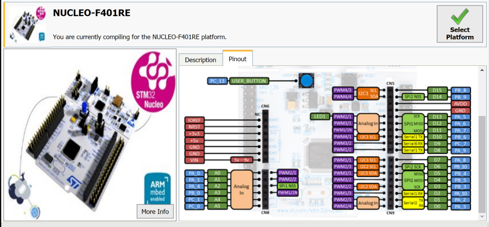

<h1 id="serial-comm">Board to PC communication over USB</h1>

The Arm Mbed microcontroller on your board can communicate with a host PC over the same USB cable that you use for programming.

<span class="tips">If you're working on Windows 7, you might need to [install a serial driver](../program-setup/windows-serial-driver.html).</span>

This allows you to:

- Print out messages to a PC terminal (useful for debugging).
- Read input from a PC keyboard.
- Communicate with applications running on a PC to exchange data.

## Hello World - printing messages

This program prints a "Hello World!" message that you can view on a serial terminal. Mbed OS redirects any `printf()` statements to the board's debug USB serial.

[](https://github.com/ARMmbed/mbed-os-snippet-Serial_STDOUT/blob/v6.14/main.cpp)

## Viewing output in a serial terminal

Serial terminals run on your host PC. They provide an interface where your Mbed board can print and where you can type characters back to your board.

Mbed CLI provides a serial terminal that is configured with a default baud rate of `9600`. You can either set it to [open after compilation](#opening-a-serial-terminal-after-compilation), or open it [manually](#manually-opening-a-serial-terminal).

### Opening a serial terminal after compilation

You can use one command to compile an application, flash it onto a board and open a serial terminal:

```
mbed compile -t <TOOLCHAIN> -m <TARGET> --flash --sterm
```

When the board is flashed, it starts printing to the terminal (`Hello World!`, in this example).

To close the serial terminal, enter <kbd>Ctrl + C</kbd>.

**Notes:**

- If your application uses a baud rate other than 9600, specify it with `-b <BAUDRATE>` in the command above.
- This method only works for a single board. To work with multiple boards, open a serial terminal manually as described below.</div>

### Manually opening a serial terminal

You can open a serial terminal manually, which is useful when the board is already flashed with the desired application (i.e. one built with the [online compiler](../quick-start/build-with-the-online-compiler.html)).

When a single board is connected, run:

```
mbed sterm
```

`mbed sterm` starts message printing.

**Notes:**

- If your application uses a baud rate other than 9600, specify it with `-b <BAUDRATE>` when opening the serial terminal.
- If you have multiple boards connected:
    1. Run `mbedls` to find the port of the board you want to use.
    1. Run `mbed sterm -p <PORT>`.
- To list all options, run `mbed sterm -h`.
- To close the serial terminal, enter <kbd>Ctrl + C</kbd>.

## Additional examples - reading user inputs

In addition to printing messages, Mbed OS applications can also read keyboard inputs from the user using the [BufferedSerial](../apis/bufferedserial.html) and [UnbufferedSerial](../apis/unbufferedserial.html) classes.

Use your terminal application to interact with the following examples.

If you're not sure how to build these examples and run them on your board, please see our [build tools section](../build-tools/index.html).

### Echo back characters you type

[](https://github.com/ARMmbed/mbed-os-snippet-Serial_EchoBack/blob/v6.14/main.cpp)

### Use the U and D keys to make LED1 brighter or dimmer

<span class="notes">**Note:** This example only works if LED1 is on the Pwm pin of the board you are using, such as the NUCLEO-F401RE. </span>

<span class="images"><span>The pin map of the NUCLEO-F401RE shows LED1 on the Pwm pin.</span></span>

[](https://github.com/ARMmbed/mbed-os-snippet-Serial_LEDControl/blob/v6.14/main.cpp)

### Pass characters in both directions

Tie pins together to see characters echoed back.

[](https://github.com/ARMmbed/mbed-os-snippet-Serial_PassCharacters/blob/v6.14/main.cpp)

### Read to a buffer

[](https://github.com/ARMmbed/mbed-os-snippet-Serial_ReadToBuffer/blob/v6.14/main.cpp)
