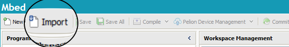
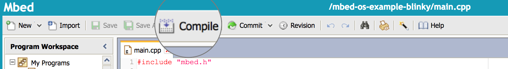

<h1 id="quick-start-online">Using the Online Compiler</h1>

This page covers:

1. Setting up an Mbed account and adding a development board to it.
1. Importing the Blinky code for either the full profile or bare metal profile of Mbed OS.
1. Compiling and flashing the code to your board.

## Setting up

1. [Create an Mbed account](https://os.mbed.com/account/signup/).
1. If you have an Mbed board:

    1. Plug your Mbed board into your computer.

        The board is listed as a USB device.
    1. Open the board's USB device folder.
    1. Double click on the `MBED.HTML` file. This adds your Mbed board to the Online Compiler as a compilation target.

    If your board doesn't have an `MBED.HTML` file, follow the instructions in the next step (for users who don't have a board). Instead of selecting any board, search for your board and select it.

1. If you don't have a board but still want to follow the quick start:

    1. Go to [os.mbed.com/platforms](http://os.mbed.com/platforms).
    1. Select any board.
    1. On the board page, click **Add to your Mbed Compiler**.

## Importing the code - full profile

Click the button below to automatically import the example into the Online Compiler.

[](https://github.com/ARMmbed/mbed-os-example-blinky/blob/mbed-os-6.2.0/main.cpp)

Alternatively, you may select the import button on the top left hand side of the Online Compiler screen and copy the [example link](https://github.com/ARMmbed/mbed-os-example-blinky) into the prompt.

<span class="images"></span>

## Importing the code - bare metal profile

Click the button below to automatically import the example into the Online Compiler.

[](https://github.com/armmbed/mbed-os-example-blinky-baremetal/blob/mbed-os-6.2.0/main.cpp)

Alternatively, you may select the import button on the top left hand side of the Online Compiler screen and copy the [example link](https://github.com/ARMmbed/mbed-os-example-blinky-baremetal) into the prompt.

<span class="images"></span>

## Compiling and flashing (programming)

1. Click **Compile**.

    **Note:** To build with the Mbed OS bare metal profile, add `"requires": ["bare-metal"]` to the `mbed_app.json` file:

    ```NOCI
    {
        "requires": ["bare-metal"],
        "target_overrides": {
            "*": {
    ```

    <span class="images"></span>

    The Online Compiler compiles the code into an executable file, which your browser downloads.

1. Open the folder where the executable file was downloaded, and then click and drag (or copy and paste) the file to your Mbed board's USB device folder.

1. Press the board's reset button.
