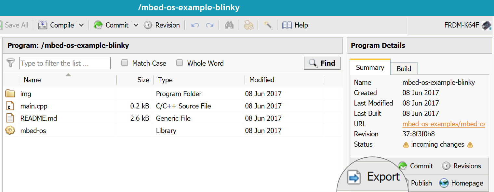

<h1 id="debug-ide-qs">Debugging with the Online Compiler</h1>

## Using printf

The easiest way to do basic debugging is to use the `printf` command in your code, then read the output using a serial terminal.

For example, add `printf("Hello World!\n\r");` to the top of your main function, and then recompile the program and flash it to your device. To view the output, open a serial terminal:
```
mbed sterm
```

You may need to reset the board, because messages are visible if printed while the terminal is open.

To close the serial terminal, press Ctrl + C.

<span class="notes">**Note:** Unless otherwise specified, `printf` defaults to a baud rate of `9600` on Mbed OS. You can modify this value in the `mbed_app.json` file. To configure your terminal client to this baud rate, change the speed option when selecting the port. You can view the [configuration options page](../reference/configuration.html) to learn more about how to configure OS-level options.</span>

For more options of `mbed sterm`, see [Board to PC communication over USB](../tutorials/serial-comm.html).

## Exporting to a desktop IDE

To debug using a desktop IDE such as Keil uVision, IAR or Eclipse:

1. Under **Program Details**, click the **Export** button.
1. Select your export platform and IDE.
1. Click **Export**.
1. Your browser downloads a `.zip` file with the project files.

<span class="images"></span>
