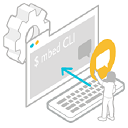

<h1 id="quick-start">Arm Mbed OS quick start</h1>

This quick start gets an example application running on your board. It shows how to create and build an application, select your build target, flash your board and interact with your device.

The example application blinks the LED on your board every 500 milliseconds.

## Please choose how to proceed

<table style="margin-left: auto; margin-right: auto; border = 0;">
<tbody>
<tr>
<td align="center"><a href="../quick-start/online-with-the-online-compiler.html">Build with Mbed Online Compiler</a></td>
<td align="center"><a href="../quick-start/offline-with-mbed-cli.html">Build with Mbed CLI</a></td>
<td align="center"><a href="https://os.mbed.com/docs/mbed-studio/">Build with Mbed Studio</a></td>
</tr>
<tr>
<td align="center">A great choice if you want to get started working with Mbed OS quickly</td>
<td align="center">Our command-line tool. It provides more options than the Online Compiler, but requires more setup. Compatible with Windows, Linux and macOS.</td>
<td align="center">An alternative to the Mbed Online Compiler. This link will take you to the Mbed Studio documentation site.</td>
</tr>
<tr>
<td align="center"><a href="../quick-start/online-with-the-online-compiler.html">
</td>
<td align="center"><a href="../quick-start/offline-with-mbed-cli.html">
</td>
<td align="center"><a href="https://os.mbed.com/docs/mbed-studio/">

</td>
</tr>
</tbody>
</table>

Once you have this application working, check the [further reading section](../quick-start/further-reading.html) to add functionality.
