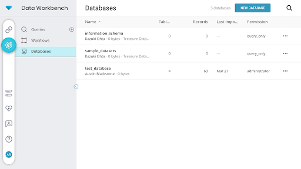
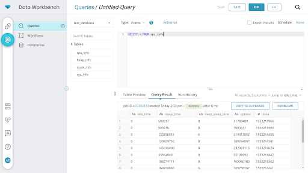
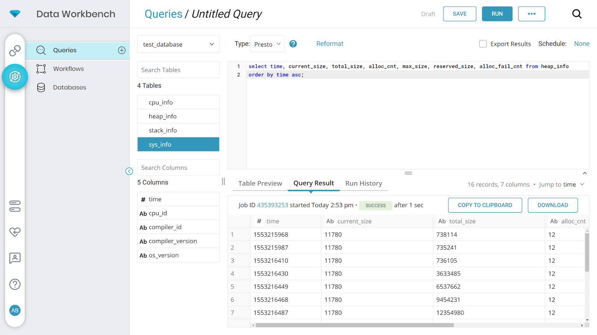
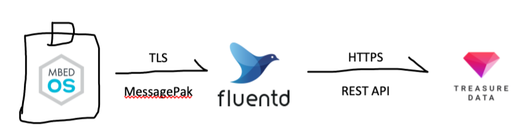

# Send data securely to Arm Treasure Data

This tutorial introduces securely sending data from Mbed OS devices to Arm Treasure Data using two methods:

- HTTPS library - Send data directly to the Treasure Data REST API.
- Fluentd using fluent logger library - Send data to a hosted Fluentd instance that aggregates and forwards the data on to your treasure data account.

Arm Mbed TLS provides equal in-transit security to both libraries. We recommend the HTTPS library for development and the Fluentd library for production. The tradeoff between the two is size of code on chip, size of data in transit and setup complexity:

- Code size on chip - The HTTPS library is ~50KB of ROM space on chip. This is due to the HTTP stack. Both libraries use Mbed TLS to secure the connections, which is ~7KB per connection on your stack for both libraries.
- Data size in transit - The HTTPS library sends data as an ASCII JSON string. The Fluend library uses MessagePack (binary encoded JSON) across a TLS connection. This means that on average the Fluentd library uses less bandwidth to send an equivalent message. When you pay per byte transmitted from both your power budget and data plan it matters.
- Maintenance - Initially, setting up the HTTPS library on a device and having it send data directly to Treasure Data is easier, but what if you want to change what the device is doing or how its data is reported? If you are using the HTTPS library, you must issue a firmware update to every device to change how it formats its data, whereas if you are using a Fluend server, you can modify the Fluentd config file on the server to change how data is formatted and processed.

The following steps show how to send data using first the HTTPS library and then Fluentd.

## HTTPS library

To use the HTTPS library, use the [mbed-os-example-treasuredata-rest](https://github.com/armmbed/mbed-os-example-treasuredata-rest) program. This program turns on Mbed OS device statistics by enabling the `MBED_ALL_STATS_ENABLED` macro and then sends heap/CPU/stack/system information to Treasure Data.

<span class="images">[](https://youtu.be/ky-HDNFZw8w)</span>

### Import code

You can compile the program using any of the following development tools:

- Arm Mbed CLI (offline):

```
mbed import https://github.com/armmbed/mbed-os-example-treasuredata-rest
```

- Arm Online Compiler:

[](https://github.com/armmbed/mbed-os-example-treasuredata-rest/blob/master/main.cpp)

### Set up variables

1. Configure the Treasure Data API key in `mbed_app.json` by changing the `api-key` variable:

   ```
   "api-key":{


   "help": "REST API Key for Treasure Data",

   "value": "\"REPLACE_WITH_YOUR_KEY\""

   },

   ```

1. Wi-Fi credentials: If you're using Wi-Fi, add your SSID/password. If you are using ethernet, you do not need to add Wi-Fi credentials.

1. Create a database called `test_database` in Treasure Data.
   <span class="notes">**Note:** The tables are created automatically.</span>

### Compile and load

Next, you can compile and load your code onto your board. If you are not familiar with how to compile and load code, please look at the Mbed OS quick start tutorial.

After you have compiled your code and loaded it onto your board, open a serial terminal, and connect it to the board. View the output:

```
--- Terminal on /dev/tty.usbmodem146103 - 9600,8,N,1 ---
Treasure Data REST API Demo
Connecting to the network using the default network interface...
Connected to the network successfully. IP address: 192.168.43.202
Success

MAC: C4:7F:51:02:D9:5D
IP: 192.168.43.202
Netmask: 255.255.255.0
Gateway: 192.168.43.249

 Sending CPU Data: '{"uptime":6918609,"idle_time":0,"sleep_time":509277,"deep_sleep_time":0}'

 Sending Heap Data: '{"current_size":15260,"max_size":75334,"total_size":747954,"reserved_size":307232,"alloc_cnt":12,"alloc_fail_cnt":0}'

 Sending Stack Data: '{"thread_id":0,"max_size":4820,"reserved_size":12632,"stack_cnt":4}'

 Sending System Data: '{"os_version":51104,"cpu_id":1091551809,"compiler_id":2,"compiler_version":60300}'

```

### Verify data in Treasure Data

Go to the [Database list in Treasure Data](https://console.treasuredata.com/app/databases), and open the `test_database` you created earlier. You can see the data from the board in the database. There is a 3- to 5-minute delay from when the data is sent to the database until the visualization system lets you see it, so please be patient, and wait for it to arrive. Be sure to refresh the page.

<span class="images"></span>

<span class="notes">**Note:** The database tab shows how much data you have in the database and gives a few samples, but it does not show all your data. For that, you need to run queries.</span>

### Run queries

Now that you have data in Treasure Data, it's time to analyze and use it.

1. Go to the [Queries tab](https://console.treasuredata.com/app/queries/editor).
2. Select the `test_database`, and run some queries. To learn more about how to run queries, please read the [Treasure Data documentation](https://support.treasuredata.com/hc/en-us/articles/360007995693).

#### Select all fields

Run `select * from cpu_info` to get a full list of all fields in the table.

<span class="images"></span>

#### Select certain fields, order by time

This query selects only certain columns from the table and orders them by the time field in ascending value. You can also replace `asc` with `desc` to get the order reversed.

```
select time, current_size, total_size, alloc_cnt, max_size, reserved_size, alloc_fail_cnt from heap_info
order by time asc;
```

<span class="images"></span>

### Troubleshooting

If you experience issues, ensure you have at least 10KB of space left on your stack. You can also change the `TD_DEBUG` macro to `true` to turn on the Treasure Data debug printfs.

## Fluentd

For mass deployments, we recommend you use Fluentd or fluentbit to aggregate and forward the data into Treasure Data. Depending on where you host your Fluentd instance, you will need to follow slightly different setup instructions. (localhost on your machine with self signed certificates or at a public IP address in the cloud with Certificate Authority (CA) signed certificates). This example uses MessagePack (a binary encoded JSON) to encode the data.

<span class="images"></span>

### Set up Fluentd

#### Install

First, install Fluentd. Please see the [Fluentd quick start](https://docs.fluentd.org/v1.0/articles/quickstart) for details.

Experienced users can use `gem install Fluentd fluent-plugin-td`.

#### Download example code

Download the [example code](https://github.com/armmbed/mbed-os-example-fluentlogger). This repository contains both the embedded example code and the Fluentd configuration files.

#### Set configuration file

Run Fluentd using the provided configuration file `fluentd --config ./fluentd-setup/fluentd.conf -vv`. This file opens two ports: port 24227 for unencrypted TCP traffic and port 24228 for TLS encrypted traffic. The configuration is provided for reference. We strongly suggest using TLS encryption on port 24228 to secure your data in transit.

You can either run Fluentd on a public IP address with CA signed certificates (suggested for deployments), or locally on your machine using self signed certificates (recommended for prototyping/testing).

##### Signed by CA, running in cloud

If you have valid certificates from a CA, replace the `fluentd.crt` and `fluentd.key` files with the CA certificates. Then uncomment the lines in the `fluentd.conf` file for CA trusted certificates, comment out the lines for self-signed certificates and change the passphrase to match for your certificate:

```
	## cert_path ~/mbed-os-example-fluentlogger/fluentd-setup/fluentd.crt
	## private_key_path ~mbed-os-example-fluentlogger/fluentd-setup/fluentd.key
	## private_key_passphrase YOUR_PASSPHRASE
```

##### Self-signed certificates on localhost

<span class="images">[](https://youtu.be/DpnNaVxEhvA)</span>

If you are running the Fluentd server locally on your machine to develop a proof of concept (PoC), you need to generate a new self-signed certificate (where the Common Name (CN) is the IP address of your machine), and modify the `fluentd.conf` file with the IP address of your machine. Each time you restart the Fluentd instance, it generates a new certificate that you need to copy and paste into your embedded code.

1. Change the `generate_cert_common_name` parameter in `fluentd.conf` to be the IP address of the computer running the Fluentd server.
1. Run ` openssl req -new -x509 -sha256 -days 1095 -newkey rsa:2048 -keyout fluentd.key -out fluentd.crt` to generate new certificates. When entering the prompted values, make sure to match the parameters in the `fluentd.conf` file (US, CA, Mountain View and so on). **Make sure the CN field is set to the IP address of the Fluentd server**.

For example:

```
Country Name (2 letter code) []:US
State or Province Name (full name) []:CA
Locality Name (eg, city) []:Mountain View
Organization Name (eg, company) []:
Organizational Unit Name (eg, section) []:
Common Name (eg, fully qualified host name) []:192.168.1.85
Email Address []:
```

<span class="images"></span>

### Mbed OS setup

Run the example code on your device. You can either [import to the Mbed Online Compiler](http://os.mbed.com/compiler/?import=https%3A%2F%2Fgithub.com%2Farmmbed%2Fmbed-os-example-fluentlogger) or use Mbed CLI to clone it locally, compile and load it to the board:

```shell
$ mbed import https://github.com/armmbed/mbed-os-example-fluentlogger
$ mbed compile --target auto --toolchain GCC_ARM --flash --sterm
```

#### Secure (TLS)

To send data to Fluentd over TLS (securely):

1. Run `openssl s_client -connect localhost:24228 -showcerts`.
1. Copy the certificate to `fluentd-sslcert.h`. If you are running the Fluentd server on localhost, this certificate will change every time you restart Fluentd. You need to rerun this command and recompile your embedded code every time you restart Fluentd.
1. Modify the call in `main.cpp` to the FluentLogger object.
1. Change the IP address to the IP address of the Fluentd server, or if you are hosting it in the cloud, change it to the web address where it is hosted. **It is important that the IP address in the main.cpp file matches the IP address set in the CN field of the Fluentd server. Otherwise, it will not work because Mbed TLS uses strict CN verification.**
1. Compile the code and load it onto your board.

### Success

Successful output on the Fluentd terminal:

<span class="images"></span>


```sterm
 -0500 debug.test: ["sint",0,1,-1,-128,-32768,-2147483648]
 -0500 [trace]: #0 fluent/log.rb:281:trace: connected fluent socket addr="192.168.1.95" port=5522
 -0500 [trace]: #0 fluent/log.rb:281:trace: accepted fluent socket addr="192.168.1.95" port=5522
 -0500 debug.test: ["uint",0,1,128,255,65535,4294967295]
 -0500 [trace]: #0 fluent/log.rb:281:trace: connected fluent socket addr="192.168.1.95" port=5523
 -0500 [trace]: #0 fluent/log.rb:281:trace: accepted fluent socket addr="192.168.1.95" port=5523
 -0500 [trace]: #0 fluent/log.rb:281:trace: enqueueing all chunks in buffer instance=70248976563020
 -0500 debug.test: {"string":"Hi!","float":0.3333333432674408,"double":0.3333333333333333}
 -0500 [trace]: #0 fluent/log.rb:281:trace: connected fluent socket addr="192.168.1.95" port=5524
 -0500 [trace]: #0 fluent/log.rb:281:trace: accepted fluent socket addr="192.168.1.95" port=5524
 -0500 debug.test: {"string":"Hi!","float":0.3333333432674408,"double":0.3333333333333333}
 -0500 [trace]: #0 fluent/log.rb:281:trace: connected fluent socket addr="192.168.1.95" port=5525
 -0500 [trace]: #0 fluent/log.rb:281:trace: accepted fluent socket addr="192.168.1.95" port=5525
 -0500 [trace]: #0 fluent/log.rb:281:trace: adding metadata instance=70248976563020 metadata=#<struct Fluent::Plugin::Buffer::Metadata timekey=nil, tag="td.fluentd_database.test", variables=nil>
 -0500 [trace]: #0 fluent/log.rb:281:trace: writing events into buffer instance=70248976563020 metadata_size=1
 -0500 [debug]: #0 fluent/log.rb:302:debug: Created new chunk chunk_id="585c249fd2ebe20867267de2fde7c4bc" metadata=#<struct Fluent::Plugin::Buffer::Metadata timekey=nil, tag="td.fluentd_database.test", variables=nil>
 -0500 [trace]: #0 fluent/log.rb:281:trace: connected fluent socket addr="192.168.1.95" port=5526
 -0500 [trace]: #0 fluent/log.rb:281:trace: accepted fluent socket addr="192.168.1.95" port=5526
 -0500 debug.test: {"string":"Hi!","float":0.3333333432674408,"double":0.3333333333333333}

```

### Setting Treasure Data databases and tables

The second field in the tag of your embedded code determines the database. For example, sending data to a tag called `td.mydatabase.mytable` logs the data to the database called `mydatabase` in the table `mytable`. You can modify the example configuration file to see this.

### Debugging

For more verbose debug messages, turn on the following flags in `mbed_app.json`:

```json
{
	"macros": [
		"MBEDTLS_SSL_DEBUG_ALL = 1"
	],
	"target_overrides": {
		"*": {
			"mbed-trace.enable": true
		}
	}
}

```
