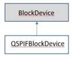

## QSPIFBlockDevice

 QSPIFBlockDevice class hierarchy

The QSPIFBlockDevice is a block device driver for NOR-based QSPI Flash devices that support the SFDP standard. NOR-based QSPI Flash supports up to 4 bits per cycle of instruction, address and data. SFDP-based QSPI Flash supports variable bus modes (single, dual and quad), several sector erase size types and multiple regions of sector size types.

For more information about the SFDP JEDEC standard, please see [its documentation](https://www.jedec.org/system/files/docs/JESD216C.pdf).

### QSPIFBlockDevice class reference

### QSPIFBlockDevice example

This example creates a QSPIFBlockDevice, erases a sector, programs it, reads the block back and cleans up.

