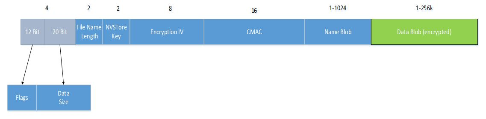
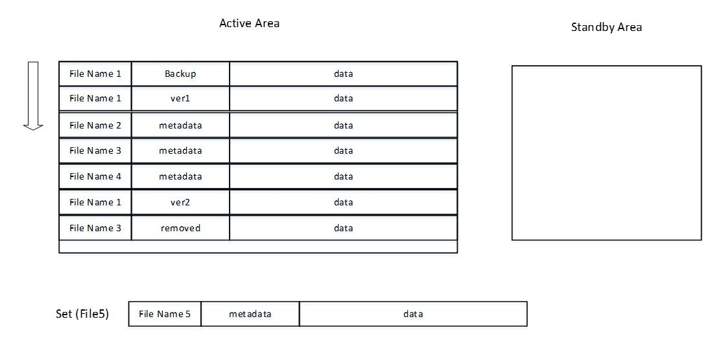
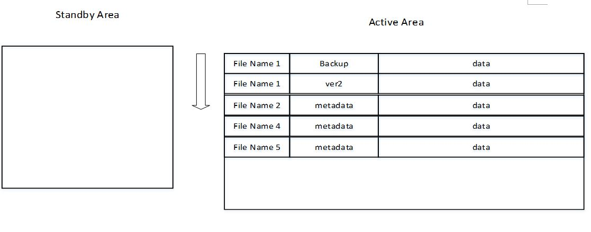
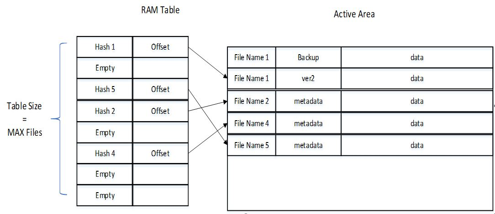

# StorageLite Design
## Overview

StorageLite consists of two main design items:

+ **persistent NOR flash** - based on dividing the memory into two areas: active and standby and storing the files within the active area sequentially one after the other. For each specific file name, the latest programmed record supersedes the previous records with the same file name.
+ **RAM Table** - small table storing a unique hash code that identifies uniquely each specific file name, and an offset to the file and its metadata on the external memory storage. This table will allow fast unique identification of file name by its hash code in RAM, and a quick reference to its location in external memory.

## Persistent Memory Module

### Persistent File record
Each file will be stored in persistent memory within a dedicated record that will contain the following fields:
+ Data Size and Flags: 4 bytes Bit Field containing:
  - 20 Bits File Data Length
  - 12 Bits File Flags
    - File features Flags: Rollback protection, Encrypt, Factory Reset
    - Internal indications bits, such as backup copy
+ File name size: 2 bytes, number of bytes used by the name of the record
+ NVSTore key: 2 bytes holding a handle to Nvstore, where the CMAC will be kept if rollback protection is required.
+ Encryption IV: 8 bytes nonce randomly created to be used by encryption of file data
+ CMAC: 16 Bytes authentication CMAC for entire record (other than the CMAC itself)
+ File Name Blob: 1-1024 bytes length
+ The data of the record. Must include 1 byte at least, with max size of 256k bytes.

### Persistent Design:
+ Persistent memory is divided into two areas: active and standby.
+ When adding a new file record, it is written in the active area sequentially after the previous record
+ When removing an existing file, a new record for it, which is marked as deleted, is written in the active area sequentially after the previous record
+ When updating existing file, a new record for the updated file is added to external memory and supersedes the previous version of the file.
+ When active area is full a Garbage Collection (GC) mechanism is activated, moving all of the latest versions of existing files from the active area to the standby area. When all files are moved we switch between the active and standby areas, and delete the new standby area.

  Note: for factory-reset feature an additional backup file version is kept at the external memory. This backup file may or may not be identical to the working file version

  e.g.

  Adding File 5 to almost-full Active Area will trigger GC:

- Before GC:

  - After GC: the following files are not moved to the new active area:
    - File 1 - older version 1
    - File 3 - was removed

## RAM Table Design
### RAM Design
+ Number of entries in table - Predefined maximum number of files
+ Table entry per file contains the following information:
  - Hash code - unique hash code per file name
  - External Memory Offset - offset to the file and its metadata at the active external memory
    area

 Note: RAM table will only contain entries for working files (not including Backup, older version and removed files)

