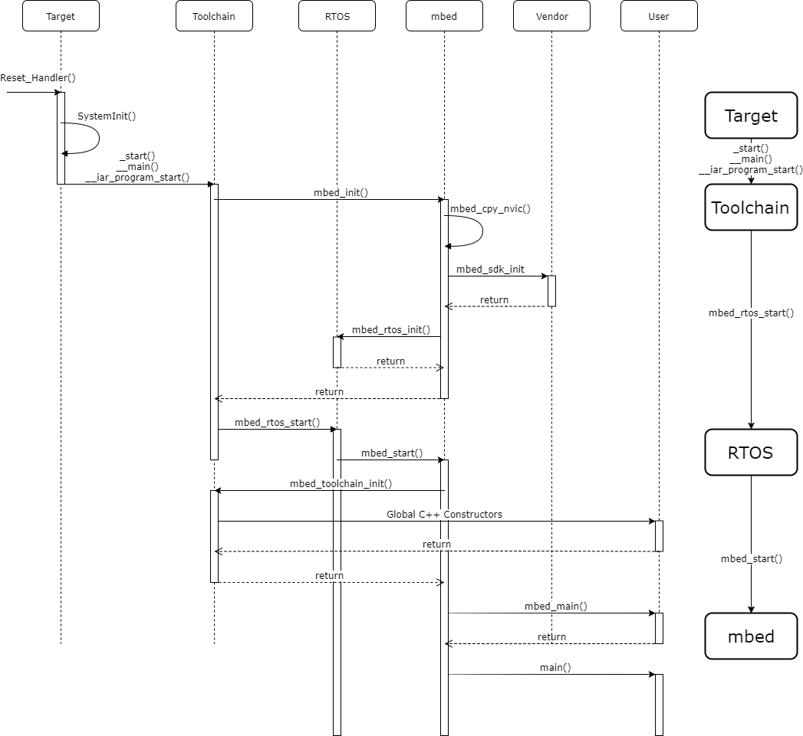

## Bootstrap

### Entry points

Mbed OS provides two entry points for developers to hook into:

- `main(void)` - Default entry point. All the standard application code goes here.
- `mbed_main(void)` - Executed directly before `main`. The user can define this.

When execution reaches the entry points, a user can expect a fully initialized system that is ready to execute application code. The Mbed OS boot sequence consists of four phases: target setup, toolchain setup, starting the RTOS and starting the Mbed application. These phases can be seen below:

1. Setup target
     - Configure clocks
     - Configure watchdog (if applicable)
     - Turn on RAM (if applicable)
     - Jump to setup toolchain
2. Setup toolchain
     - Initialize RAM
     - Initialize standard library
     - Call mbed_init
         - Vector table copied to RAM
         - Vendor SDK initialized
     - jump to start rtos
3. Start RTOS
     - Create main thread
     - Start scheduler
     - main thread calls start mbed
4. Start mbed
     - Call mbed_main
     - Call main

Sequence diagram of the Mbed 5 boot sequence:

### Retargeting

Mbed OS redefines multiple standard C library functions to enable them to work in a predictable and familiar way on a remote embedded target device:

- `stdin`, `stdout`, `stderr` - These file descriptors are pointing to the serial interface to enable users to use standard input/output functions, such as `printf` or `getc`.
- `fopen`, `fclose`, `fwrite`, `fread`, `fseek` and other standard file operations - Enable the user to work with the serial interface, as well as the built-in file system.
- `opendir`, `readdir`, `closedir` and other standard directory operations - Enable users to use built in file system.
- `exit` - It causes the board to stop current execution, flush the standard file handles, close the semihosting connection and enter an infinite loop. If the return code indicates an error, the board blinks error patterns on the built-in LED.
- `clock` - Overloaded to use platform's microsecond ticker.
