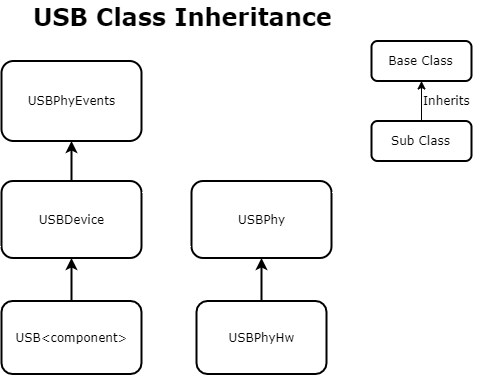
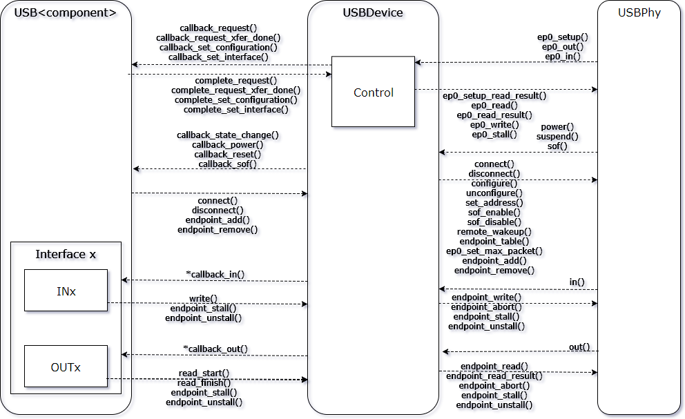
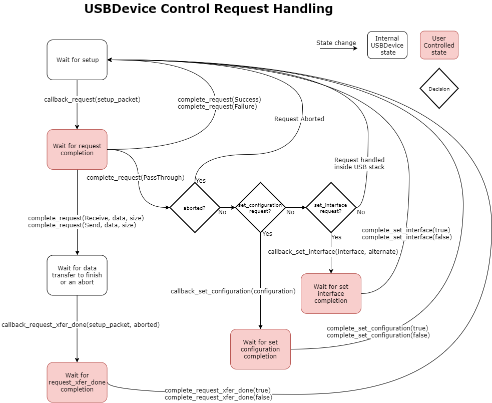
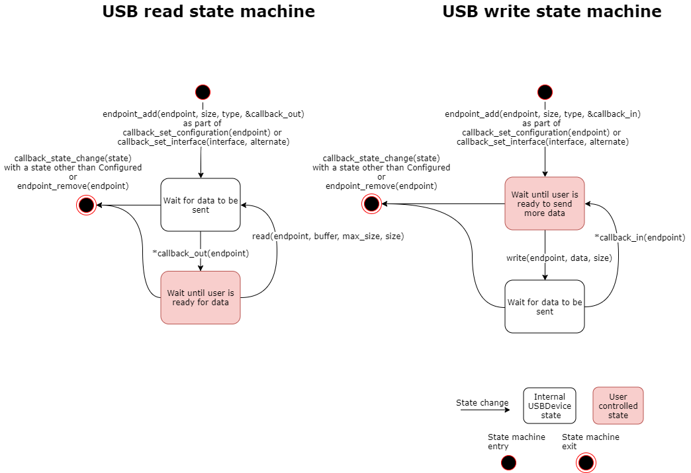

### USB Device stack

#### Introduction

A functional mbed-os USB device consists of three parts - an implementation of USBPhy, the USBDevice stack and a USB component code.
- USBPhy  - provides raw access to USB in the role of a USB Device
- USBDevice - the core of mbed-os's USB stack and is responsible for state management and synchronization
- USB component - is code which inherits from USBDevice and provides the desired USB interfaces




The interaction of these three components can be seen in this diagram:



#### Synchronization

The class USBDevice is an interrupt safe class. It uses a critical section to provide thread and interrupt safe locking. This lock can be used from USB components inheriting from USBDevice but is not required.

The recommended model for synchronizing a USB component is to wrap code requiring synchronization in a call to USBDevice::lock and USBDevice::unlock. Functions or callbacks which are synchronized by a caller at a higher level should document this by locking requirement by calling USBDevice::assert_locked in the first line of the function or callback.

Code requiring locking:
```c
void USBComponent::do_something()
{
    lock();

    // Do do something

    unlock();
}
```

Code where the lock is held externally:
```c
void USBComponent::do_something_internal()
{
    assert_locked();

    // Do do something
}
```

#### USB Device state

USB defines 5 separate states a device can be in - Attached, Powered, Default, Address, Configured. Each state adds functionality, with the Attached state having the least functionality and the Configured state having the most functionality.

| State      | Functionality                            |
|:----------:|:----------------------------------------:|
| Attached   |    Power events                          |
| Powered    |    Reset events                          |
| Default    |    Control endpoint 0 active             |
| Address    |                                          |
| Configured |    All enabled endpoints are functional  |

 At any time the USB device can enter a state with less functionality. This could be due to a loss of power event or a surprise USB disconnect. When leaving or outside of the Configured state writes to and reads from all endpoints other than endpoint 0 are ignored.

#### USB component callbacks

All callbacks sent by USBDevice to its children are prefixed with callback_*. These callbacks are called with the USB lock is held. One notable callback is `callback_state_change` which can be used generically handle leaving the Configured state. The Configured state is automatically exited by the USB stack on disconnect, power loss or USB reset.

##### Control request state machine

There are four callbacks sent from the USB control state machine. These are shown in the table below. When these callbacks are called they must return a result to continue the control state machine. The result does not need to be returned immediately, giving the USB component time to process the request. **Note that the response must always be sent regardless of any USB device state changes.**

Table of control callbacks and the required response:

| Callback                                          | Response                                 |
|:-------------------------------------------------:|:----------------------------------------:|
| callback_request(setup_packet)                    | complete_request(result, data, size)     |
| callback_request_xfer_done(setup_packet, aborted) | complete_request_xfer_done(result)       |
| callback_set_configuration(configuration)         | complete_set_configuration(result)       |
| callback_set_interface(interface, alternate)      | complete_set_interface(result)           |




The setup packet passed to `callback_request` and `callback_request_xfer_done` is guaranteed by the USB stack to remain valid and unchanged up to the point the request is completed with `complete_request` and `complete_request_xfer_done` respectively . Additionally, when `complete_request` is called with the value `Receive` or `Send` the USB stack guarantees that `callback_request_xfer_done` will be called. If `complete_request` is called with a buffer and size that buffer must remain valid and unchanged until the function `callback_request_xfer_done` is called by USBDevice.

#### IN and OUT state machine for endpoints

Endpoints are added and removed by a USB component as part of `callback_set_configuration` and `callback_set_interface` to setup the corresponding interface or configuration. Additionally, all added endpoints are automatically removed if the device leaves the Configured state.

When an endpoint has been added it can be either written to with `write` or read from by calling `read_start` and `read_finish`. These functions copy data passed to them, so buffers can be freed or used for other purposes as soon as the call completes. Note that the buffer size must not exceed the max packet size for the given endpoint.

Below is a diagram showing the typical state machine for read (OUT) and write (IN) transfers.



#### Endpoint Configuration

To ensure a USB component will run on all supported devices the endpoints used by its configuration descriptor must be selected based on the current device. This is because endpoint number and endpoint functionality can differ based on device. The features of a device can be determined by examining its endpoint table.

To simplify the process of selecting endpoints it is recommended that EndpointResolver class is used. It is constructed with an endpoint table and can be called to find an endpoint of the given type and size. After all required endpoints have been found the function EndpointResolver::valid() can be called to check if this configuration is supported by this device. An example of this is shown below:

```c++
EndpointResolver resolver(endpoint_table());
resolver.endpoint_ctrl(CDC_MAX_PACKET_SIZE);
bulk_in = resolver.endpoint_in(USB_EP_TYPE_BULK, CDC_MAX_PACKET_SIZE);
bulk_out = resolver.endpoint_out(USB_EP_TYPE_BULK, CDC_MAX_PACKET_SIZE);
int_in = resolver.endpoint_in(USB_EP_TYPE_INT, CDC_MAX_PACKET_SIZE);
MBED_ASSERT(resolver.valid());
```
