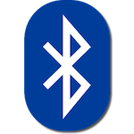

### Network connectivity in Mbed OS

Mbed OS support wide range of connectivity options. This section helps you to understand how to connect Mbed OS based device to outside world.

Following is the brief introduction of the different connectivity technologies that we support.

#### Bluetooth low energy

Bluetooth low energy (BLE) is a low power wireless technology standard for personal area networks. Typical applications of BLE are health care, fitness trackers, beacons, smart home, security, entertainment, proximity sensors, industrial and automotive.

To learn how to use Bluetooth low energy on Mbed OS, please refer to [Bluetooth](TODO) section under API reference.

#### IP Networking

Arm Mbed OS support various IP based connectivity options and various IP stacks.

Socket API is standardised API between all connectivity options and support both IPv4 and IPv6.
Applications are therefore portable and easy to develop regardles of final connectivity option.

Network drivers are provided, for example, Ethernet, WiFi and Cellular devices.

Supported interfaces and protocols are described in the [IP Networking](networking.md) section.

#### 6LoWPAN Mesh networking

6LoWPAN is a compression method for IPv6 packet. Mbed OS supports 6LoWPAN-ND and Thread
protocols for forming IPv6 based mesh networks. Both protocols use the same 6LoWPAN
compression method, but different routing protocols to achieve wireless mesh network.

Applications running on 6LoWPAN based mesh network use the same familiar Socket API for
connectivity.

Mesh networks are described in [6LoWPAN Mesh](mesh/quick_start_intro.md) section.

#### LoRa

[LoRaWAN](http://lora-alliance.org) is a long range wide-area network technology that combines long range with low power consumption. LoRaWAN is not IP based.

LoRA networking is described in [Building your own private LoRa network](intro-to-lora.md) section of this book.
