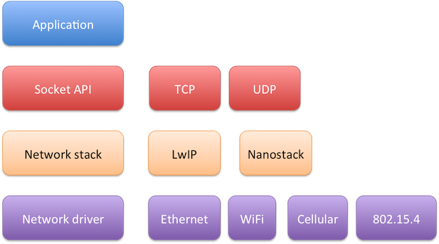

### IP Networking: WORK-IN-PROGRESS

- Socket API
- Interface API
- Onboard stack, external stack

#### IP Stacks

Arm Mbed OS has two options to select when using build in networking stack.

LwIP
Nanostack

#### Interfaces

Ethernet
WiFi
Mesh
