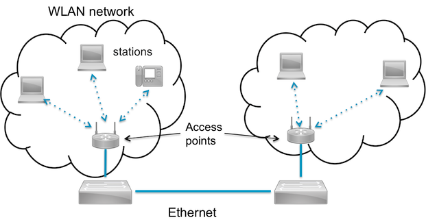

<h2 id="wlan-technology">Wireless LAN</h2>

One of the most popular connectivity technology used today is Wireless LAN (Wireless Fidelity - WiFi) as standardized in IEEE 802.11. Basically it extends the Ethernet standards by making it wireless and adding required security.
From user point of view, these networks behave exactly as Ethernet, but without cables.

WLAN networks

WLAN networks typically consist of access point (AP) connected to Ethernet backbone and multiple stations (STA) connecting the same access point. Networks are identified by by their name, in standard referred as *service set identifier* (SSID). Same network can be served by multiple access points and then each AP can be identified by its *basic service set identifier* (BSSID).

### Standards

The original version of the standard IEEE 802.11 was released in 1997 and have later been obsoleted by updated and extented standards.

| Standard   | Year | Speeds (Mb/s) | Frequency Range |
|------------|------|---------------|-----------------|
| 802.11a | 1999 | 6, 9, 12, 18, 24, 36, 48, 54 | 5.16 - 5.35 Ghz |
| 802.11b | 1999 | 1, 2, 5.5, 11 | 2.401 - 2.495 Ghz |
| 802.11g | 2003 | 1, 2, 5.5, 6, 9, 11, 12, 18, 24, 36, 48, 54 | 2.401 - 2.495 Ghz |
| 802.11n | 2009 | 6.5 - 600 | Both 2.4 Ghz and 5 Ghz |
| 802.11ac | 2013 | 6.5 - 1000 | 5 Ghz |

Today, new access points and computers support all a/b/g/n/ac standards while most embedded devices offer only a/b/g/n capability.
Speed and standard are negotiated automatically between device and access point without requiring user configuration.

### WiFi in Mbed OS

Wi-Fi driver

In Mbed OS, wireless LAN devices are either external devices or integrated modules. Driver and hardware are handling all complexity of IEEE 802.11 family standards
and integrate into Mbed OS by offering emulated Ethernet interface or Network Stack API.

As with Ethernet, WiFi networks are only used for carrying IP traffic in Mbed OS.

For more information, study following sections of this book

* [IP networking](ip-networking.html)
* [Ethernet](ethernet-technology.html)
* [Socket API](socket-api.html)
* [WifiInterface API](wi-fi.html)
