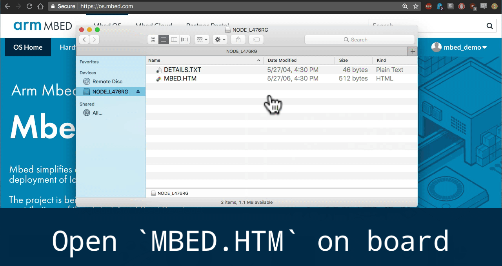

## Setting up your environment

You have two choices when developing with Mbed OS. You can either develop using the [online compiler](http:/os.mbed.com/compiler) where the online environment is setup for you and works out of the box or you can use the offline tool [Mbed CLI](https://os.mbed.com/docs/latest/tools/arm-mbed-cli.html) for deeper control of your compiler options. Both environments will compile production ready binaries, enable you to export your projects to your IDE of choice, and are fully compatible with both git and mercurial. They are the same set of mbed tools, the only difference is how you prefer to use them, in a web browser or on the command line. 

### Online 

In order to use the online compiler you will need two things, a mbed developer account and a mbed target to compile for. 

#### 1. Create an mbed Developer Account

Go to [developer.mbed.org](https://developer.mbed.org) and [create an account](https://developer.mbed.org/account/signup/?next=%2F).

#### 2. Setup Environment

1. Plug your mbed board into your computer and open its USB device folder
2. Double click on the `MBED.HTM` file (this will add your mbed platform to the online compiler)

If you do not have an mbed board, go to [developer.mbed.org/platforms](https://developer.mbed.org/platforms), select a board and click the "Add to your mbed Compiler" button.

### Offline

For the best experience we reccomend using the offline tools installers to ensure that everything 'just works'.

- [Windows Installer](TODO: Windows Installer Link) 
- [OSX Installer](TODO: OSX Installer Link)
- Linux - see manual install instructions below

#### Manual Install

Manual installation assumes you know what you are doing. No support provided here. 

Install the following packages
- [Python 2.7.12+](https://www.python.org/downloads/source/)
- Compiler of your choice (ARM GCC is free):
  * [ARM GCC ](https://developer.arm.com/open-source/gnu-toolchain/gnu-rm/downloads)  
  * [ARMCC ](https://developer.arm.com/products/software-development-tools/compilers/arm-compiler/downloads/version-5)  
  * [IAR](https://www.iar.com/iar-embedded-workbench/tools-for-arm/) 
- Mbed CLI - `pip install -U mbed-cli`
- [Git](https://git-scm.com/downloads) and Mercurial with `pip install -U mercurial`

#### Verify Installation

To verify the tools have been installed correctly you just need to check the installation of the compiler and Mbed CLI are good.

Check Mbed CLI with `mbed --help`

Make sure the compiler is available in your global path:

  * ARM GCC: run `arm-none-eabi-gcc --version` from your command line
  * ARMCC:  run `armcc` with no arguments from your command line
  * IAR: run `iccarm --version` from your command line

