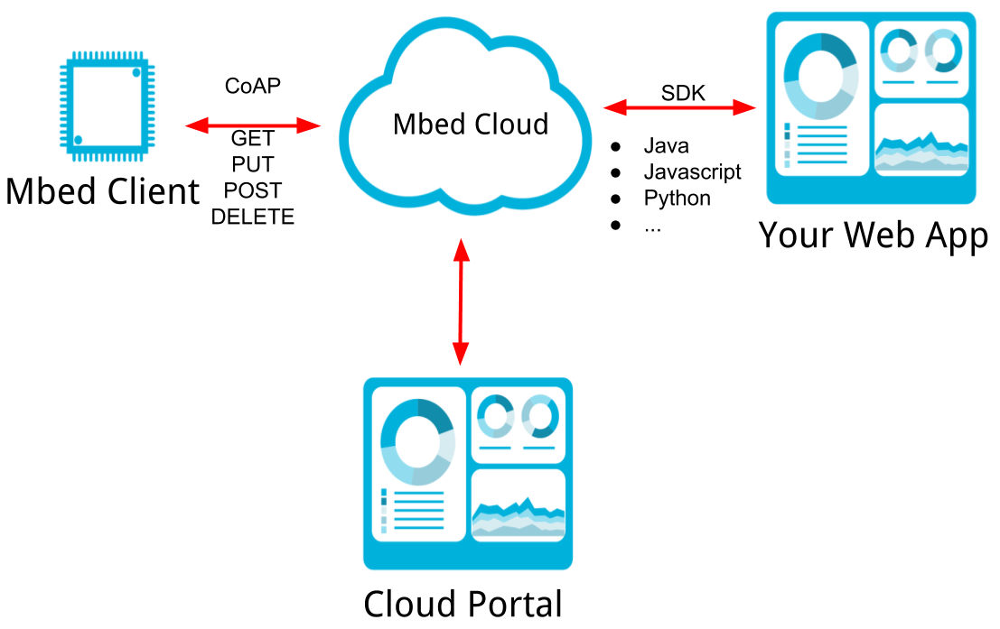

## Cloud API

The way to interract with Mbed Cloud is through the Mbed Cloud REST API. To make this API easier to use there are language specific wrappers called the [Mbed Cloud SDK](https://cloud.mbed.com/docs/current/mbed-cloud-sdk-references/index.html)'s. The SDK's make using the REST API easier. There are currently 4 SDK's
- Python
- Javascript
- .NET
- Java

### Cloud Services
There are actually 5 seperate cloud services that make up Mbed Cloud.  Each of the following API's will show up in the SDK's. 
1. Device Directory - list registered devices, view events, set filters
1. Connect - list connected devices, register webhooks, manage subscriptions
1. Update - manage update campaigns
1. Device Identity - generate and manage device certificates
1. Manage access - Manage API keys, users, and groups across a Mbed Cloud account

### Get Data from Connect API
To get data from the Cloud API's you need to do 4 things. 
1. Add API Key to app.
1. Setup a Notification Channel, either long polling or Web Hook
	- long polling will constantly ask the server if there is any new data. It is highly inefficient, but works locally from your computer. 
	- WebHooks are asynchronous, you effectively give Mbed Cloud a URL for your web app and tell Mbed Cloud to notify you when there is some data you care about. This is the reccomended method for deployment.
1. Get a list of endpoints and resources from the Connect API
1. Read resource value, or write resource value. 

Each SDK has a list of examples in their documentation or source repository. They shoudl be referenced for language specific implementation details. 

It should be noted that Connector is not a real time system, so you should expect some lag when using it. 

### Subscriptions
With Mbed Cloud you can subscribe to objects and resources, then when the value changes on the device a notification will be sent to the web app that has subscribed to the resource. This can be used with wild cards to subscribe to large ranges of objects and resources.

For example, remember that in LWM2M temperature sensor have an ObjectID of `3303` and sensor values are resourceID `5700`. If you have lots of devices on your network and you want to subscribe to the temperature measurements of every device then you could simply subscribe to `*/*/5700`, which will in effect subscribe to any device with a resource value of `5700`. Likewise you could subscribe to all the values on a temperature sensor by subscribing to `5700/0/*`. 

In this way you can subscribe to a large number of resources with one subscription instead of making a large number of individual calls. 
