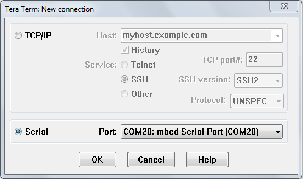
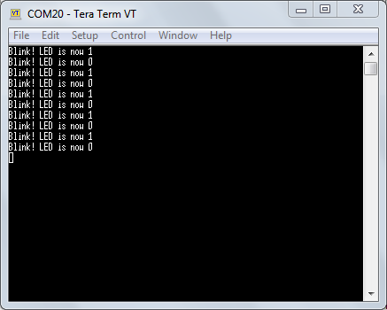
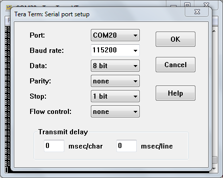
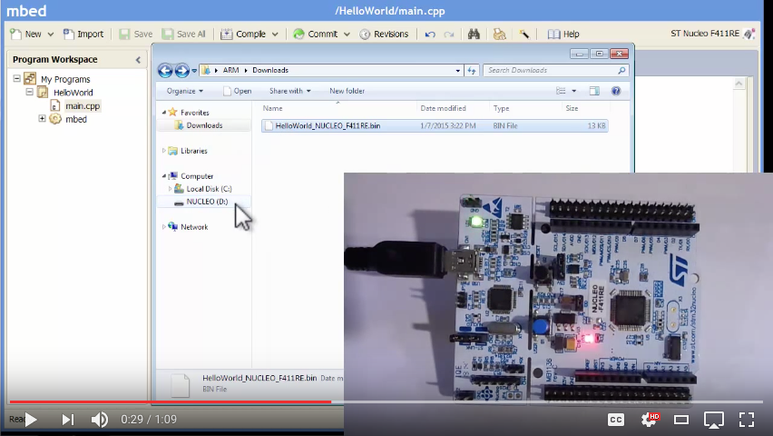
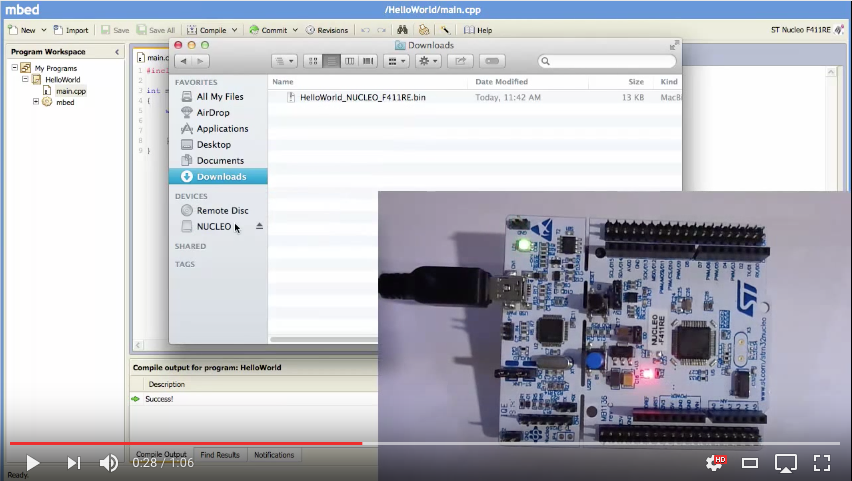

# Debugging using printf() statements

An easy way to inspect what your application is doing is to augment your application with log statements. In Arm Mbed, you can use a serial connection to send feedback from your development board back to your computer. This uses the same USB cable that you use to program your device.

## Prerequisites

### Windows

Install the serial port driver for your development board:

- For ST boards: [ST Link Driver](https://os.mbed.com/teams/ST/wiki/ST-Link-Driver).
- For all other boards: [Arm Mbed Windows serial port driver](windows-serial-driver.html) - not required for Windows 10.

You also need a serial monitor:

- [TeraTerm](http://sourceforge.jp/projects/ttssh2/files).

### macOS

On macOS, all software comes installed by default.

### Linux

If you do not have it, install [GNU Screen](https://www.gnu.org/software/screen/).

## Getting started

To send data over the serial connection, use the [Serial](../apis/serial.html) object.

### Example program

This program blinks the LED on your development board and prints a message every time the LED changes state:

```cpp
#include "mbed.h"

// define the Serial object
Serial pc(USBTX, USBRX);

DigitalOut led1(LED1);

int main() {
    while (true) {
        led1 = !led1;

        // Print something over the serial connection
        pc.printf("Blink! LED is now %d\r\n", led1.read());

        wait(0.5);
    }
}
```

Compile this program, and flash it on your development board. You now can inspect these messages using a serial monitor.

### Seeing the log messages

### Windows

1. Open TeraTerm.
1. Click *File > New Connection*.
1. Select the *Serial* radio button.
1. Choose your development board from the drop-down menu (often called `mbed Serial Port` or `STLink Virtual Port`).
1. Click *OK*.
1. Log messages appear in the main window.

<span class="images"><span>Selecting the COM port</span></span>

<span class="images>"<span>Seeing the output over the serial port</span></span>

<span class="notes">**Note:** Unsure which COM port is used? In the [device manager](http://www.computerhope.com/issues/ch000833.htm), look under the *Ports* section.</span>

### macOS

1. Open a terminal window.
1. Enter `screen /dev/tty.usbm`, and press `Tab` to autocomplete.
1. Press `Enter`.
1. Log messages appear.
1. To exit, press:
    - `Ctrl+A`
    - `Ctrl+\`
    - `y`

### Linux

1. Open a terminal window.
1. Find the handler for your device:

    ```
    $ ls /dev/ttyACM*
    /dev/ttyACM0
    ```

1. Connect to the board by entering `sudo screen /dev/ttyACM0 9600`.
1. Log messages appear.
1. To exit:
    1. Press `Ctrl+A`.
    1. Enter `quit`.

<span class="notes">**Note:** To avoid using `sudo`, set up a udev rule.</span>

### Setting the baud rate

By default, the speed at which the microcontroller and your computer communicate (the baud rate) is set to 9600 baud. This setting fits most use cases, but you can change it by calling the `baud` function on the serial object:

```cpp
#include "mbed.h"

Serial pc(USBTX, USBRX);

int main() {
    pc.baud(115200);
    pc.printf("Hello World!\r\n");
}
```

If you change the baud rate on the device, you also need to change it on your serial monitor:

1. Windows:
	1. In TeraTerm, go to *Setup > Serial Port*.
	1. Change *Baud rate* to 115200.
1. macOS and Linux: Pass the baud rate as the last argument to the `screen` command:

    ```
    $ screen /dev/ttyACM0 115200
    ```

<span class="images"><span>Changing the baud rate</span></span>

## Printf()

As seen above, you use the `printf()` function to communicate back to the user:

1. The `printf()` functions produce output according to a format string (containing format specifiers) and matching value arguments.
2. The microcontroller's universal asynchronous receiver/transmitter (UART) console peripheral "feeds" output from `printf()` into the interface chip.
3. The chip forwards the feed to the development host.
4. You can view this `printf()` traffic with a terminal program running on the host.

`printf()` is not free:

- It uses an additional 5-10K of flash memory. However, this is the cost of the first use of `printf()` in a program; further uses cost almost no additional memory.
- Each call to `printf()` takes significant time to process and execute: about 100,000 instructions, or 10 milliseconds, depending on the clock speed. This is only a baseline: `printf()` with formatting will cost even more. If your clock runs slowly (as most microcontrollers' clocks do) and your computational power is therefore lower, `printf()` can cost so much that you can use it as a delay.

The limited code-space on the microcontroller's internal flash and the delay of the program require you to use `printf()` judiciously. Be careful about using it in an event handler, which we expect to terminate within a few microseconds.


<span class="notes">**Note:** For printf-related memory considerations, please read our documentation about [printf and reducing memory](../tutorials/optimizing.html#printf-and-reducing-memory).</span>

### Parameters

`printf()` can receive any number of parameters without knowing how many to expect.

You need to provide a format string with format specifiers, followed by a matching number of arguments. For example, `printf(“temp too high %d”, temp)`: the format string is `temp too high %d`, and the format specifier is `%d`. The last part is the argument: `temp`. It matches the format specifier `%d`, which specifies an integer.

## Printf() from an interrupt context

If you run this code, you may receive an unpleasant surprise:

```cpp
#include "mbed.h"

DigitalOut led(LED1);
InterruptIn btn(SW2);

void do_something() {
  led = !led;
  printf("Toggle LED!\r\n"); // CRASH! Blocking call in ISR...
}

int main() {
  btn.fall(&do_something);

  while (1) { }
}
```

Your board crashes when you press the button because [mutexes guard](../apis/mutex.html) calls to stdio functions, such as printf, in the Arm C standard library, and mutexes [cannot be called from an ISR](https://www.keil.com/pack/doc/cmsis/RTOS/html/group__CMSIS__RTOS__MutexMgmt.html).

You can avoid this by:

- Signaling from the ISR to the main thread using a [semaphore](../apis/semaphore.html) or [mailbox](../apis/mail.html), and calling `printf` in the main thread.
- Using an event dispatching library, such as [Mbed events](../apis/event.html).

You can see example code for both approaches in [this blog post](https://os.mbed.com/blog/entry/Simplify-your-code-with-mbed-events/).

## Printf() macros

You can use macro-replacement, which the preprocessor performs, to do some nifty tricks with `printf()`.

The general form for a simple macro definition is:

```
#define MACRO_NAME value
```

This associates the macro's name (`MACRO_NAME`) with the body of the macro, represented by whatever `value` appears between the first space after the `MACRO_NAME` and the end of the line.

You can use `printf()` when you are debugging and looking for an explanation of a problem. Otherwise, you can disable many of them. You can use the `#define` directive to create parameterized macros that extend the basic `printf()` functionality. For example, macros can expand to printf()s when needed and to empty statements under other conditions.

The general form for defining a parameterized macro is:

```
#define MACRO_NAME(param1, param2, ...)
    {body-of-macro}
```

For example, you can categorize `printf()` statements by severity levels, such as `DEBUG`, `WARNING` and `ERROR`. To do so, define levels of severity. Then, each time you compile or run the program, specify which level you want to use. The macros use the level you specified in an `if` condition. That condition can control the format of the information the macro prints, or whether it prints anything at all. This gives you full control of the debug information presented every run.

Remember that `printf()` can take as many parameters as you give it. Macros support this functionality: you can define them with `...` to mimic printf()’s behavior.

This is an example:

```c
// -- within a header file named something like trace.h --
enum {
    TRACE_LEVEL_DEBUG,
    TRACE_LEVEL_WARNING
};
/* each time we compile or run the program,
* we determine what the trace level is.
* this parameter is available to the macros
* without being explicitly passed to them*/

extern unsigned traceLevel;

// ...

// Our first macro prints if the trace level we selected
// is TRACE_LEVEL_DEBUG or above.
// The traceLevel is used in the condition
// and the regular parameters are used in the action that follows the IF
#define TRACE_DEBUG(formatstring, parameter1, parameter2, ...) \
    { if (traceLevel >= TRACE_LEVEL_DEBUG) \
            { printf("-D- " formatstring, __VA_ARGS__); } }
// this will include the parameters we passed above

// we create a different macro for each trace level
#define TRACE_WARNING(formatstring, parameter1, parameter2, ...) \
    { if (traceLevel >= TRACE_LEVEL_WARNING) \
        { printf("-W- " formatstring, __VA_ARGS__); } }
```

This is another example of macro-replacement that allows a formatted `printf()`. Set `#define MODULE_NAME "<YourModuleName>"` before including the code below, and enjoy colorized `printf()` tagged with the module name that generated it:

```c
#define LOG(x, ...) \
    { printf("\x1b[34m%12.12s: \x1b[39m"x"\x1b[39;49m\r\n", \
    MODULE_NAME, ##__VA_ARGS__); fflush(stdout); }
#define WARN(x, ...) \
    { printf("\x1b[34m%12.12s: \x1b[33m"x"\x1b[39;49m\r\n", \
    MODULE_NAME, ##__VA_ARGS__); fflush(stdout); }
```

You can use `ASSERT()` to improve error reporting. It uses `error()` (a part of Arm Mbed OS). `error()` flashes LEDs and puts the program into an infinite loop, preventing further operations. This happens if the `ASSERT()` condition is evaluated as FALSE:

```c
#define ASSERT(condition, ...)  { \
    if (!(condition))   { \
        error("Assert: " __VA_ARGS__); \
    } }
```

## Fast circular log buffers based on printf()

When capturing logs from events that occur in rapid succession, using `printf()` may introduce unacceptable runtime latencies, which might alter the system's behavior or destabilize it. But delays in `printf()` aren’t because of the cost of generating the messages. The biggest cause of delay with `printf()` is actually pushing the logs to the UART. The solution is not to avoid `printf()` but to avoid pushing the logs to the UART while the operation you're debugging is running.

To avoid pushing during the operation’s run, use `sprintf()` to write the log messages into a ring buffer. The buffer holds the debugging messages in memory until the system is idle. Then you can perform the costly action of sending the information through the UART. In BLE, the system usually idles in `main()` while waiting for events, so use `main()` to transmit.

`sprintf()` assumes a sequential buffer into which to write - it doesn’t wrap strings around the end of the available memory. That means you have to prevent overflows. You can do this by only appending to the tail of the ring buffer if the buffer is at least half empty. In other words, so long as the information already held by the buffer doesn’t exceed the halfway mark, add new information "behind" it. When you reach the halfway point, wrap around the excess information to the beginning (rather than the tail) of the buffer, creating the “ring” of a ring buffer. Half is an arbitrary decision; you can decide to let the buffer get three-quarters full or only one-tenth full.

This is an example implementation of a ring buffer, which wraps `printf()` using a macro called `xprintf()`. Debug messages accumulated using `xprintf()` can be read circularly starting from `ringBufferTail` and wrapping around (`ringBufferTail` + `HALF_BUFFER_SIZE`). An overwrite by the most recently appended message may garble the first message:

```c TODO
#define BUFFER_SIZE 512 /* You need to choose a suitable value here. */
#define HALF_BUFFER_SIZE (BUFFER_SIZE >> 1)

/* Here's one way of allocating the ring buffer. */
char ringBuffer[BUFFER_SIZE];
char *ringBufferStart = ringBuffer;
char *ringBufferTail  = ringBuffer;

void xprintf(const char *format, ...)
{
    va_list args;
    va_start(args, format);
    size_t largestWritePossible =
            BUFFER_SIZE - (ringBufferTail - ringBufferStart);
    int written =
            vsnprintf(ringBufferTail, largestWritePossible, format, args);
    va_end(args);

    if (written < 0) {
        /* do some error handling */
        return;
    }

    /*
    * vsnprintf() doesn't write more than 'largestWritePossible' bytes to the
    * ring buffer (including the terminating null byte '\0'). If the output is
    * truncated due to this limit, then the return value ('written') is the
    * number of characters (excluding the terminating null byte) which would
    * have been written to the final string if enough space had been available.
    */

    if (written > largestWritePossible) {
        /* There are no easy solutions to tackle this. It
        * may be easiest to enlarge
        * your BUFFER_SIZE to avoid this. */
        return; /* this is a short-cut; you may want to do something else.*/
    }

    ringBufferTail += written;

    /* Is it time to wrap around? */
    if (ringBufferTail > (ringBufferStart + HALF_BUFFER_SIZE)) {
        size_t overflow =
            ringBufferTail - (ringBufferStart + HALF_BUFFER_SIZE);
            memmove(ringBufferStart, ringBufferStart
                    + HALF_BUFFER_SIZE, overflow);
        ringBufferTail =
                    ringBufferStart + overflow;
    }
}
```

## Video tutorials

Windows:

[](http://www.youtube.com/watch?v=jAMTXK9HjfU&feature=youtu.be&t=31s)

macOS:

[](http://www.youtube.com/watch?v=IR8Di53AGSk&feature=youtu.be&t=34s)
