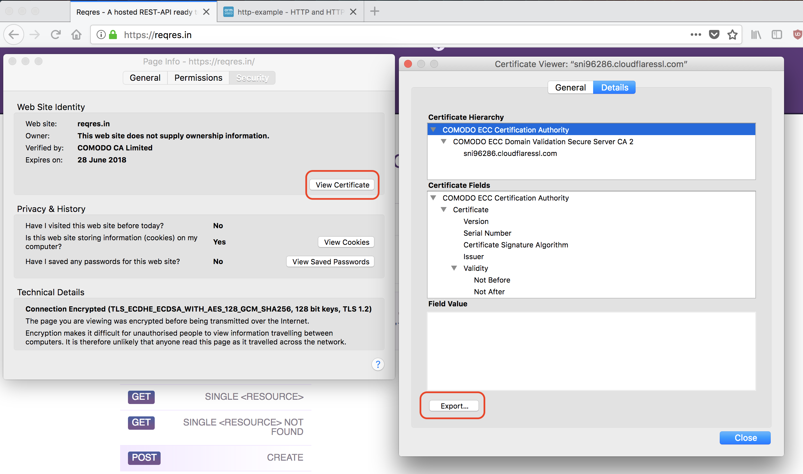
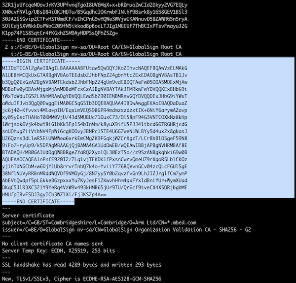

<h1 id="tls-tutorial">Using Mbed TLS to communicate securely</h1>

Since Mbed OS 5.11, the [IP networking interface](../reference/ip-networking.html) has been extended to include [TLSSockets](../apis/tlssocket.html), which behave similarly to normal TCP sockets but automatically use Mbed TLS to set up a TLS connection to the server. This tutorial, based on [our blog entry](https://os.mbed.com/blog/entry/Adding-TLS-Sockets-to-Mbed-OS/), helps you understand and use TLS encryption in Mbed OS. The Transport Layer Security (TLS) is a successor of Secure Sockets Layer (SSL), and it is designed to provide communication security over a computer network. You will often find it necessary to use TLSSockets instead of raw TCPSockets when connecting to secured online services, such as cloud IoT platforms.

In particular, this tutorial:

- Introduces the basic concepts of CA certificates.
- Explains how to practically obtain them and embed them in your application using TLSSockets.
- Points to further reading on client's key and certificate verification.

## Certificate Authorities (CAs)

Unlike desktop operating systems, such as Windows or macOS, Mbed OS does not have a central list of trusted Certificate Authorities (CAs). This means that when you want to talk to a server through TLS, you need to provide the list of root CAs, yourself. You can find the root CAs quickly through your browser or through OpenSSL.

### Browser

You can use any browser to find the root CAs, but this tutorial uses Firefox:

<span class="images"><span>Getting a root CA in Firefox</span></span>

1. Use Firefox to go to a page that uses HTTPS and is hosted on the same domain as the server you want to talk to over a TLS Socket.
1. Click `Tools` > `Page Info`.
1. Click `Security`.
1. Click `View Certificate`.
1. Choose the `Details` tab.
1. Click on the top item in the certificate hierarchy; this is the root CA.
1. Click `Export`.
1. This gives you a `.crt` file. Store it inside your project, so you can find it later.

### OpenSSL

1. Open a terminal and run:

   ```
   $ openssl s_client -connect os.mbed.com:443 -showcerts
   ```

   (Replace `os.mbed.com:443` with your host and port.)

1. Look for the last occurance of `-----BEGIN CERTIFICATE-----`.
1. Copy everything from `-----BEGIN CERTIFICATE-----` to `-----END CERTIFICATE-----`, and store it in a file. 

<span class="images"><span>Getting a root CA through OpenSSL</span></span>

## Placing the CA certificate in code

To use the CA certificate in code, place it in a C-style string variable initialized with a multiline string literal. For example:

```c
// Every line ends with `\n`
// To add more root certificates, just concatenate them.
const char SSL_CA_PEM[] = "-----BEGIN CERTIFICATE-----\n"
    "MIIDdTCCAl2gAwIBAgILBAAAAAABFUtaw5QwDQYJKoZIhvcNAQEFBQAwVzELMAkG\n"
    // Rest of your certificate
    "-----END CERTIFICATE-----\n"
    // You can also concatenate multiple certificates.
    "-----BEGIN CERTIFICATE-----\n"
    "BAYTAlVTMSUwIwYDVQQKExxTdGFyZmllbGQgVGVjaG5vbG9naWVzLCBJbmMuMTIw\n"
    // Rest of your second certificate
    "-----END CERTIFICATE-----\n";
```

## Enabling logging

The TLS Socket library uses the [mbed-trace](https://github.com/ARMmbed/mbed-os/blob/1bbcfff8f331c2e00a3883ea27ca3c91461bc7a9/features/frameworks/mbed-trace/README.md) library that is part of Mbed OS for logging. To see the TLS handshakes, you need to enable the trace library. In addition, you can specify the debug level for the TLS socket. Create a file named `mbed_app.json` in the root of your project, and add the following to enable tracing:

```json
{
    "macros": ["MBEDTLS_SHA1_C=1"],
    "target_overrides": {
        "*": {
            "mbed-trace.enable": 1,
            "tls-socket.debug-level": 0
        }
    }
}
```

<span class="notes">**Note:** Enabling traces in `mbed_app.json` is not enough to actually show them. You still need to tell the trace library where it needs to write. Calling `mbed_trace_init();` from code writes the traces to the default serial UART port, so you can see them through a serial monitor, the same as when you call `printf`.</span>

## Making an HTTPS request to os.mbed.com

With everything in place, you can now set up a TLS socket connection. On the Mbed website is a file called `hello.txt`, which returns `Hello World!` in plain text.

<span class="notes">**Note:** If you're looking for a fully fledged HTTP/HTTPS library, look at [mbed-http](https://os.mbed.com/teams/sandbox/code/mbed-http/). It also uses TLS Sockets underneath.</span>

### Setting up a TLS socket

<span class="notes">**Note:** There is an [example TLS Socket project](https://github.com/ARMmbed/mbed-os-example-tls-socket) available.</span>

You set up a TLS socket in the same way as you set up a TCP socket, except you call `set_root_ca_cert` with the root CA string.

```cpp
#include "mbed.h"
#include "mbed_trace.h"

const char cert[] = /* your certificate, see above */ "";
 
int main (void) {

nsapi_size_or_error_t result;
NetworkInterface *net = NetworkInterface::get_default_instance();

if (!net) {
    printf("Error! No network inteface found.\n");
    return 0;
}

printf("Connecting to network\n");
result = net->connect();
if (result != 0) {
    printf("Error! net->connect() returned: %d\n", result);
    return result;
}

TLSSocket *socket = new TLSSocket;
result = socket->set_root_ca_cert(cert);
if (result != 0) {
    printf("Error: socket->set_root_ca_cert() returned %d\n", result);
    return result;
}

result = socket->open(net);
if (result != 0) {
    printf("Error! socket->open() returned: %d\n", result);
    return result;
}

printf("Connecting to os.mbed.com\n");
result = socket->connect("os.mbed.com", 443);
if (result != 0) {
    printf("Error! socket->connect() returned: %d\n", result);
    return result;
}

}
```

This now makes the request and returns the content of the file.

```
[INFO][TLSW]: mbedtls_ssl_conf_ca_chain()
[INFO][TLSW]: mbedtls_ssl_config_defaults()
[INFO][TLSW]: mbedtls_ssl_conf_authmode()
[INFO][TLSW]: mbedtls_ssl_conf_rng()
[INFO][TLSW]: mbedtls_ssl_setup()
[INFO][TLSW]: Starting TLS handshake with os.mbed.com
[INFO][TLSW]: TLS connection to os.mbed.com established
 
[DBG ][TLSW]: Server certificate:
    cert. version     : 3
    serial number     : 03:56:D4:79:41:63:31:CA:E0:56:06:61
    … snip ...
 
[INFO][TLSW]: Certificate verification passed
```

You can also look at the [complete example](https://github.com/ARMmbed/mbed-os-example-tls-socket/blob/master/main.cpp) for more details.

<span class="notes">**Note:** If you come across a message saying the signature's algorithm is missing: <br>
```
[ERR ][TLSW]: mbedtls_x509_crt_parse() failed: -0x262e (-9774): X509 - Signature algorithm (oid) is unsupported : OID - OID is not found
```
then you may need to add the following line in `target_overrides` section of your `mbed_app.json` file:<br>
```json
    "target_overrides": {
        "*": {
            "target.macros_add" : ["MBEDTLS_SHA1_C"]
        }
    }
```
</span>

### Providing client's certificate and key

The CA certification only allows you to verify the server's authenticity.

The TLS handshake can also perform the second stage of verification where the client's certificate is verified to confirm its authenticity.

To achieve this, you must call the TLS socket's `set_client_cert_key()` function, which stores your key and certificate pair within the TLS socket. This may be required in cases where the server needs to verify the client's identity for secure communication, for example when your IoT device wants to send (and not just receive) some data to the server.

The mechanism of providing the client's key and certificate to TLS socket is the same as in case of CA certificate.
